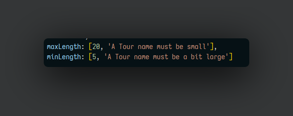
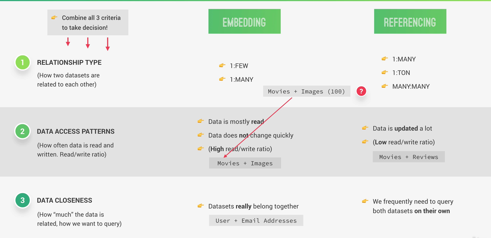

-
	- ### What is Node js ?
		- Node js is a javascript Runtime built on google's open source javascript engine .
		- Node js is single threaded , based on non-blocking I/O model
		- Node js is not suitable for heavy CPU intensive task .
		- #+BEGIN_NOTE
		  To run  a node script you can do 
		  node [filename.js]
		  #+END_NOTE
		- #### Node Js File System
			- The Node-js file system module allows you to work with the file system on your computers .
				- To import any module in your js file the Syntax is 
				  
				- #### Common Uses of FS module
					- Read File
						- ```
						  const text = fs.readFileSync('./sample1.txt','utf8')
						  ```
						  fs.readFileSync will read the file in a synchronous way block the code that is executing below it .
					- Create File
						- ```
						  fs.writeFileSync('./sample2.txt',textOut)
						  ```
						  fs.writeFileSync will write the textOut Data into a file named sampl2.txt
					- Update File
					- Delete File
					- Rename File
			-
	- ###  Node.js architechture and behind the scenes
	- The most important javascript libraries
		- **V-8 engine**  - It convert javascript code into machine code .
		- **Libuv** - This layer give node an access to underline computer operating system , networking , file system and etc .
			- ^^Event Loop^^ : it is used to handle easy tasks
				- All the application code that is inside callback functions .
				- Event loop does **orchestration** .
				- Makes asynchronous programming possible in nodejs .
					- Other architechtures like**php and apache**  always create a new thread for functioning .
					- 
			- ^^Thread Loop^^ : it is used to handle heavy works , like accessing computer files .
				- Additional 4 threads
				- Offload work from the event loop
			-
	- Node application always runs on single threads .
	  id:: 674dfaf6-b0ca-4835-876b-c9dd062ee30d
	- 
	- **fs** : It is the Node.js file system module allows you to work with file on your computer .
	- ^^process.nextTick^^ : A method of native Node process module , it is similar to the setTimeout method in which it delays execution of its callback function until some point in the future .
	- ^^Crypto^^ : This module provides cryptographic functionality that includes , OpenSSL's hash , cipher , decipher , sign .
		- {:height 50, :width 361}
		- The above callback functions are handled by different threads , hence there the callback function time is different.
		- 
		-
		- If we use only one single thread by 
		  ^^process.env.UV_THREADPOOL_SIZE = {no of threads you want to use }^^
		- 
		- The above callback functions are done using only single process .
	- ^^Event Module^^ : It is a built module where you can create , fire , listen .... for your own events .
		- Every action on a computer is an event , like connection is made or a file is opened .
	- **Streams** : Used to process data piece by piece , without completing the whole read or write operations and therefore without keeping all the data in memory .
		- Perfect for handling large volumes of data .
		- More efficient data processing in terms of memory and time .
		- Streams are instance of Event Emitter class
		- There are four types of streams
			- ^^Readable Streams^^ : Streams from which we can read data .
				- Example : http requests , fs read streams .
			- ^^Writable Streams^^ :
				- Streams to which we can write data .
					- Example http responses and fs write streams .
			- ^^Duplex Streams^^ :
				- Streams that are both readable and writable .
					- Example net web socket .
			- ^^Transform Streams^^ :
				- Duplex streams which are both readable and writable at the same time .
		- 
		  This is an example of reading data through streams but it will cause back pressure problem .
		- 
		  This is an example of reading data through streams using pipe .
		-
	- #### How the common js module system works ?
		- Each javascript file is treated as a separate module .
		- Node.js uses the : require() , exports or module.exports; (CommonJS module system)
		- ES module system is used in browser : import / export
		- Following steps are taken
			- ^^Resolving & loading^^
				- Core modules : ^^require('http')^^
				- Developer modules : require('./lib/controller') these modules import starts with a ./
				- Third party modules : these modules are imported same as the core modules .
				  We don't need to got to node_modules to find the modules there .
				-
			- ^^Wrapping^^
				- The module code is wrapped into a custom function which will give access to special objects .
					- require : function to require modules
					- module : reference to current module
					- exports : a reference to module.exports used to export object from a module
					- __file_name : absolute path of current module's file;
					- --dir_name : directory name of the current module
			- ^^Execution^^
			- ^^Returning exports^^
				- require function returns the export of the required module
			- ^^Caching^^ :
				- ```
				  If I run these three lines 
				  require('./test-module3')()
				  require('./test-module3')()
				  require('./test-module3')()
				  
				  ```
				- 
				- This will be the output
				- All the functions that are called are cached .
	- ### Express
		- Express is a minimal node.js framework , a higher level of abstraction .
		- It allows for rapid development of node.js
		- #+BEGIN_NOTE
		  If we do not specify a route for the post method then the express server will send ous a html template that contains ( Cannot POST )
		  #+END_NOTE
	- ### API
		- It is the piece of software that can be used by another piece of software , in order to allow applications to talk to each other .
		- **Resouce** : Object or representation of something , which has data associated to it. Any information can be a resource .
		- 
		- Endpoints should contain only resources and use HTTP methods for actions .
		- ^^GET^^ : It is used when the user want to access the endpoint , If we want a specific one data then we need to specify the id after another slash .
		- ^^POST^^ : It is used when the user want to create new resources .
		- ^^PUT/PATCH^^ : it is used to update the resources .
		  PUT : send the entire object after updation .
		  PATCH : send only the updated object after updation .
		- ^^DELETE^^ : it is used to delete the resources .
		- In json file all the key has to be a string and it should be **key-value** pair .
		- First we put the status as success or failure and then send the data to the user .
		- A rest-full api should always be stateless . 
		  
		  #+BEGIN_IMPORTANT
		  In Stateless Restful api -> all the state is handled on the client . This means that each request must contain all the information necessary to process a certain request . 
		  #+END_IMPORTANT
	- ### Real world applications notes
		- The ^^app.use()^^ is used to mount specified middleware functions at the path which is being specified . It is mostly used to set up middleware for your application .
			- **path** : it is the path for which the middleware function is being called .
			- **callback** : it is the middleware function .
		- ^^express.Router()^^ : it is the a class which helps us to create router handlers .
		- ^^router.get('route',controller)^^ : it defines the route which will be used for the particular req .
		- ^^const user = users.filter((user) => user.id == req.params.id )^^ : filter method creates a shallow copy of  a portion of a array to filter out the elements from the array according to the given condition .
		  For example : the condition is user.id == req.params.id if the users send in the req is same as the one in the array .
		- When you are importing a json file from the server make sure to  convert it into javascript object by ^^JSON.parse('json')^^ from text format .
	- ### Middlewares
		- It is used to modify the req  data and res objects and then compile any code that is required .
		- ^^Object.assign( target  , Source )^^ : it help to copy all the enumerable properties from the source to target .
		- When sending data to the web server then that data has to be a string so we use ^^JSON.stringify^^
		- If we want to do an optional parameter in the app.get() request then we add a ? after that parameter 
		  ```
		  app.get('/api/v1/tours/:id/:x?', (req, res)
		  ```
		- ^^const tour = tours.find(el => el.id === id)^^ in this ele is the index and it is checking weather the tours array contains the index id .
		- If you are having same route paths then you can also you another syntax like this
		  ```
		  app.route('/api/v1/tours').get(getAllTours).post(createTour)
		  ```
		- In express everything is a middleware.
		- Middleware are execute in the order they are defined in the code .
		- The syntax of middleware 
		  ```
		  app.use((req,res,next) => {
		      
		  })
		  ```
		- If you skip the next function in a middleware then your application will get stuck at that middleware function .
		- #+BEGIN_NOTE
		  To the current time at that request we can use ^^req.requestTime = new Date()^^ 
		  #+END_NOTE
		- #+BEGIN_PINNED
		  Morgan is another HTTP request logger middleware for node js 
		  It simply the process of logging request to user 
		  1. dev 
		  2. combined 
		  3. short 
		  4. tiny 
		  #+END_PINNED
		- We can refractor the code by declaring a router with express.Router and then creating  a middleware by ^^app.use('parent route path',routerName)^^ and changing the app word in your handlers .
		- To export multiple export controllers function we add the keyword ^^exports.functionname^^ to export them into their particular routers 
		  ```
		  exports.function((req,res) => {
		  	console.log("dummy function")
		  })
		  ```
			- To import it on the routers 
			  First we have to import the controller file and then get all the required function using . operator .
		- #### Param Middleware
			- This middleware only runs for only special parameter in our url .
			- It has a special parameter called **value** , This value parameter will hold the actual of the url->parameter 
			  ```
			  router.param('id', (req, res, next, val) => {
			      console.log(`Tour id is : ${val}`)
			      next()
			  })
			  ```
			- It a request came then first it will travel through all the middlewares i.e is ^^middleware stack^^
			- We can also reduce the amount of code by specifying an repeated check in any of our controllers , and just specifying the particular condition as follows 
			  ```
			  router.param('id', tourController.checkId)
			  ```
			- To create multiple middleware functions we can also do with our post method 
			  ```
			  post(tourController.checkData, tourController.createTour);
			  ```
			- #+BEGIN_NOTE
			  Static files are those files that are stored into our machines locally . 
			  To access those files 
			  Let us suppose our file is stored in the public folder input project directory 
			  {:height 148, :width 552} 
			  #+END_NOTE
			- **Enviornment Variables**
				- These are the global variables that are used to define the enviornment that node is using .
				- We change those variables according to our requirement , in future the result might change .
				- ^^.env^^ is the extension for that particular that defines the enviornment variables .
				- The username should always be in capital letters .
				- We use a module called dotenv in node js to specify the config file .
				  ```
				  dotenv.config({ path: './config.env' })
				  ```
				- The reading of these variable only happens once , Location of the dotenv read must be in order of the app execution , otherwise you will get undefined .
	- ### MongoDB
		- It is NoSql database .
		- DATABASE -> Collections (Tables) -> Documents (Rows)
		- Stores data in documents ( field-value pair data structures , NoSQL)
		- No document schema is required , so each document can have different number and type of fields .
		- It uses ^^BSON^^ Data format for data storage . And all documents will be typed .
		- It also enables ^^embedding/denormalizing^^ : Including related data in a single document .
		- #+BEGIN_IMPORTANT
		  MongoDB cheat sheet 
		  Link https://www.mongodb.com/developer/products/mongodb/cheat-sheet/
		  #+END_IMPORTANT
		- #+BEGIN_NOTE
		  Mongodb operators start with ^^$^^
		  $lte => less than or equal to .
		  $lt => less than 
		  same goes with gte which means greater than or equal to .
		  The $or accepts an array of condition with an or condition 
		  #+END_NOTE
		- To show a particular filed in the output of the mongosh you need to add 1 to the field 
		  ^^{ name : 1 }^^ .
		- ^^$set : {}^^ is used to update the values of a particular document in the mongodb
	- ### Mongoose Library
		- First you need to create a enviornment variable in your config file 
		  ^^DATABASE_LOCAL = mongodb://localhost:27017/natours-test^^
		- To connect you online or local database you need to add the url to the mongoose.connect method 
		  ```
		  mongoose.connect()
		  // This method require two arguments 
		  // 1. URL 
		  // 2. Options to deal with deprication warnings . 
		  ```
		  This method returns a promise .
		- Mongoose is an object Data modeling library for MongoDB and Node.js , a higher level of abstraction .
		- It act as a layer over the mongdb .
		- It gives us
			- Schemas to model data .
			- easy validation .
			- Query API , middlewares .
		- ^^Mongoose Schema^^ is the place where we model our data , by describing structure of the data .
		- ^^Mongoose Model^^ is a wrapper for the schema which allows us to perform crud operations with the database .
		- ```
		  const tourSchema = mongoose.Schema({
		      name: {
		          type: String,
		          required: [true, 'A tour must have a name'] // This is a validator 
		      },
		      rating: {
		          type: Number,
		          default: 2.0
		      },
		      price: {
		          type: Number,
		          required: [true, 'A tour must have a price']
		      }
		  })
		  
		  const Tour = mongoose.model('Tour', tourSchema)
		  ```
		- #+BEGIN_NOTE
		  there is a parameter for mongoose model which is ^^trim : true^^ which removes the trailing spaces from the end and starting of the given string . 
		  To add a mongoose field which accepts an array of strings  .
		  ^^name_of_the_model: [type_of_data]^^
		  #+END_NOTE
		- **mongoose.model** require two parameters
			- Name of the tour must be capital
			- Name of the Schema that you defined using mongoose.Schema
		- To save a model you can do ^^testTour.save()^^ where testTour is a new object of Tour  class and .save() method returns a promise which can be handled like this 
		  ```
		  const testTour = new Tour({
		      name: 'The ShiriKhand Mahadev',
		      rating: 4.7,
		      price: 789
		  })
		  
		  testTour.save().then((doc => console.log(doc))).catch(err => console.log('ERROR : ' + err));
		  ```
		- #+BEGIN_TIP
		  If you change the parameter of a collection then please restart the mongodb service before working further 
		  #+END_TIP
		- Application Logic -> controllers 
		  Business Logic -> models
		- In our controller function you can use **Tour.create** method to create an instance of tour object if this method does not returns any promise then the controller function will run the catch block and handle the error .
		- In our controller function when we import the mongoose model we have a function called **.find()**  method
		- **.findById()**  this method is to get a specific document from the db with a particular id .
		- **.findByOne( _id : "")** this method is used to get a specific document from the db with particular filed value in the document it can be any field .
		- For updating the documents we need to use a specific method called **.findByIdAndUpdate()** this method require three argument first one is the id and the second one is the updated value and there is another one called options 
		  ```
		   const tour = await Tour.findByIdAndUpdate(req.params.id, req.body, {  new: true , runValidators : true})
		  ```
		  ^^runValidators : true^^ means that validators should run again .
		- .findByIdAndDelete() this method requires only two parameters first one is the id and second one are the options 
		  ```
		  const tour = await Tour.findByIdAndDelete(req.params.id)
		  ```
		- ^^await Tour.deleteMany();^^  this command will delete all the Tours from the mongodb .
		- ^^process.argv()^^ is use to return all the command line arguments when a node.js program is being launched.
		  The first one will be the node location and the second one will be the file location which the node.js is running i.e this is very common . 
		  we can access all those argument by indexing in array .
		- ^^process.exit()^^ this is an aggressive way to stop an application
		- #### Filtering
			- In this process we when user want to retrive the particular data from the db .
			- ```
			  const tours = await Tour.find({
			              duration: 5,
			              difficulty: 'easy'
			          })
			  ```
			- You can also use some special mongoose methods to these kinds of stuff .
			- Or you can also do  ^^Tour.find(req.query)^^ to do these kinds of stuff .
			- If we want to remove some unnecesary filtering data we do the de-structuring  of the    req.query like 
			  ```
			      const excludedObj = ['page','sort','path','limit']
			  
			      excludedObj.forEach(el => delete queryObj[el])
			  ```
			- The above command will loop over the excludedObj and delete the excluded queryObjects .
			- #### Advanced Filtering
			  collapsed:: true
				- using operator like less than or equal to and many more .
				- ```
				   let queryStr = JSON.stringify(queryObj)
				      queryStr = queryStr.replace(/\b(gte|gt|lte|lt)\b/g, match => `$${match}`)
				      console.log(JSON.parse(queryStr))
				  ```
			- To add some mongodb query operators like gt or gte or lt or lte we need add these operator in the req.query
			  but we need to replace all the occurances of these operator by adding a $ symbol at the string otherwise mongodb will not accept those query 
			  so we use regex to solve this problem and replace all the occurances with /g , and then do pass the query to the backend .
			  
			  #+BEGIN_NOTE
			  Before passing it to the .find() method make sure to Json.parse() the queryString 
			  #+END_NOTE
			- #### Sorting
				- Arranging the data that the user received after a particular query
				- ^^req.query^^ will return an JS object
				- ^^query.sort^^ Sets an sorted order of the JS object passed as an argument . 
				  this function accepts an JS object .
				- ```
				   if (req.query.sort) {
				          query = query.sort(req.query.sort)
				      }
				  ```
				- To sort the result in the ascending order just add ^^sort = -price^^ in order to sort the data in descending order .
				- To sort the data according to multiple fields like Price and ratingsAverage
					- You need to add another filed after the sort = syntax Like 
					  ```
					  sort=price,ratingsAverage
					  ```
					- After that you need to replace the , operator with a empty space otherwise the sort in the  mongoose will not work . 
					  ```
					    if (req.query.sort) {
					          sortBy = req.query.sort.split(',').join(' ')
					          console.log(sortBy)
					          query = query.sort(sortBy)
					      }
					  ```
			- #### Limiting the fields
				- To limit the fields the user want to see in their pull request from the backend .
				- ```
				   // Field Limiting
				      if (req.query.fields) {
				          const fields = req.query.fields.split(',').join(' ')
				          console.log(fields)
				          query = query.select(fields)
				      }
				      else {
				          query = query.select('-__v');
				      }
				  ```
				- The ^^-__V^^ the - symbol in the front   means we does not want to include __v field in our pull request .
				- #+BEGIN_NOTE
				  If you want to totally remove a field in you get request you get just add select property to false in your model file 
				  #+END_NOTE
				- **Mongodb skip and limit**
					- The limit function is used to specify the maximum result to be returned .
					- The skip function is used when we need to skip certain documents in our pull request .
					- If the page does not exist in the document then we can throw a new error by 
					  ```
					   if (req.query.page) {
					          const no_of_tours = await Tour.countDocuments();
					          if (skip > no_of_tours) throw new Error('This page does not exist')
					      }
					  ```
					- ^^countDocuments()^^ method is used to count the number of document present after we do a get request from the backend .
					-
			- #### Aliasing some common requests
				- We can also do a separate get request to fetch all the top five hotels by a special aliasing .
				- First you need to define a separate query fields for that particular request in an separate functions . 
				  ```
				  exports.aliasTopFive = async (req, res, next) => {
				      req.query.limit = '5'
				      req.query.sort = '-ratingsAverage,price'
				      req.query.fields = 'name,price,ratingsAverage,summary,difficulty'
				      next()
				  }
				  ```
				- Then you need to add this custom function before your normal get request in the another route with a different name . 
				  ```
				  router.route('/top-five-tours').get(tourController.aliasTopFive, tourController.getAllTours)
				  ```
			- #### Refactoring Rest of the code
				- We can also refactor our code by making a separate class for all the required method .
				- Export the the Class to the required places .
				  ```
				  const Tour = require("./../models/tourModel")
				  
				  class APIFeatures {
				      constructor(query, queryString) {
				          this.query = query
				          this.queryString = queryString
				      }
				      filter() {
				          const queryObj = { ...this.queryString }
				          const excludedObj = ['page', 'sort', 'limit', 'fields']
				          excludedObj.forEach(el => delete queryObj[el])
				          let queryStr = JSON.stringify(queryObj)
				          queryStr = queryStr.replace(/\b(gte|gt|lte|lt)\b/g, match => `$${match}`)
				          this.query = this.query.find(JSON.parse(queryStr))
				          return this;
				  
				      }
				      sort() {
				          if (this.queryString.sort) {
				              const sortBy = this.queryString.sort.split(',').join('')
				              this.query = this.query.sort(sortBy);
				          }
				          else {
				              this.query = this.query.sort('-createdAt')
				          }
				          return this
				      }
				  
				      limitFields() {
				          if (this.queryString.fields) {
				              const fields = this.queryString.fields.split(',').join(' ')
				              this.query = this.query.select(fields)
				          }
				          else {
				              this.query = this.query.select('-__v')
				          }
				          return this
				      }
				      paginate() {
				          const page = this.queryString.page * 1 | 1
				          const limit = this.queryString.limit * 1 | Tour.countDocuments
				          const skip = (page - 1) * limit
				          this.query = this.query.skip(skip).limit(limit)
				          return this
				      }
				  }
				  
				  module.exports = APIFeatures
				  
				  ```
			- #### Aggregation Pipeline: Matching and Grouping
				- Aggregation Pipeline is a mongoose feature in which we process large number of documents by passing them through different stages .
				- **Aggregation match** behaves like a find , it will filter the documents that match the query provided .
				- ```
				  const stats = await Tour.aggregate([
				              {
				                  $match: { ratingsAverage: { $gte: 4.5 } }
				              },
				              {
				                  $group: {
				                      _id: { $toUpper: '$difficulty' },
				                      numTours: { $sum: 1 },
				                      numRatings: { $sum: '$ratingsQuantity' },
				                      avgRating: { $avg: '$ratingsAverage' },
				                      avgPrice: { $avg: '$price' },
				                      minPrice: { $min: '$price' },
				                      maxPrice: { $max: '$price' }
				                  }
				              },
				              {
				                  $sort: { avgPrice: 1 }
				              }
				          ]);
				  ```
				- **$toUpper** is used to convert a string to uppercase in mongoose
				- **Aggregation group** separates the documents into groups according to the a "group key", the output is one document for each unique key .
				- #+BEGIN_NOTE
				  To view more of these aggregations you can visit
				  https://www.mongodb.com/docs/manual/reference/operator/aggregation/group/
				  #+END_NOTE
				- **Aggregation sort** sort all inputs documents and returns  them to the pipeline in sorted order .
				- In sort aggregation the 1 is to sort in ascending order .
			- #### Unwinding and Projecting
				- id:: 6403754d-2ece-45ee-bf6c-cc0ccdec729d
				  #+BEGIN_IMPORTANT
				  Note in javascript you can use 
				  
				  The is the trick to transfer it into a number  
				  #+END_IMPORTANT
				- **Unwind** in mongo is used to deconstruct an array field in a document and create a separate output document for each item in the array .
				- ```
				  const plan = await Tour.aggregate([
				              {
				                  $unwind: '$startDates'
				              },
				              {
				                  $match: {
				                      startDates: {
				                          $gte: new Date(`${year}-01-01`), // note it contains all the dates within 2021 
				                          $lte: new Date(`${year}-12-31`),
				                      }
				                  }
				              },
				              {
				                  $group: {
				                      _id: { $month: '$startDates' }, // this will group all the data with respective to the start dates
				                      // $month will return the month of a date .  
				                      numTourStarts: { $sum: 1 }, // this will count all the documents within the particular month 
				                      tours: { $push: '$name' }, // rpeturns an array of all values that results from applying an expression to a documents  and this will return the names of all the tours that are in the particular mongth of particular yaer 
				                  }
				              },
				              {
				                  $addFields: { month: '$_id' }, // In this statement we are just modifying the _id in our mongodb result 
				              },
				              {
				                  $project: { // project specify the inclusion of the fields 
				                      _id: 0  // this statement makes sure that _id field does not shows up in the result 
				                  }
				              },
				              {
				                  $sort: { numTourStarts: -1 }  // this statement will sort the result with respect to the maximum number of tour in that particular months 
				              },
				              {
				                  $limit: 6 // this will makes sure to return only 6 documents in the result 
				              }
				  ```
				- **month** will return the month of a particular given date
				- **push**  will returns an array of all values that results from applying an expression to particular documents .
				- **addFields**  add a newly created node in the mongodb result
				- **project** is used to specify field inclusion
				- **limit** is used to limit the no of documents .
			- #### Virtual Properties
				- These are those properties that we define in the schema but are not saved in the actual back-end .
				  For example : converstion of miles into km before saving into the actual back-end .
				  ```
				  tourSchema.virtual('durationWeeks').get(function () { // it is not goint the pe persistence in the database 
				      return this.duration / 7; // note in this statement the this keyword will be pointing to the current document .
				  })
				  ```
				  ^^this keyword is pointing to the current document^
				- To display virtual  properties in our results when need to explicitly do it .
				  ```
				  {
				          toJSON: { virtuals: true },
				          toObject: { virtuals: true }
				      });
				  ```
			- #### Middleware in Mongoose
				- These middleware works on the mongodb database .
				- 
				- The pre method will run before the save() and create() function in the mongodb
				- It is necessary to call next() function otherwise the request will get stuck in only one middleware forever .
				- To use slugify method we need to import slugify library .
				- Here also the this keyword is pointing to the current document .
			- #### Query Middleware
				- These middleware help to alter the information before we display it to the users .
				- There are many types of Middleware Queries link pre , post , etc .
				- To use the particular middleware in all the routes starting with find you take the help of regular expressions . 
				  ```
				  
				  tourSchema.pre(/^find/, function (next) {
				      this.find({ secretTour: { $ne: true } }),
				          this.start = Date.now()
				      next()
				  })
				  
				  tourSchema.post(/^find/, function (docs, next) {
				      console.log(`Query Took ${Date.now() - this.start} milliseconds`)
				      console.log(docs)
				      next()
				  })
				  ```
			- #### Aggregation Middleware
				- These middlwares allows us to add hooks before and after the aggregation happens .
				- 
				- ^^this.pipleline()^^ is an object , which contains one or more stages that process documents .
			- #### Data Validators( Built-in )
				- There are lot of built-in data validators in mongoose .
				- Enums are basically String Objects .
				- There are number of validators like maxLength , minLength , max , min 
				  {:height 236, :width 590}
				- 
				  Enum usage as Data Validator .
				- **Custom Validator**
					- Validator's made explicitly
					- 
					  This custom validator is checking weather the the discount price is less than the actual price or not .
	- ### Error Handling with Express
		- First install ^^ndb^^
		  ```
		  npm -i ndb --save-dev
		  ```
		- Modify the package.json file : 
		  ```
		   "debug": "ndb server.js"
		  ```
		  At this line to the scripts .
	- ### Authentication , Authorization and Security
		- while defining the rules of the schema element 
		  ```
		   required : [ true , 'Please specify a name'],
		  ```
		  The next argument after the true , is the message that the database would return as a error if the field is sent as null .
		-  
		  In this ^^lowercase : true^^ will always make sure that the value of the is field is always store in lowercase in the backend .
		  ^^validator.isEmail^^ is checking weather the email format is correct or not .
		- To export the user Model : 
		  ```
		  const User = mongoose.model('User', userSchema);
		  
		  module.exports = User;
		  ```
		- #### Managing Passwords
			- 
			  This custom validator  is checking weather the password is same as the confirmPassword .
			- For Hashing the passwords before storing into the database we use a library called ^^bcryptjs^^
			- id:: 641b0877-6656-4dce-8209-3f4027395328
			  ```
			  userSchema.pre('save', async function (next) {
			      if (!this.isModified('password')) return next()
			      this.password = await bcryptjs.hash(this.password, 12)
			      this.passwordConfirmation = undefined
			      next()
			  })
			  ```
			  this bcryptjs hash function is of sync behaviour that will hash the password with the cost of 12 
			  the first if condition is checking weather the password is modified or not , if it is not modified then we will return to next() function call else we will encrypt it before storing into database .
		- #### Authentication with JWT
			- 
			- When we decode the JWT it is broken down into 
			  1. Header 
			  2. Payload
			  3. Verify Signature
			  
			- 
			  test signature == signature Data is not modified and user is authenticated 
			  test signature != signature Data is modified and user is not authenticated
				- 1 . First you need to import jsonwebtoken
				  2 . Import jsonwebtoken into the required file . 
				  3 . To create a token syntax is : 
				       ```
				    const token = jwt.sign({ id: newUser._id }, process.env.JWT_SECRET, { expiresIn: process.env.JWT_EXPIRES_IN })
				  ```
				  First argument is the payload and the second one is the secret key and in options we have set the expiration timer to 90 days .
		- #### Logging in users
			- #+BEGIN_NOTE
			  If you dont want to show a field in the response after we store the data in the database then we set select argument to false in respective model : 
			  ```
			   select: false
			  ```
			  #+END_NOTE
			- First we need to create a login route
			- Then we create controller for that route 
			   
			  1. First we get the email and password after Destructuring the req.body 
			  2. Then we check weather the req.body actually contains the email and password . 
			  3. Then we check weather the email and password exists in our database or not , ^^here .select method is used to specify which field is to include or exclude in our query result . ^^
			  4. After that we check weather the user is present or not and also we compare the password that the user entered and password store in the database . ^^.correctPassword^^ is a method in users model that return true and false 
			  5. Finally we generate the token and return the response .
			- An Instance method is method which is available on all documents on a certain collection
			- ```
			  userSchema.methods.correctPassword = function (candidatePassword, userPassword) {
			      return bcryptjs.compare(candidatePassword, userPassword)
			  }
			  ```
			  this method return true if both the password are equal else return false .
			  this method is an example of instance method .
		- #### Protecting Tours
			-  
			  The first if condition is checking weather the ^^headers.authorization is present && it starts with Bearer^^ 
			  If the above condition is satisfied then we get the token from the authorization . 
			  The next if condition checks there is token present or not . 
			  Token Verification
			  To verify the token we will be using ^^jwt from jsonwebtoken^^  for verifying the web token and ^^promisify^^ to return the decoded data . 
			  There is also another check for the token expiration that will be discussed later .
			  There can be a case when the user has been deleted but the token stil exists then we must check after verify that it belongs to a person or not . 
			  The last verification is check weather user changed the password after the token was issued
				- First we get the token timestamp from ^^decoded.iat^^
				- Then we create a custom middleware in the userModel which takes JWTTimestamp as a argument then then convert the changedPasswordTime Stamp to seconds 
				  
		- #### User Authorization
			- This means to restrict the user who does not have permission to access some features of the database .
			- First we will add a role in the userModel then create a method in the auth controller which will check weather the role that is specified should be allowed or not  .
			- ```
			  delete(
			          authController.protect,
			          authController.restrictTo,
			          userController.deleteUser
			      );
			  ```
			- ```
			  exports.restrictTo = async (req, res, next) => {
			      try {
			          // roles ['admin','lead-guide']
			          console.log(req.user.role)
			          const roles = ['admin' , 'lead-guide']
			          if (!roles.includes(req.user.role)) {
			              throw new Error("You do not have permission to access this.")
			          }
			          next()
			      } catch (error) {
			          res.status(401).json({
			              status: 'fail',
			              message: error.message
			          })
			      }
			  
			  }
			  ```
		- #### Password reset token
		  id:: 641b0877-c1ba-4ede-9110-1d1ec8878216
		  collapsed:: true
			- To generate this token we use a library called ^^crypto^^
			- We will create a method for this token generator :
			  ```
			  userSchema.methods.createPasswordResetToken = function(){
			    // 1. We will generate a random password token with cryto 
			      const resetToken = crypto.randomBytes(32).toString('hex')  
			    // 2. hasing the reset token 
			     this.passwordResetToken = crypto.createHash('sha256').update(resetToken).digest('hex')
			     console.log({resetToken},this.passwordResetToken) 
			    // 3. setting the passwordResetExpires 
			     this.passwordResetExpires = Date.now()  + 10*60*1000
			  
			    return resetToken
			  
			  }
			  
			  ```
			  we will use crypto to generate a random String of 32 Bytes and then hash this password with sha256 and set the expiration date to 10 min
			- In authController we will call this method on the user and call the user.save({}) with a flag turned false . 
			  ```
			   const randomToken = user.createPasswordToken();
			   await user.save( { validateBeforeSave : false } )
			  
			  ```
		- #### Sending email with nodemailer
		  id:: 641b0877-ba76-43c5-9451-0dfb59c7e729
			- We will use a library called ^^nodemailer^^
			- ```
			  const sendEmail = async options => {
			    // 1. create a transporter 
			    const transporter = nodemailer.createTransport({
			      port:process.env.EMAIL_PORT,
			      host:process.env.EMAIL_HOST,
			  
			      auth: {
			        user:process.env.EMAIL_USERNAME,
			        pass:process.env.EMAIL_PASSWORD,
			      }
			    });
			    // 2. Define email options
			    const emailOptions = {
			      from : 'Pratham Dhiman <hello@dhiman.io',
			      to : options.email,
			      subject : options.subject,
			      text : options.messasge
			    }
			    // 3. Sending the email 
			    await transporter.sendMail(emailOptions)
			  }
			  
			  module.exports = sendEmail
			  
			  ```
			  The transporter is the service that you will use for sending the message ,
			  In the above example we are making our own transporter with ^^.createTransporter^^ method .
			  Next we are defining the email options in which from will be same for all email but the to and subject and text will change with respect to the email options sent . 
			  with ^^transporter.sendMail(emailOptions)^^ we send the male this returns a promise remember 
			  {:height 288, :width 684} 
			  In the authController we are creating the resetUrl and creating the message that will contain the link of the resetPassword .
		- #### Password Reset Functionality
			- In the auth Controller we will create a function forget Password
			  ```
			  exports.forgetPassword = async (req,res,next) => {
			     // 1. Get the user based on the posted email 
			        const user = await User.findOne({ email : req.body.email})
			        if(!user){
			        throw new Error("Sorry the email address is not correct !")
			      }
			      // 2 . Generate the random token 
			      const randomToken = user.createPasswordResetToken()
			      await user.save( { validateBeforeSave : false } )
			      // 3 . Send it to user's email
			      const resetUrl = `${req.protocol}://${req.get('host')}/api/users/resetPassword/${randomToken}`
			  
			      const message = `Forget Your password ? Submit a PATCH request with your new password to : ${resetUrl} . \n if you didn't forget your password please ignore it`
			      console.log(message)
			    try {    
			      await sendEmail({
			        email : user.email,
			        subject : 'Password Change Token',
			        message
			      })
			      res.status(201).json({
			        status: 'success',
			        message : 'Reset token sent '
			      })
			  
			    } catch (error) {
			      user.passwordResetToken = undefined
			      user.passwordResetExpires = undefined  
			      await user.save({ validateBeforeSave : false})
			      res.status(404).json({
			        status : 'fail',
			        message : error.message
			      }) 
			    }
			  
			  ```
			- First we find the user from the email that is provided in the body then we generate a randomToke  with the createPasswordResetToken ((641b0877-c1ba-4ede-9110-1d1ec8878216)) method in userModel then we save the user details without validating then we are just called the sendMail method ((641b0877-ba76-43c5-9451-0dfb59c7e729)) .
			- ```
			  exports.resetPassword = async (req,res,next) => {
			    try {
			      // 1. Get the user based on the token 
			        const hashedToken = crypto.createHash('sha256').update(req.params.token).digest('hex')
			      console.log("this is passwordResetToken "+ hashedToken)
			        const user = await User.findOne({passwordResetToken : hashedToken , passwordResetExpires : {$gt : Date.now()}})
			    // The above statement will not return any user if the tokenRsertExpires is greater than Data.now()
			    // 2. If the token not expired , there is a user , set a new password 
			      if(!user){
			          throw new Error("Sorry Token expired!")
			    }
			      user.password = req.body.password
			      user.passwordConfirm = req.body.passwordConfirm
			      user.passwordResetToken = undefined
			      user.passwordResetExpires = undefined
			      await user.save()
			    // 3. Update the changedPassword for the current user 
			    // 4. Log the user in 
			      const token = signToken(user._id)
			      res.status(200).json({
			        status : 'success',
			        token : token
			      })
			  
			    } catch (error) {
			        res.status(404).json({
			        status : 'fail',
			        message : error.message
			      })
			      }
			    }
			  
			  ```
			- In the reset function we are calling a method .createHash('sha256') ^^The **crypto.createHash() method** is used to create a *Hash* object that can be used to create hash digests by using the stated algorithm.^^  
			  then we get the get based after comparing passwordResetToken and hashedToken and also another condition ^^passwordResetExpires : {$gt : Date.now()}}^^ in which we check the expired passwordResetTokens finally we generate a new token for the user._id and log the user in .
			- After we reset the password the ^^passwordResetToken^^ and ^^passwordResetExpires^^ are lost from the database .
			- Before logging in we need to change the passwordChangedAt property in the userModel 
			  So we add a middle-ware in the userModel :
			  ```
			  userSchema.pre('save',function (next) {
			    if(!this.isModified('password') || this.isNew) return next()
			    this.passwordChangedAt = Date.now() - 1000
			    next()
			  })
			  ```
			  here ((641b0877-6656-4dce-8209-3f4027395328)) and **^^this.isNew^^ is mongoose method which checks weather the document is new or not** .
		- #### Updating password
			- Why we cannot update the pass with mongoose findByIdAndUpdate method ?
				- 1. Validation on the user model will not be going to run , because this.anything is not defined when we use this method . 
				  2. And all the middlewares will also not run .
				- 
				- The we get the user from the collection with .findByid method with include the password document field in the user variable .
				- Secondly we check weather user entered the correct password in the req.body .
				- Then we simply update the password and passwordConfirm field of the user and then just save the user in the db .
			- #### Updating the Current User Data
				- We will use the old method which is ^^findByIdAndUpdate^^.
				- 
				- First we are checking weather the request contains the password or passwordConfirm field .
				- Secondly we filter the fields that are allowed with a function called filterObj 
				  
				  In this function we create a empty obj and loop through the obj that we passed and if the allowed field includes the field that is passed in the obj i.e req.body then we consider it otherwise we don't .
				- At last we send out updatedUser .
			- #### Sending JWT via Cookie
				- To send jwt via cookie we use : ^^res.cookie('jwt',token,cookieOptions)^^
				- 
			- #### Implementing rate limiting
				- In order to prevent same IP to make multiple request to the server .
				- We need to implement this globally .
				- There is a express-rate-limit package available for this work .
				- 
				- There are total three options
					- 1. max : represents the maximum requests from the user 
					  2. message : message to be displayed when the limit has been reached .
			- #### Setting Security HTTP Headers
				- We can limit the about of data that comes in the body.
				- For this we use a package called helmet .
					- Which is required to implement CSP ( Content Security Policy ) .
				- ```
				  app.use(helmet());
				  ```
			- #### Data Sanitization
				- This means to remove the special character from the user input that could cause some malcious activities .
				- An Example of this type of malcious attack is :
				  ```
				  { "email": { "$gt" : " "}}
				  ```
				- The above query will return all the user present in the data base .
				- We will be using two packages for this :
				  1. express-mongo-sanitize
				  2. xss-clean
				- The first package that we installed will be used as a middleware  for each and every request and remove all the user  input that may be malcious to the web backend .
				- The Second package will remove all the HTML elements from the user input to prevent the XSS atttacks .
			- #### Prevent Parameter Pollution
				- #+BEGIN_NOTE
				  .split method in js only works on strings not on arrays. 
				  #+END_NOTE
				- We need to install a package name ^^hpp^^. to prevent parameter pollution .
				- If we add multiple sort function in the parameter then it will only sort the data with respect to the last sort function only.
				- We can also specify some exceptional parameters that shall not be touched by HPP. By specify parameter are those parameters that are used as arrays.
		-
	- ### Data Modelling in Mongodb
		- There are three types of relationship between the data
			- One to One.
			- One to Many.
				- One to 3-5.
				- One to 100/1000.
				- One to Millions .
			- Many to Many.
		- **Referencing Vs Embedding**
			- In referencing we pass the reference  ( using some sort of id of the data )of data if a relation ship exists .
				- Performance wise it is better than Embedding
				- We need to send to queries if we want to  retrieve the linked data .
			- In Embedding we pass the actual data if a relation ship exists between the data.
				- Impossible to query the embedded data on its own.
			- 
			- Types of Referencing
				- Child Referencing
					- In this parent keep the reference of their child with them.
				- Parent Referencing
					- In this child keep the reference to their parent with them.
				- Two-way Referencing
					- Both the data have their reference.
				-
				-
			-
-