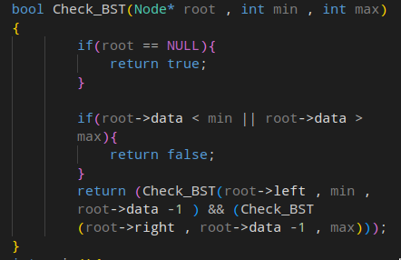

- Binary trees in (c++)
	- Implementation of Binary tree
	- {:height 405, :width 361}
	- To add a root node we need to write
	- #+BEGIN_NOTE
	   
	  #+END_NOTE
	- We will use two stacks currentLevel & nextLevel and a bool variable Left to Right , if Left to right is true we first push left child to nextLevel Stack else vice versa .
	- 
	- We will push to root to currentLevel stack always ( before the while loop )
	- 
	- We are creating a temp of type Node* which will store the top of currentLevel stack If temp is NULL then it will not do anything .
	- At the end of the while loop we are swapping the currentLevel and nextLevel stack to cover all the other Levels of the binary tree .
- #### Properties
	- Maximum nodes at level $L = L^2$
	- Maximum nodes in a tree of height $H = H^2$ - 1
	- For N nodes , minimum possible height or minimum number of levels are 
	- A binary tree with L leaves has at least  number of levels
#### Major Traversal In BST
	- #### Pre_order
		- 
	- #### In_order
		- 
	- #### Post_order
		- 
	- #### Check_BST
		- This method is the range method in which we will check the range of each node while traversing the binary tree and then return true and false accordingly .
		- 
		- ##### Method two
			- 
		- #### Find the Kth Smallest element in BST
			- We are going to use Inorder traversal of the bst and when we will reach the left most element in the bst which satisfy the condition  
			  , then we will assign the val to the nums[1] and return .
			- 
		- #### Find the second minimum value in BST
			- [Second Minimum In BST](https://leetcode.com/problems/second-minimum-node-in-a-binary-tree/)
		- #### Vertical Order Print in BST
			- In this approach we will be doing level order traversal 
			  We will go level by level in BST , so that the upper element comes first and then the rest lower elements . The Data Structure we are going to use is hashmap .
			- In HashMap ^^Key = Horizontal Distance^^  
			  ^^Value = Array/Vectors of Integers^^
			- [#C] Algo ->
			  1. Starting from root Node 
			  2. Recursively call left and right with (HD -1) and (HD + 1) as arguments .
			  3. **Base Case** : When current node = Null(return).
			  4. Push the value into vector corresponding to the horizontal distance (HD).
			- [Link To Problem](https://leetcode.com/problems/vertical-order-traversal-of-a-binary-tree/submissions/)
			-
		- #### Binary Tree Pruning
			- In this approach first we will pass the reference of our root node to the helper function 
			  and **Base Case** : When root = null
			- The helper function will do recursive calls to the left and the right subtree respectively .
			  Then we will check if left doesn't  contain the 1 then we are going to set left = null i.e remove the subtree 
			  Then we will check if right doesn't contain the 1 then we are going to set right  = null i.e remove the subtree
			-