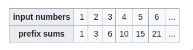

- #### Fast I/0
	- cin/cout are slower than scanf / printf , so inorder to achieve the same speed we use this \darr
	  ```
	  ios_base::sync_with_stdio(false);
	  ```
	- You can include the STL with a single include : \darr
	  ```
	  #include<bits/stdc++.h>
	  ```
- #### Use Full C++ libraries
	- 1. **vector** 
	  2. **queue** 
	  3. **stack** 
	  4. **set and map** 
	  5. **priority_queue**
	  
	  #+BEGIN_NOTE
	  By Default max heap is created for the priority in c++ 
	  #+END_NOTE 
	  6. **deque**
- #### unordererd_map
	- It contains key value pairs , it is implemented using hashing data structure , 
	  #+BEGIN_IMPORTANT
	  The key / value pairs are not ordered 
	  #+END_IMPORTANT
	  key is represented using ^^[""] ( Square Brackets )^^
	- This STL provide an method called ^^.find(key)^^ which return the iterator , then you can find the value of the value and key using first and second .
	  **.first** : This will print the key . 
	  **.second** : This will print the value .
	  [intro.cpp](../assets/intro_1662478226834_0.cpp)
- #### unordered_set
	- An unordered_set is implemented using a hash table .
	- Keys are hashed into indices of a hash table so that the insertion is always randomised
	- All operations on the unordered_set takes constant time O(1) on an average . 
	  
	  #+BEGIN_NOTE
	  In Set -> key are stored in ordered fashion . 
	  Set is internally  implemented as RED BALCK Tree 
	  unordered_set -> keys are stored in unordered fashion . 
	  unordered_set -> is internally implemented using hashing . 
	  #+END_NOTE
	  Set Operation -> Time complexity ^^O(log n)^^
	  unordered_set operation -> Time complexity ^^O(1)^^
	- #+BEGIN_CAUTION
	  unordered_set does not have duplicates key
	  #+END_CAUTION
	- #### Functions 
	  1. insert() 
	  2. size()
	  3. clear()
	  4. begin()
	  5. end()
	  6. find()
	  7. erase()
	  8. count()
		- The delete key takes an value which needs to be deleted . 
		  count() function return the '1' if it is present or '0' if not .
	- #+BEGIN_NOTE
	  if You want to sort in your own way then you can do that by creating another function which will take 2 vector/arrays as arguments and algo pass the function as the third parameter of the sort inbuilt function . 
	  #+END_NOTE
- ####  Deque
	- Double-ended queues are sequence[ containers](https://www.geeksforgeeks.org/containers-cpp-stl/) with the feature of expansion and contraction on both ends.
	  Double Ended Queues are basically an implementation of the data 
	  structure double-ended queue. A queue data structure allows insertion 
	  only at the end and deletion from the front. This is like a queue in 
	  real life, wherein people are removed from the front and added at the 
	  back. Double-ended queues are a special case of queues where insertion 
	  and deletion operations are possible at both the ends.
		- Accessing Elements- O(1)
		- Insertion or removal of elements- O(N)
		- Insertion or removal of elements at start or end- O(1)
	- [For Methods](https://www.geeksforgeeks.org/deque-cpp-stl/)
	- This Data structure is used in sliding window maximum .
- #### Pascal's Triangle
	- **Approach :** First we will create our 2d vector and then create another prev vector and initialize it with 1 then we will add it to our ans 2d vector .
	  We will do a for loop till the row given and make another vector temp which will store our each row values and add the previous two values to the new row according to the pasca's triangle theory at last we add 1 to end of our vector , after that we push our created vector into the main ans 2d vector and return it .  
	  ```
	   vector<vector<int>> generate(int numRows) {
	          vector<vector<int>> ans;
	          vector<int> prev={1};
	          ans.push_back(prev);
	          
	          for(int i=2;i<=numRows;i++){
	              vector<int> temp(i);
	              temp[0]=temp[i-1]=1;
	              for(int j=1;j<i-1;j++){
	                  temp[j]=prev[j-1]+prev[j];
	              }
	              ans.push_back(temp);
	              prev=temp;
	          }
	          return ans;
	      }
	  ```
- #### Prefix Sum Array
	- There is a simple yet powerful technique that allows for the fast calculation of sums of elements in given slice (contiguous segments of array). Its main idea uses prefix sums which are defined as **the consecutive totals of the first 0,1,2,...,n elements of an array**.
	  
- #### Combinatorics
	- \begin{equation}
	  (n-1)*(n)/2
	  \end{equation}
	- The above formula is the  number of pairs you can form an n elements set .
- [[Importatnt Points]]
- [[Strings]]
- ####  Sets
	- To find the minimum element from a set we can do
	- ```
	   while(!st.size() > 0){
	       auto node = *st.begin(); 
	     }
	  ```
	- In set elements are stored in sorted order .
	- ^^Time Complexity For Insertion :^^ -> log(n)
	- If you want to find a particular value then you can use **find()**
	  
	  #+BEGIN_NOTE
	  find() -> will return iterator of that element . 
	  #+END_NOTE
	- ```
	  // To print the set we can do 
	  	for(auto it = s.begin() ; it!= value : s){
	     		cout<<(*it)<<endl;
	      }
	  ```
		- Remember to put * before accessing the value of the iterator .
- #+BEGIN_NOTE
  To generate all subsequence there are two methods first one is ^^recursion^^ and second is ^^power set^^. 
  #+END_NOTE
- Use Sliding Window using Map if ( distinct element are allowed only ) Approach in Maximum sum subarray if time constraint is less .
-