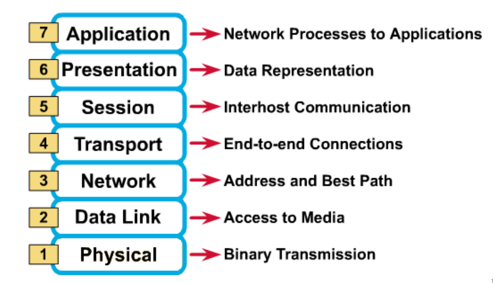

- Computer network connects two or more autonomous computers.
- #### LAN , MAN & WAN
	- Network is small geographical Area (  room , Building , Campus ) is called a LAN .
	- Network in a city is called MAN .
	- Network spread geographically is called WAN .
- #### Applications of Networks
	- Resource Sharing
		- 1. Hardware ( computing resources , disks , printers )
		  2. Software (application software)
		- Information Sharing
			- 1. Easy Accessibility from anywhere ( files , database )
			  2. Search Capability
		- Communication
			- Email
			- Message broadcast
		- Remote computing
		- Distributed processing
- #### Network Topology
	- The network topology defines the way in which computers, printers,and other devices are connected. A network topology describes the layout of the wire and devices as well as the paths used by data transmissions.
	  Ex : Bus Topology , Ring Topology , Star Topology , Mesh Topology.
- 
- Hub , Switches , Routers , Wireless Access points , Modems etc .
- #### OSI Reference Model : 7 Layers
	- 
	- #+BEGIN_TIP
	  All People Seem to Need Data Processing .
	  #+END_TIP
- #### Summary of all the OSI Layer functioning
	- 1. Application layer : Application programs using the network 
	  2. Transport Layer ( TCP / UDP ) : Management of end-to-end message Transmission, error detection and error correction .
	  3. Network Layer ( IP ) : Handling of datagrams : routing and congestion
	  4. Data Link Layer : Management of cost effective and reliable data delivery , access to physical networks 
	  5. Physical Layer : Physical Media
- [[Network Layer]]
- [[Tansport Layer]]