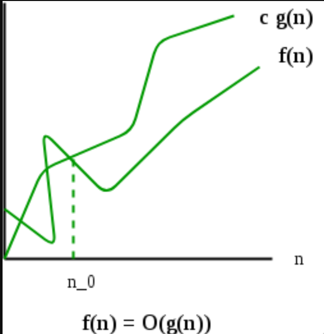
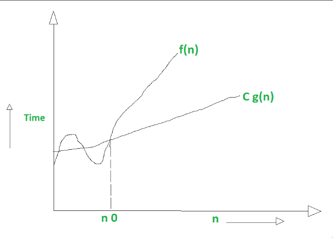
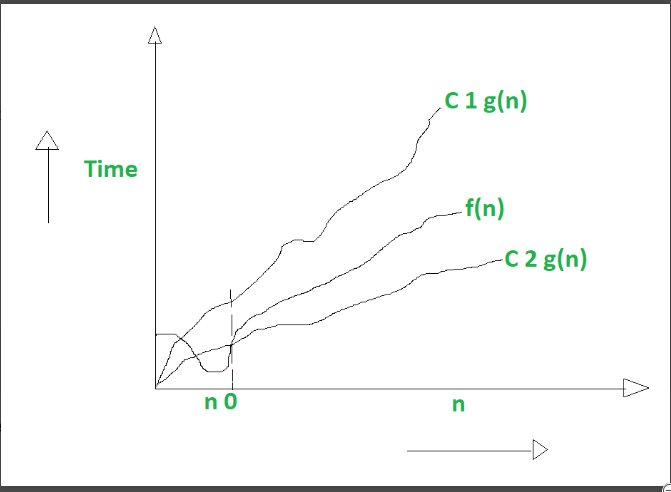
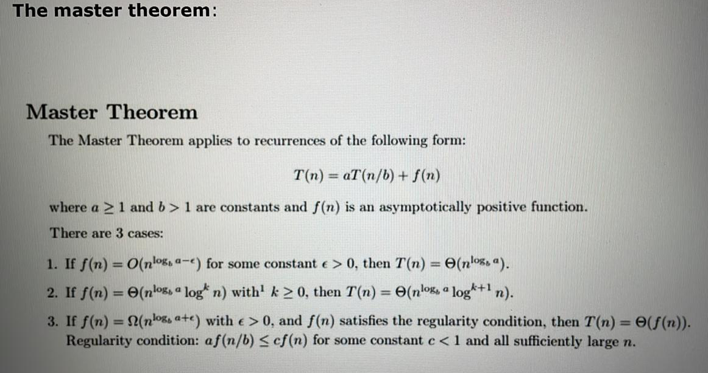

- #### Algorithm
	- Finite set of steps to solve a problem is called algorithm
	- **Analysis** is the process of comparing two algos wrt time , space , etc .
- #### Asymptotic Notation
	- **Big (O) :** 
	  {:height 576, :width 551}
	  \begin{equation}
	  f \left( n  \right)   =  O.g \left( n  \right)   , 
	  f \left( n  \right)   <   =  C.g \left( n  \right)   
	  \end{equation}
	  #+BEGIN_IMPORTANT
	  Above C > 0
	  n>=n_0
	  n_0>=0
	  #+END_IMPORTANT
	- Worst Case
	- Upper Bound ( At most )
	- **Big-Omega** : 
	   
	  \begin{equation}
	  f \left( n  \right)   =   \Omega  .g \left( n  \right)   ,
	  f \left( n  \right)   >   =  C.g \left( n  \right)   
	  \end{equation}
	- Best Case
	- Lower Bound
	- **Theta** :
	  
	  \begin{equation}
	   { C  }_{ 1  }  .g \left( n  \right)   <   =  f \left( n  \right)   <   =   { C  }_{ 2  }  .g \left( n  \right)   
	  \end{equation}
- #### Comparison of various Time complexities
	- **Method 1** : Put a large value for n .
	- **Method 2** : Simplify the given equation
- #### Recurrence Problem
	- **Methods**
		- Substitution Method : This  method can solve any recurrence problem  , but this method is very slow .
	- **Master Theorem** :
		- Master Theorem According to class :
		  
		- Suppose the equation is given in the following way :
		  \begin{equation}
		  T \left( n  \right)   =  aT \left( n-b  \right)  +f \left( n  \right)   
		  \end{equation}
		  a > 0 , b > 0 and f(n) = O(n^{k}) where k>=0
			- Cases 
			  1. if a < 1 : 
			  \begin{equation}
			  O \left(  { n  }^{ k  }    \right)   , O \left( f \left( n  \right)    \right)   
			  \end{equation}
			  2. if a = 1 : 
			  \begin{equation}
			  O \left(  { n  }^{ k+1  }    \right) , O \left( n \cdot  f \left( n  \right)    \right)   
			  \end{equation}
			  3. if a > 1 : 
			  \begin{equation}
			  O \left(  { n  }^{ k  }   \cdot   { a  }^{  \frac{ n  }{ b  }    }    \right)   , O \left( f \left( n  \right)   { a  }^{  \frac{ n  }{ b  }    }    \right)   
			  \end{equation}
			-
		- Suppose the equation is given in the following way : 
		  \begin{equation}
		  T \left( n  \right)   =  aT \left(  \dfrac{ n  }{ b  }    \right)  +f \left( n  \right)   
		  \end{equation}
		  #+BEGIN_IMPORTANT
		  a>=1 , b>1
		  #+END_IMPORTANT
		  \begin{equation}
		   T \left( n  \right)   =   { n  }^{ lo { g  }_{ b  }  a  }   \left( U \left( n  \right)    \right)   
		  \end{equation}
		  The Value of U(n) depends on H(n)
		  \begin{equation}
		  H \left( n  \right)   =   \dfrac{  \left( f \left( n  \right)    \right)    }{  { n  }^{ lo { g  }_{ b  }  a  }    }   
		  \end{equation}
		  Relation between H(n) and U(n) is :
		  if( R(n) ) : 
		  n^{r} , r>0 
		  then O(n^{r})
		  if( R(n) ) :
		  n^{r} , r<0 
		  then O(1)
		  \begin{equation}
		   \left(  { \left( \log\left( n  \right)   \right) }^{ i  }    \right)   
		  \end{equation}
		  then 
		  \begin{equation}
		  \dfrac{  {  \left( lo { g  }_{ 2  }  n  \right)    }^{ i+1  }    }{ i+1  }   
		  \end{equation}
		- #+BEGIN_IMPORTANT
		  \begin{equation}
		  T \left( n  \right)   =  T \left( n-1  \right)  +1 =  O \left( n  \right)   
		  \end{equation}
		  \begin{equation}
		  T \left( n  \right)   =  T \left( n-1  \right)  +n =  O \left(  { n  }^{ 2  }    \right)   
		  \end{equation}
		  \begin{equation}
		  T \left( n  \right)   =  T \left( n-1  \right)  + \log\left( n  \right)   =  O \left( n \cdot   \log\left( n  \right)    \right)   
		  \end{equation}
		  \begin{equation}
		  T \left( n  \right)   =  T \left( n-1  \right)  + { n  }^{ 2  }   =  O \left(  { n  }^{ 3  }    \right)   
		  \end{equation}
		  In the above relation you can try this logic , it will be same irrespective of the term subtracted from n .  
		  #+END_IMPORTANT
		- **Some Important relations **
		  \begin{equation}
		  T \left( n  \right)   =  3 \cdot  T \left( n-1  \right)  +1 =  O \left(  { 3  }^{ n  }    \right)   
		  \end{equation}
		  \begin{equation}
		  T \left( n  \right)   =  2 \cdot  T \left( n-1  \right)  +1 =  O \left(  { 2  }^{ n  }    \right)   
		  \end{equation}
		  \begin{equation}
		  T \left( n  \right)   =  2 \cdot  T \left( n-1  \right)  +n =  O \left( n \cdot   { 2  }^{ n  }    \right)   
		  \end{equation}
		- **Recursive Tree Method** : 
		  if a + ar + ar^{2} + ar^{3} ........ a^{k}
		  \begin{equation}
		   { G  }_{ sum  }   =  a \cdot   \dfrac{  \left(  { r  }^{ k+1  }  -1  \right)    }{ r-1  }   
		  \end{equation}
		- **Change Variable Method** : 
		  Denominator of power = base of log of variable of function 
		  \begin{equation}
		  T \left( n  \right)   =  2T \left(  \sqrt[   ]{ n  \phantom{\tiny{!}}}    \right)  + \log\left( n  \right)   
		  \end{equation}
		  m = log_{2}n
		  n = 2^{m}
		  T(2^{m}) = S(m) 
		  Solve the equation using any method
- #### Divide and Conquer
	- We just divide a bigger problems into small sub-problems and then solve then , after that we just combine the sub problems . 
	  **Divide** : This involves dividing the problems into smaller sub-problems . 
	  **Conquer** : Solve sub-problems by calling recursively util solved . 
	  **Combine** : Combine the sub-problems to get the final solution of the whole problems . 
	  ```
	  DAC(a,i,j)
	  {
	      if(small(a,i,j)){
	        return (Solution(a,i,j))
	      }
	      else{
	        m = divide(a,i,j);
	        b = DAC(a,i,mid);
	        c = DAC(a,mid+1,j);
	        d = combine(b,c);
	      }
	      return d ;
	  }
	  ```
	  Some algorithms that follows divide and conquer approach are 
	  1. Binary Search 
	  2. Quick Sort 
	  3. Merge Sort
	  4. Strassen's Matrix multiplication
	- **Binary Search**
		- The Array must be sorted in Binary search .
		- Code : 
		  ```
		  int BinarySearch(A,n,key){
		  	l = 1 ; 
		      h = n ;
		      while(l<=h){
		      	  mid = (l+h)/2;
		            if(A[mid]==key){
		            return mid;
		            }
		            else if (A[mid] > key){
		            	 h = mid - 1;
		            }
		            else {
		            	l = mid+1;
		            }
		      }
		      return 0;
		  }
		  ```
		- Time Complexity : O(logn)
		  min comparison : O(1)
		  max comparison : O(logn)
		- Best Case : if the element you are searching is present at the middle of the array .
		  Worst Case : if the element you are searching is present at the leaf node of the array or not present in the array .
	- **Quick  Sort** :
		- Time compexity : O(nlogn)
		  ^^Recurrence Relation^^
		  \begin{equation}
		  T \left( n  \right)   =  2 \left( T \left(  \dfrac{ n  }{ 2  }    \right)    \right)  +n 
		  \end{equation}
		  ```
		  quickSort(arr[],low,high){
		  	if(low<high){
		        pi = partion(arr,low,high);
		        quickSort(arr,low,pi-1); 
		        quickSort(arr,pi+1,high);
		      }
		  }
		  // Code for partition
		  partition(arr[],low,high){
		    pivot = arr[low];
		    up = high ; 
		    down = low + 1;
		    while(down < up){
		    		while(arr[down] <= pivot){
		          	down++;
		          }
		          while(arr[up] > pivot){
		          	up--;
		          }
		          if(down < up ){
		           swap(arr[up],arr[down]);
		          }
		    }
		    swap(arr[low] ,arr[up]);
		    return up;
		  }
		  ```
		  #+BEGIN_NOTE
		  At the end of the array we add infinite symbol to stop the loop if no element is found greater than the pivot .
		  #+END_NOTE
		  The Best Case in Quick sort is when the pivot element reaches the middle of the array after the first operation in the array .
		  Time Complexity : O(nlogn)
		  
		  #+BEGIN_IMPORTANT
		  Achieving best case is not possible in quick sort 
		  #+END_IMPORTANT 
		  The Worst Case in Quick sort is when the array is already sorted or is is sorted in descending order  . Partitioning will be done in the beginning of the list 
		  Time Complexity : O(n^{2})
		- \begin{equation}
		  1 + 2 + 3  + ... n = n(n+1)/2
		  \end{equation}
		- **Two ways to improve the worst case in quick sort **
		  1. Select the middle element as pivot 
		  2. Select the random element as pivot
		- #+BEGIN_IMPORTANT
		  If last element is selected as a pivot element then just swap down with pivot rather than up   , and return down instead of up . 
		  #+END_IMPORTANT
	- **Merge Sort** :
		- Time Complexity : O(nlogn) in all cases . 
		  It is two way Sorting algorithm
		  No of levels : logn 
		  ```
		  mergeSort(arr,p,r){
		  	if(p<r){
		      q = (p+r)/2;
		      mergeSort(arr,p,q); // T(n/2)
		      mergeSort(arr,q+1,r); // T(n/2)
		      merge(arr,p,q,r); // n 
		      }
		  }
		  // Code for merge 
		  merge(arr,p,q,r){
		  	n1 = q - p + 1;
		      n2 = r - q ; 
		      create two array L[n1] , R[n2];
		      for i = 1 to n1 {
		      	L[i] = arr[p + i - 1];
		      }
		      for(i = 1 to n2){
		      	R[i] = arr[q + j];
		      }
		      L[n1+1] = infinite
		      R[n2+1] = infinite
		      i = 1 
		      j = 1 
		      for k from p to r {
		      	if L[i] <= R[j]{
		          	A[k] = L[j];
		              i++;
		          }
		          else {
		          	A[k]=R[j];
		              j++;
		          }
		      }
		  }
		  ```
		  
		  #+BEGIN_NOTE
		  If one list has m no of elements and other has n no of elements then the total number of comparisons will be ^^m + n -1^^ 
		  #+END_NOTE
		  Recurrence Relation : 
		  \begin{equation}
		  T \left( n  \right)   =  2T \left(  \dfrac{ n  }{ 2  }    \right)  +n 
		  \end{equation}
		- ^^Post order traversal^^ merging is done in merge sort
		- Pros
			- Suitable for large size list
			- In is suitable for linked list
			- Supports External sorting
			- It is stable ( if duplicates are present then the order of the duplicates is maintained even after sorting )
		- Cons
			- It needs Extra space ( not in place sorting )
			- No small problem ( for small size of array insertion sort performs better than the merge sort )
			- Recursive ( Uses stack ) 
			  height of the stack is log n ( at a time )
			  extra space for auxiliary array
	- **Selection Sort** : 
	  We just select the minimum element from the array put that element at the starting of the array , again and again it finds the minimum element and put it at the starting index . 
	  Algorithm : 
	  ```
	  for i = 1 to n -1 {
	  	min = i;
	      for j = i + 1 to n {
	      	if arr[j] < arr[min] {
	          	min = j ; 
	          }
	      }
	      if index != i {
	       	swap(arr[min],arr[i]);
	      }
	  }
	  ```
	  Time Complexity  : 
	  Best Case : Ascending Order O(n^{2}) , No swaps will be done 
	  Time complexity of swaping is O(1) . 
	  Worst Case : Descending Order O(n^{2}) , 
	  Time complexity of swaping is O(n) .
	  
	  #+BEGIN_IMPORTANT
	  Worst-case O(n^{2}) comparisons , 
	  performance O(n) swaps , 
	  
	  Best-case O(n^{2}) comparisons  ,
	  performance O(1) swaps , 
	  
	  Average Case O(n^{2}) comparisons , 
	  performance O(n) swpas , 
	  
	  Space Complexity : O(1)
	  #+END_IMPORTANT
	  Selection sort is not a Stable algorithm 
	  Selection sort is In place .
	  Recurrence Relation : 
	  \begin{equation}
	  T \left( n  \right)   =  T \left( n-1  \right)  +n 
	  \end{equation}
	- **Insertion Sort** :
		- Remember no swaping in insertion sort .
		  No of passes : n  -  1  
		  No of Comparisons : O(n^{2})
		  No of swaps : O(n^{2})
		- Algorithm : 
		  ```
		  for i  = 2 to arr.length{
		  	key = arr[i];
		      j=i-1;
		      while j>0 && arr[j] > key {
		      	arr[j+1] = arr[j];
		          j=j-1;
		      }
		      arr[j+1] = key ;
		  }
		  ```
		- Best Case ( Ascending Order ) :
		  Time Complexity : O(n)
		- Worst Case ( Descending Order ) :
		  Time Complexity : O(n^{2})
		  Insertion Sort is Stable 
		  Insertion Sort is in place 
		  
		  #+BEGIN_NOTE
		  Also known as Online ( Imediaetely )
		  #+END_NOTE
	- **Bubble Sort** :
		- No of Passes  for n elements : n - 1
		- After every pass the respective element is at the right index .
		- No of comparisons : 
		  \begin{equation}
		  n \cdot   \dfrac{  \left( n-1  \right)    }{ 2  }   
		  \end{equation}
		  O(n^{2})
		- Maximum No of Swaps : 
		  \begin{equation}
		  n \cdot   \dfrac{  \left( n-1  \right)    }{ 2  }   
		  \end{equation}
		  O(n^{2})
		- Time Complexity : O(n^{2})
		- Code : 
		  ```
		  void bubblesort(int arr[] , int n ){
		  	int flag ;
		  	for(int i = 0 ; i<n - 1 ; i++){
		      flag = 0 ;
		      	for(int j = i + 1 ; j < n-1 - i ; j++  ){
		          	if(arr[j] > arr[j+1]){
		              swap(arr[j],arr[j+1]);
		  			flag = 1;
		              }
		          }
		          if(flag == 0){
		          	break;
		          }
		      }
		  }
		  ```
		- In Best Case ( Ascending Order )
			- Time Complexity : O(n) 
			  
			  #+BEGIN_NOTE
			  The above time complexity is only when the flag variable is introduced , 
			  otherwise the complexity remains the same . 
			  #+END_NOTE
			- No of swaps : 0
			- bubble sort is adaptive ( after we made it by using flag variable ).
			- Stability : Yes the bubble sort is stable in nature .
	- #### Strassens's Matrix Multiplication
		- Follows divide and conquer
		- Code for normal matrix multiplication 
		  ```
		  for( i = 0 ; i<n ; i++){
		  	for( j = 0 ; j<n ; j++){
		      	c[i][j] = 0 ;
		          for( k = 0 ; k < n  ; k++){
		          	c[i][j] = c[i][k]*c[k][j];
		          }
		      }
		  }
		  ```
		  Time Complexity : O(n^{3})
		- Code for Divide and conquer Alogo 
		  ```
		  MM ( A , B , n ){
		  	if(n<=2){
		      	write the four formulas for matrix multiplication
		       }
		       else {
		       	mid = n / 2 ;
		          MM(A11,B11, n/2 )+MM(A12,B21,n/2);
		  		MM(A11,B12,n/2)+MM(A12,B22,n/2);
		          MM(A21,B11,n/2)+MM(A22,B21,n/2);
		          MM(A21,B12,n/2)+MM(A22,B22,n/2);
		       }
		  }
		  ```
		- Recurrence Relation 
		  \begin{equation}
		  T \left( n  \right)   =  8 \left( T \left(  \dfrac{ n  }{ 2  }    \right)    \right)  + { n  }^{ 2  }   
		  \end{equation}
		  #+BEGIN_NOTE
		  Time Complexity for matrix addition is generally O(n^{2})
		  #+END_NOTE 
		  Time Complexity : O(n^{3})
		- Basically Strassen has reduced the number of multiplications 
		  \begin{equation}
		  P =   \left(  { A  }_{ 11  }  + { A  }_{ 22  }    \right)   \cdot   \left(  { B  }_{ 11  }  + { B  }_{ 22  }    \right)   
		  \end{equation}
		  \begin{equation}
		  Q =   \left(  { A  }_{ 21  }  + { A  }_{ 22  }    \right)   \cdot   \left(  { B  }_{ 11  }    \right)   
		  \end{equation}
		  \begin{equation}
		  R =   \left(  { A  }_{ 11  }    \right)   \cdot   \left(  { B  }_{ 12  }  - { B  }_{ 22  }    \right)   
		  \end{equation}
		  \begin{equation}
		  S =   \left(  { A  }_{ 22  }    \right)   \cdot   \left(  { B  }_{ 21  }  - { B  }_{ 11  }    \right)   
		  \end{equation}
		  \begin{equation}
		  T =   \left(  { A  }_{ 11  }  + { A  }_{ 12  }    \right)   \cdot   { B  }_{ 22  }   
		  \end{equation}
		  \begin{equation}
		  U =   \left(  { A  }_{ 21  }  - { A  }_{ 11  }    \right)   \cdot   \left(  { B  }_{ 11  }  + { B  }_{ 12  }    \right)   
		  \end{equation}
		  \begin{equation}
		  V =   \left(  { A  }_{ 12  }  -  { A  }_{ 22  }    \right)   \cdot   \left(  { B  }_{ 21  }  + { B  }_{ 22  }    \right)   
		  \end{equation}
		  Now 
		  C_{11} = P + S - T + V 
		  C_{12} = R + T 
		  C_{21} = Q + S 
		  C_{22} = P + R - Q + U
		- Recurrence Relation 
		  \begin{equation}
		  T \left( n  \right)   =  7 \left(  T \left(  \dfrac{ n  }{ 2  }    \right)     \right)  + { n  }^{ 2  }   
		  \end{equation}
		  so know if we solve the above relation we will get 
		  \begin{equation}
		  lo { g  }_{ 2  }  7 =  2.81 
		  \end{equation}
		  Which is smaller than 3 
		  \begin{equation}
		  O \left(  { n  }^{ 3  }    \right)   >  O \left(  { n  }^{ 2.81  }    \right)   
		  \end{equation}
- [[Greedy Methods]]