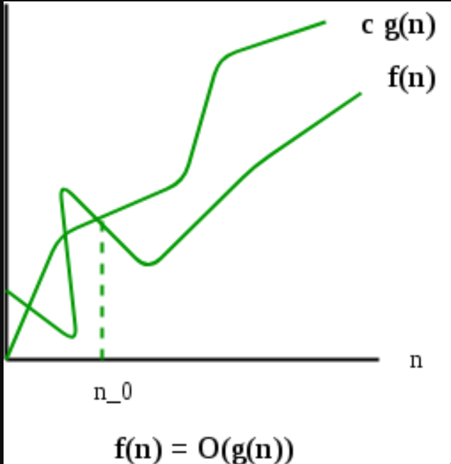
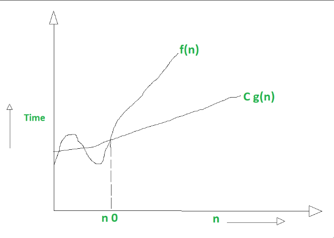
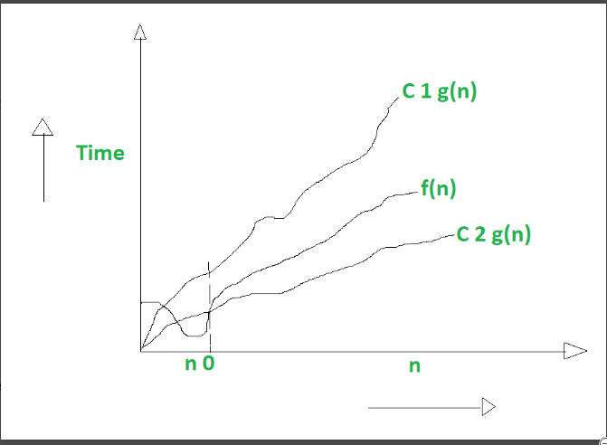

- #### Algorithm
	- Finite set of steps to solve a problem is called algorithm
	- **Analysis** is the process of comparing two algos wrt time , space , etc .
- #### Asymptotic Notation
	- **Big (O) :** 
	  {:height 576, :width 551}
	  \begin{equation}
	  f \left( n  \right)   =  O.g \left( n  \right)   , 
	  f \left( n  \right)   <   =  C.g \left( n  \right)   
	  \end{equation}
	  #+BEGIN_IMPORTANT
	  Above C > 0
	  n>=n_0
	  n_0>=0
	  #+END_IMPORTANT
	- Worst Case
	- Upper Bound ( At most )
	- **Big-Omega** : 
	   
	  \begin{equation}
	  f \left( n  \right)   =   \Omega  .g \left( n  \right)   ,
	  f \left( n  \right)   >   =  C.g \left( n  \right)   
	  \end{equation}
	- Best Case
	- Lower Bound
	- **Theta** :
	  
	  \begin{equation}
	   { C  }_{ 1  }  .g \left( n  \right)   <   =  f \left( n  \right)   <   =   { C  }_{ 2  }  .g \left( n  \right)   
	  \end{equation}
- #### Comparison of various Time complexities
	- **Method 1** : Put a large value for n .
	- **Method 2** : Simplify the given equation
- #### Recurrence Problem
	- **Methods**
		- Substitution Method : This  method can solve any recurrence problem  , but this method is very slow .
	- **Master Theorem** :
		- Suppose the equation is given in the following way : 
		  \begin{equation}
		  T \left( n  \right)   =  aT \left(  \dfrac{ n  }{ b  }    \right)  +f \left( n  \right)   
		  \end{equation}
		  #+BEGIN_IMPORTANT
		  a>=1 , b>1
		  #+END_IMPORTANT
		  \begin{equation}
		   T \left( n  \right)   =   { n  }^{ lo { g  }_{ b  }  a  }   \left( U \left( n  \right)    \right)   
		  \end{equation}
		  The Value of U(n) depends on H(n)
		  \begin{equation}
		  H \left( n  \right)   =   \dfrac{  \left( f \left( n  \right)    \right)    }{  { n  }^{ lo { g  }_{ b  }  a  }    }   
		  \end{equation}
		  Relation between H(n) and U(n) is :
		  if( R(n) ) : 
		  n^{r} , r>0 
		  then O(n^{r})
		  if( R(n) ) :
		  n^{r} , r<0 
		  then O(1)
		  \begin{equation}
		   \left(  { \left( \log\left( n  \right)   \right) }^{ i  }    \right)   
		  \end{equation}
		  then 
		  \begin{equation}
		  \dfrac{  {  \left( lo { g  }_{ 2  }  n  \right)    }^{ i+1  }    }{ i+1  }   
		  \end{equation}
		-
- #### Divide and Conquer
	- We just divide a bigger problems into small sub-problems and then solve then , after that we just combine the sub problems . 
	  **Divide** : This involves dividing the problems into smaller sub-problems . 
	  **Conquer** : Solve sub-problems by calling recursively util solved . 
	  **Combine** : Combine the sub-problems to get the final solution of the whole problems . 
	  ```
	  DAC(a,i,j)
	  {
	      if(small(a,i,j)){
	        return (Solution(a,i,j))
	      }
	      else{
	        m = divide(a,i,j);
	        b = DAC(a,i,mid);
	        c = DAC(a,mid+1,j);
	        d = combine(b,c);
	      }
	      return d ;
	  }
	  ```
	  Some algorithms that follows divide and conquer approach are 
	  1. Binary Search 
	  2. Quick Sort 
	  3. Merge Sort
	- **Quick ( Sort )** : 
	  Time compexity : O(nlogn)
	  ^^Recurrence Relation^^
	  \begin{equation}
	  T \left( n  \right)   =  2 \left( T \left(  \dfrac{ n  }{ 2  }    \right)    \right)  +n 
	  \end{equation}
	  ```
	  quickSort(arr[],low,high){
	  	if(low<high){
	        pi = partion(arr,low,high);
	        quickSort(arr,low,pi-1);
	        quickSort(arr,pi+1,high);
	      }
	  }
	  // Code for partition
	  partition(arr[],low,high){
	    pivot = arr[low];
	    up = high ; 
	    down = low + 1;
	    while(down < up){
	    		while(arr[down] <= pivot){
	          	down++;
	          }
	          while(arr[up] > pivot){
	          	up--;
	          }
	          swap(arr[up],arr[down]);
	    }
	    swap(pivot,arr[up]);
	    return up;
	  }
	  ```
	  #+BEGIN_NOTE
	  At the end of the array we add infinite symbol to stop the loop if no element is found greater than the pivot .
	  #+END_NOTE
	  The Best Case in Quick sort is when the pivot element reaches the middle of the array after the first operation in the array .
	  The Worst Case in Quick sort is when the array is already sorted or is is sorted in descending order  .
	  Time Complexity : O(n^{2})
	- **Merge Sort** : 
	  Time Complexity : O(nlogn) in all cases . 
	  ```
	  mergeSort(arr,p,r){
	  	if(p<r){
	      q = (p+r)/2;
	      mergeSort(arr,p,q);
	      mergeSort(arr,q+1,r);
	      merge(arr,p,q,r);
	      }
	  }
	  // Code for merge 
	  merge(arr,p,q,r){
	  	n1 = q - p + 1;
	      n2 = r - q ; 
	      create two array L[n1] , R[n2];
	      for i = 1 to n1 {
	      	L[i] = arr[p + i - 1];
	      }
	      for(i = 1 to n2){
	      	R[i] = arr[q + j];
	      }
	      L[n1+1] = infinite
	      R[n2+1] = infinite
	      i = 1 
	      j = 1 
	      for k from p to r {
	      	if L[i] <= R[j]{
	          	A[k] = L[j];
	              i++;
	          }
	          else {
	          	A[k]=R[j];
	              j++;
	          }
	      }
	  }
	  ```
	  
	  #+BEGIN_NOTE
	  If one list has m no of elements and other has n no of elements then the total number of comparisons will be ^^m + n -1^^ 
	  #+END_NOTE
	  Recurrence Relation : 
	  \begin{equation}
	  T \left( n  \right)   =  2T \left(  \dfrac{ n  }{ 2  }    \right)  +n 
	  \end{equation}
	- **Selection Sort** : 
	  We just select the minimum element from the array put that element at the starting of the array , again and again it finds the minimum element and put it at the starting index . 
	  Algorithm : 
	  ```
	  for i = 1 to n -1 {
	  	min = i;
	      for j = i + 1 to n {
	      	if arr[j] < min {
	          	min = j ; 
	          }
	      }
	      if index != i {
	       	
	      }
	  }
	  ```
	  Time Complexity  : 
	  Best Case : Ascending Order O(n^{2}) , No swaps will be done 
	  Time complexity of swaping is O(1) . 
	  Worst Case : Descending Order O(n^{2}) , 
	  Time complexity of swaping is O(n) .
	  
	  #+BEGIN_IMPORTANT
	  Worst-case O(n^{2}) comparisons , 
	  performance O(n) swaps , 
	  
	  Best-case O(n^{2}) comparisons  ,
	  performance O(1) swaps , 
	  
	  Average Case O(n^{2}) comparisons , 
	  performance O(n) swpas , 
	  
	  Space Complexity : O(1)
	  #+END_IMPORTANT
	  Selection sort is not a Stable algorithm 
	  Selection sort is In place .
	-
	-
	-
-