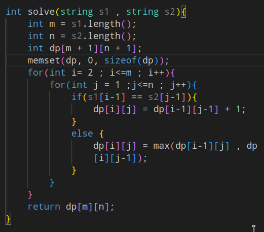
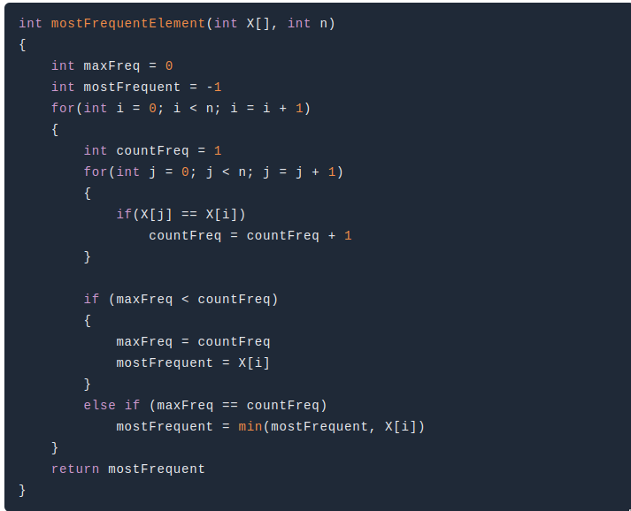

- [[HashMap]]
- [[Trees]]
- [[Bit Manipulation]]
- [[Queue]]
- [[Recursion]]
- [[Linked List]]
- [[Arrays]]
- [[Dynamic Programming]]
- [[Sorting]]
- [[Graphs]]
- [[Competitive Programming]]
- [[HashTable]]
- [[Heap]]
- [[Design Questions]]
- [[Binary Search]]
- ## Space and Time Complexity
	- Relation between Input Size and running time ( Operations )
		- Time complexity \uarr as the input size \uarr
	- ### Three Cases of Time complexity
		- Best Case \rarr the function which performs the minimum number of steps on input data of n elements \omega
		- Worst Case \rarr the function which performs the maximum number of steps on input data of size n. \theta
		- Average Case \rarr the function which performs an average number of steps on input data of n elements . O(n)
		- We will always choose the worst case time complexity for checking any runtime of the code
			- Below code 
				- In the above case the time complexity for the run time is O()n * m) in worst case .
				- In the above case if the for loops for not nested then the complexity would be O ( n+m )
		- ### Space Complexity
			- It is the amount of memory space required to solve an instance of the computational problem as a function of characteristics of the input .
-
	-
		-
		- ### DFS ( c++)
		- ### Find the middle element in the linked list
			- The approach I am gonna be using to find the middle element is slow and fast pointer .
			- 
		- ### Delete the middle element of the linked list
			- First we will find the middle element from the fast and slow pointer approach and then do this
			- 
			-
		- #### Find the Maximum guest staying in the hotel Problem
			- In this we are using vector pair but below is the optimized solution the brute force is yet to come
			- 
			- #+BEGIN_TIP
			  To Sort the vector in decreasing order we need to do this -> 
			   
			  #+END_TIP
			-
		-
		- ### Find the Next Permutation
			- [Problem Link](https://leetcode.com/problems/next-permutation/solution/)
			- First we will find the first decreasing element from the right side of the sequence .
			- The we will again traverse the sequence and fint the next highest number then the first decreasing element ( from the above point ) fro the right side of the sequence .
			- For the remaining array we just need to reverse the sequence from i + 1 to end of the sequence .
			- 
			-
		- ### Backtraking basic problem
			- Combination Sum ( In  java ) [Problem link](https://leetcode.com/problems/combination-sum/)
				- 
				-
			- Combinations Backtracking ( in Java )
				- 
				-
		- ## N-Queen Problem ( c++ )
			- Below is the implementation of the isSafe function
			- 
			- First we will check if any queen is already present horizontally
			- 
			- Second we willl check if any queen is present on left diagonal
			-
			- 
			- Third we will check if any queen is present on right diagonal
			- 
			- The Main function that will place the queen to appropriate place is
			- 
			- This condition will check weather we have traversed all the positions of the row  on the chess board
			- 
			- Output
			- 
	- #### Coin Change Problem
		- This problem is best solved through recursion  , With Dynamic programming we can optimize the solution
		- #+BEGIN_NOTE
		   
		  This method is used to fill the array 
		  #+END_NOTE
		- Code For problem
		- {:height 551, :width 532}
	- Coin Change problem 2
		- In this problem we need to find all the ways to get  to the total amount with the given coins array
		- [LeetCode ](https://leetcode.com/problems/coin-change-2/submissions/)
		- We are taking 2D dp array ^^int dp[310][10010];^^
		- **[index][amount]**
		- We are passing another argument Index in the function which will take care of repeating ways to find amount , Because it will exhaust similar coins first and make all the ways and then move to the next .
		- Code for the problem
		- 
	- ### Longest Common Subsequence
		- In This problem we are using Tabulation method ( using 2d array )
		- In 2d matrix we will traverse the 2d array one less index and fill it ->
			- If the ^^s1[i-1] == s2[j-1]^^ then we just add one to the corresponding left diagonal element and place it in 2d [i][j] i . e ^^dp[i-1][j-1]+1^^
			- If the ^^s1[i-1]!=s2[j-1]^^ then we just find the maximum of just above and just left side of the current index and replace with it i . e ^^Math.max(dp[i-1][j] , dp[i][j-1] );^^
			- #### Code For Problem
				- 
		-
	- ### Edit distance
		- This is also an Dynamic programming ( Bottom Up approach ).
		- We will make 2d grid and fill it according to the below logic
		- if ^^s1.charAt(i - 1) == s2.charAt(j - 1)^^ then we will replace the element with the corresponding left diagonal
		- else ^^dp[i][j] = 1 + Math.min(Math.min(dp[i][j - 1], dp[i - 1][j]), dp[i - 1][j - 1])^^
		- 
		- #### The White Knight ( DP Problem )
			- Algo -> 
			  1. First we will store the grid values in a 2D vector and then save the position of the knight by specifying the condition while taking input in our 2D vector 
			  2. Then we will call our helper function and pass the arguments {:height 36, :width 426}
			  3. The base condition of helper function will be  
			  4. If the value of a our dp array is not -1 then return the dp element 
			  5. Or if we encounter an P in our 2d vector then we will return 
			  6. else 
			  , The max4 function will return maximum of the 4 values that we pass in the function .
			- [Problem Link](https://www.codechef.com/submit/E1?tab=statement)
		- #### Most Frequent Element in array
			- 1. Brute force approach using nested loops 
			  
			- 2. Using Sorting and linear Search 
			  
			-
			-
		- #### Best time to buy and sell stock  ( Leetcode )
			- **The brute force** approach will be doing by creating an auxilary array which will store the maximum elements from left right , and then return the maximum difference between the given array and the auxilary array .
			  ^^Time complexity = O(n^2)^^
			- **Second Approach** we will store minimum price so far and also mantain a maximum profit which will store the maximum profit till the i the element while traversing the array .
		- #+BEGIN_NOTE
		  **Auto Keyword is used to declare a variable that has a complicated datatype , It automatically determine the data type of a variable**
		  #+END_NOTE
		  
		  if you want to iterate vector you can simply do 
		  
		  ```
		  for(auto it = v.begin() ; it!=v.end() ; ++it){
		   	cout<< (*it) << " "; 
		  }
		  ```
		- #### Multi set in C++ Standard Template Library
			- Multi sets are similar to sets , with the exception that multiple elements can have the same values .
				- [begin()](https://www.geeksforgeeks.org/multiset-begin-and-end-function-in-c-stl/) – Returns an iterator to the first element in the multiset –>  O(1)
				- [end()](https://www.geeksforgeeks.org/multiset-begin-and-end-function-in-c-stl/) – Returns an iterator to the theoretical element that follows the last element in the multiset –> O(1)
				- [size()](https://www.geeksforgeeks.org/multiset-size-in-c-stl-with-examples/) – Returns the number of elements in the multiset –> O(1)
				- [max_size()](https://www.geeksforgeeks.org/multiset-max_size-in-c-stl/) – Returns the maximum number of elements that the multiset can hold –> O(1)
				- [empty()](https://www.geeksforgeeks.org/multiset-empty-function-in-c-stl/) – Returns whether the multiset is empty –> O(1)
				- insert (x) – Inserts the element x in the multiset –> O(log n)
				- clear () – Removes all the elements from the multiset –> O(n)
				- erase(x) – Removes all the occurrences of x –> O(log n)
		- #### Clone Graph Leetcode
			- **Algo** : We need to traverse all nodes of original graph & as soon as we reach a node , we will make a copy node & call recursively for the rest of the graph .