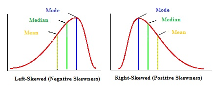
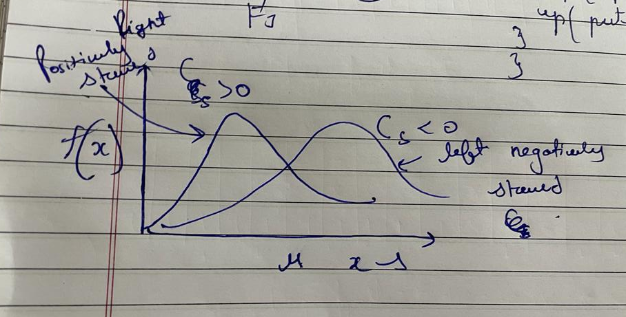
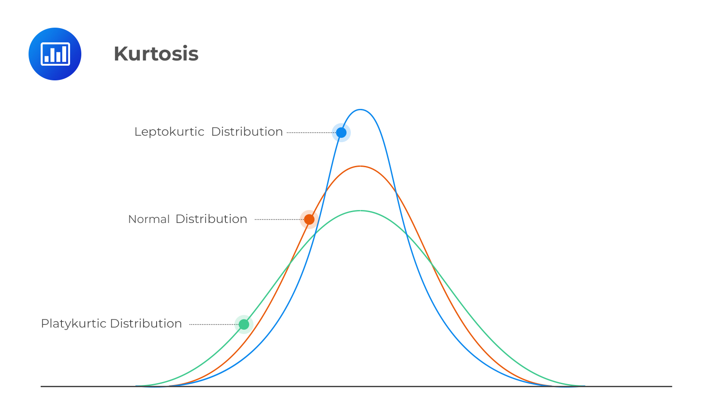
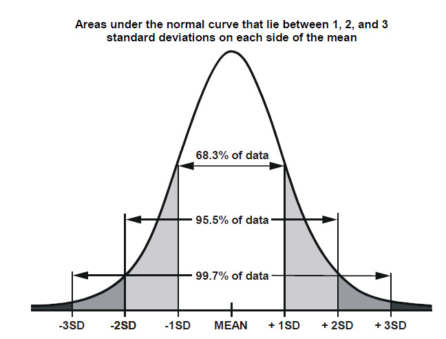
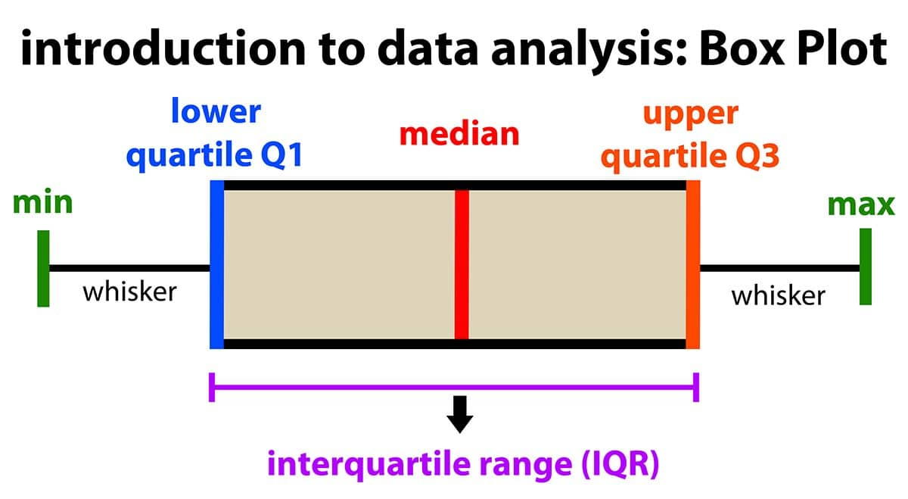

- [Statistics](https://www.geeksforgeeks.org/introduction-of-statistics-and-its-types/) is a branch of mathematics dealing with the collection, analysis, interpretation, and presentation of masses of numerical data. It is basically a collection of quantitative data.
- #### Types of Applied Statistics
	- **Descriptive Statistics** : Descriptive statistics is a term given to the analysis of data that helps to describe, show and summarize data in a meaningful way. It is a simple way to describe our data. Descriptive statistics is very important to present our raw data ineffective/meaningful way using numerical calculations or graphs or tables. This type of statistics is applied to already known data.
	- **Inferential Statistics :** In inferential statistics, predictions are made by taking any group of data in which you are interested. It can be defined as a random sample of data taken from a population to describe and make inferences about the population. Any group of data that includes all the data you are interested in is known as population. It basically allows you to make predictions by taking a small sample instead of working on the whole population.
- |Descriptive |Inferential|
  |--|--|
  |Organizing and summerizing Using numbers and graphs|Uses sample data to make an inference or draw a conclusion of population |
  |It helpes in organizing , analayzing , and to present data in meaningful manner .|It allows us to compare data , and make hypotheses and predictions|
  |It explains already known data and is limited to a sample or population having a small size . |It attemps to reach the conslusion about the population .|
  |It can be achieved with tthe help of charts , graphs , tables , etc . |Uses probability to determine how confident we can be that the conclusion that we made is correct .|
- #### Quantitative and Qualitative variables
	- Variables whose value results from counting or measuring something are called ^^Quantitiative.^^
	  Examples : height , weight , number of items sold to a shopper .
		- #+BEGIN_NOTE
		  There are two types of Quantitative variables :
		  1. Discrete : Number of cats , Number of cars.
		     Counted 
		  2. Continuous : Weight of students , Distance , height . 
		      Measured
		  #+END_NOTE
	- ^^Qualittive variables :^^
		- Variables that are not measurement variables. Their values do not result from measuring or counting.
		  Examples : hair color , religion , political parity , professsion .
- #### Measure of Centralization and Quartiles
	- Mean  : \sum \(\frac{x f }{n}\)
	  :LOGBOOK:
	  CLOCK: [2022-09-11 Sun 15:23:28]
	  :END:
	  Same formula for sample mean
	- Variance = S^{2} = \sum \(\frac{(x_{i} - mean)^{2}  }{n -1}\)
	  
	  #+BEGIN_IMPORTANT
	  Another formula for Variance : 
	  \begin{equation}
	   {  \sigma    }^{ 2  }   =   \sqrt[   ]{  \dfrac{  \left( n \cdot   \displaystyle\sum_{   }^{   } \left(f { \left( { x  }_{ i  }   \right) }^{ 2  }   \right)  - \displaystyle\sum_{   }^{   } \left( {  \left( f { x  }_{ i  }    \right)    }^{ 2  }   \right)    \right)    }{ n \cdot   \left( n-1  \right)    }    \phantom{\tiny{!}}}   
	  \end{equation}
	  #+END_IMPORTANT
	- Standard Deviation :
	  \begin{equation}
	  S_{x} = \sqrt{Variance}
	  \end{equation}
	- Range : 
	  The formula  for range is simply = Highest Observation - Lowest Observation
	- **Mean Absolute Deviation** : defined as the average deviation between the mean and the data value . 
	  1. Calculate the mean of the given data 
	  2. Determine the difference between each data value  and the mean 
	  3. Now , take the absolute value of each obtained difference 
	  4. Finally , find the mean of these differences .
- #### Probability Distribution
	- It is the relationship between the values of Random Variabes and its associated probabilites .
	- **Random Variable** : Real value of random experiment is called random variable .
	  **Discrete Random Variable** :
		- When the real value of random experiment is finite .
		- **Continuous Random Variable :** 
		  When the real value of random experiment is infinite i.e in decimals .
- #### Cumulative Distribution Function
	- It is the cumulative of the probability corresponding to a value or less than that particular value .
	- CDF and PDF both are same things
	- Cumulative distribution function is never less than zero . 
	  \begin{equation}
	   { F  }_{ x  }   \left( x  \right)   >   =  0  , 0 <   =   { F  }_{ x  }   \left( x  \right)   <   =  1 
	  \end{equation}
	- Cumulative distribution function is always increasing function .
	- Relationship between the values of R.V and the cumulative Probability .
	  
	  #+BEGIN_NOTE
	  The below formula if for discrete Random Variables . 
	  #+END_NOTE
	- \begin{equation}
	  F \left( X <   =  x  \right)   =  F \left(  { x  }_{ i  }    \right)   =   \displaystyle\sum_{ j =  1  }^{ j  } \left(P \left(  { x  }_{ j  }    \right)   \right)   
	  \end{equation}
	- **Probability Density Function** : 
	  Denoted By : 
	  \begin{equation}
	   { f  }_{ x  }   \left( x  \right)   
	  \end{equation}
		- The range of pdf is always 0 to 1 .
		- Total Area of PDF is 1 . 
		  \begin{equation}
		  1 =   \displaystyle\int_{ - \infty    }^{ + \infty    }  { f  }_{ x  }   \left( x  \right)    d \left(x \right)   
		  \end{equation}
	- **Continuous Random Variable** : In the case of CRV we cannot represent the variable with a single value . The representation of RV is done within a certain range .
	  For example : amount of rainfall we divide data into classes we use histogram . No of observation in each class represents absolute frequency .
	  \begin{equation}
	  F \left(  { x  }_{ i  }  - { x  }_{ j  }    \right)   =   \displaystyle\int_{  { x  }_{ i  }    }^{  { x  }_{ j  }    } f \left( x  \right)    d x    =  F \left(  { x  }_{ j  }    \right)  -F \left(  { x  }_{ i  }    \right)   
	  \end{equation}
	- **The Relation between CDF and PDF is **
	  The PDF is always the differentiation of CDF
	  \begin{equation}
	   { f  }_{ X  }   \left( x  \right)   =   \displaystyle\frac{d \left( { F  }_{ X  }   \left( x  \right)   \right) }{d x  }
	  \end{equation}
	  and vice versa .
- #### Statistics
	- are numbers Calculated from a sample which summarises its important characteristics 
	  Example : Measure of Central Tandency : mean.
	- **Mean** : 
	  It is first moment about the origin ( Location parameter).
	- **Population Mean For Continuous Random Variable **
	  \begin{equation}
	  { u  }_{ X  }   =  E \left( X  \right)   =   \displaystyle\int_{ - \infty    }^{ + \infty    } x \left(  { f  }_{ X  }   \left( x  \right)    \right)    d \left(x \right)   
	  \end{equation}
	- **Population Mean For Discrete Random Variable**
	  \begin{equation}
	  { u  }_{ X  }   =  E \left( X  \right)   =   \displaystyle\sum_{   }^{   } x    { P  }_{ X  }   \left( x  \right)   
	  \end{equation}
	- **Sample estimate mean** : 
	  \begin{equation}
	  \bar{x} =   \dfrac{ 1  }{ n  }   \displaystyle\sum_{ i =  1  }^{ n  } \left( { x  }_{ i  }   \right)   
	  \end{equation}
	- **Measures of Depression:**
	  Represents how widely the values of random variable are spread around like central value . 
	  Represented by variance this is second moment about the mean . 
	  **Population varience of continuous Random Variable**
	  \begin{equation}
	  E {  \left( X-u  \right)    }^{ 2  }   =   {  \sigma    }^{ 2  }   =   \displaystyle\int_{ - \infty    }^{ + \infty    }  {  \left( x-u  \right)    }^{ 2  }  f \left( x  \right)    d \left(x \right)   
	  \end{equation}
	  **Population varience of Discrete Random Variable** 
	  \begin{equation}
	  E \left( X  \right)   =   {  \left( x-u  \right)    }^{ 2  }   =   {  \sigma    }^{ 2  }   =   \displaystyle\sum_{ i =   { 1  }^{   }    }^{ n  }  \left(  {  \left(  { x  }_{ i  }  -u  \right)    }^{ 2  }   { p  }_{ i  }    \right)        
	  \end{equation}
	- **Sample estimate of varience**
	  \begin{equation}
	   { S  }^{ 2  }   =   \dfrac{ 1  }{ n-1  }   \displaystyle\sum_{ i =  1  }^{ n  }  \left(  {  \left(  { x  }_{ i  }  - \bar{x} \right)    }^{ 2  }    \right)      
	  \end{equation}
	- **Cofficient of Variability** :
	  It is the dimensions measure of variability .
	- \begin{equation}
	  C.V =   \dfrac{  \sigma    }{  \mu    }   
	  \end{equation}
	  
	  #+BEGIN_NOTE
	  For Sample : 
	  \begin{equation}
	  C.V =   \dfrac{  \sigma    }{  \bar{x}    }   
	  \end{equation}
	  #+END_NOTE
	- **Measure of symmetry** : Measure of the symmetry of the distribution about the mean quantifies the skewness of the data . 
	  This is the third moment about the mean 
	  For continuous
	  \begin{equation}
	  E {  \left( x- { u  }^{   }    \right)    }^{ 3  }   =   \displaystyle\int{  {  \left( x-u  \right)    }^{ 3  }  f \left( x  \right)    }d \left(x \right)   
	  \end{equation}
	  For discrete 
	  \begin{equation}
	  E {  \left( x- { u  }^{   }    \right)    }^{ 3  }   =   \displaystyle\sum_{ i =  1  }^{ n  }  \left(  {  \left( x-u  \right)    }^{ 3  }  p \left(  { x  }_{ i  }    \right)    \right)      
	  \end{equation}
	- ^^Skewness^^ refers to a distortion or asymmetry that deviates from the symmetrical bell curve, or normal distribution, in a set of data.
	- **Cofficient of skewness** : is made dimensionless by dividing with sigma cube Represented by Gamma  \darr
	  \begin{equation}
	  G =   \dfrac{  \left(  \displaystyle\sum_{   }^{   }  \left(  {  \left(  { x  }_{ i  }  - \bar{x}  \right)    }^{ 3  }    \right)       \right)    }{  \left( n-1  \right)   \cdot   { S  }^{ 3  }    }   
	  \end{equation}
	  
	  #+BEGIN_NOTE
	  For Sample 
	  \begin{equation}
	  { C  }_{ s  }   =   \dfrac{  \displaystyle\sum_{ i =  1  }^{ n  }  \left(  {  \left(  { x  }_{ i  }  - \bar{x}  \right)    }^{ 2  }    \right)       }{  \left( n-1  \right)   \left( n-2  \right)   { S  }^{ 3  }    }   
	  \end{equation}
	  #+END_NOTE
	  s is the standard deviation
	- Positively and Negatively Skewed PDF's
		- **Positive skewness :** Distribution is positvely skewed when there is a higher number of smaller data . 
		  
		  **Negatively skewness :** Distributiono is negatively skewed when there is higher number of larger data .
		  
	- **Measure of Peakness :** Standard Fourth population moment about the mean 
	  Kurtosis refers to the degree of flatness or peakness in the region of a curve . 
	   
	  Measure of Kurtosis 
	  \begin{equation}
	   {  \beta    }_{ 2  }   =   \dfrac{  {  \mu    }_{ 4  }    }{  {  \sigma    }^{ 2  }    }   
	  \end{equation}
	  \mu is the mean 
	  \mu_{4} forth moment about the mean 
	  \sigma is the standard deviation
	- if  
	  \begin{equation}
	  {  \beta    }_{ 2  }  > 3 
	  \end{equation}
	   then curve will be ^^lepotokurtic^^   , 
	  if  
	  \begin{equation}
	  {  \beta    }_{ 2  }  = 3 
	  \end{equation}
	   then curve will be ^^mesokurtic^^  , 
	  if  
	  \begin{equation}
	  {  \beta    }_{ 2  }  < 3 
	  \end{equation}
	   then curve will be ^^platykurtic^^ ,
	- #+BEGIN_NOTE
	  We can also write \mu_{2} instead of \sigma which is standard deviation 
	  #+END_NOTE
	-
	-
- #### Discrete Distribution
	- **Binomial Distribution**
	  A frequency distribution of the possible number of successful outcomes in a given number of trials in each of which there is the same probability of success.
	  **Formula** :
	  \begin{equation}
	   { P  }_{ n  }   =  \tbinom{n}{x} { p  }^{ x  }   { q  }^{ n-x  }   
	  \end{equation}
	  
	  #+BEGIN_NOTE
	  p = probility of occurrance of event
	  q = probability of an event not occurring  
	  #+END_NOTE
	  Probability of ocurrence of an event r or fewer times in n successive trials can be found out as cumulative binomial probability . 
	  \begin{equation}
	  P \left( x <   =  n  \right)   =   \displaystyle\sum_{ r =  0  }^{ r  } \left(\tbinom{n}{r} \cdot   { p  }^{ r  }   { q  }^{ n-r  }   \right)   
	  \end{equation}
	  
	  #+BEGIN_IMPORTANT
	  Mean =
	   \begin{equation}
	   \mu   =  np 
	  \end{equation}
	  Varience  = 
	  \begin{equation}
	  npq 
	  \end{equation}
	  Standard Deviation = 
	  \begin{equation}
	   \sqrt{ npq  \phantom{\tiny{!}}}   
	  \end{equation}
	  #+END_IMPORTANT
	- **Exponential Distribution** : 
	  Used to determine the length of time interval between ocurrance of the event of the event ( e.g flood , probability of bus arriving after 2 minutes of waiting )
	  \begin{equation}
	  f \left( x  \right)   =   \lambda   { e  }^{ - \lambda  x  }   
	  \end{equation}
	  Cumulative distribution function 
	  \begin{equation}
	  f \left( x  \right)   =   \lambda   { e  }^{ - \lambda  x  }   
	  \end{equation}
	  
	  #+BEGIN_IMPORTANT
	  Mean = 
	  \begin{equation}
	  \dfrac{ 1  }{  \lambda    }   
	  \end{equation}
	  Varience = 
	  \begin{equation}
	  \dfrac{ 1  }{  \lambda    }   
	  \end{equation}
	  #+END_IMPORTANT
	- **Gamma Distribution** :
	  It is a continuous distribution
	  Used to determine the time at the nth event , if n = 1 , the corresponding gamma . Distribution is given by exponential distribution . 
	  \begin{equation}
	  f \left( x  \right)   =   \dfrac{  \left(  {  \lambda    }^{ n  }   \cdot   { x  }^{ n-1  }   \cdot   { e  }^{ - \lambda  x  }    \right)    }{   \left( n-1  \right)    !    }   
	  \end{equation}
	  
	  #+BEGIN_NOTE
	  x > 0 , \lambda > 0 , x = 0 ,  1 ,  2 ,  .....
	  #+END_NOTE 
	  Used for wait time modeling , service time , modeling , reliability modeling .
	- Mean : 
	  \begin{equation}
	  E \left( x  \right)   =   \dfrac{  \alpha    }{  \lambda    }   
	  \end{equation}
	  Varience : 
	  \begin{equation}
	  Var \left( x  \right)   =   \dfrac{  \alpha    }{  {  \lambda    }^{ 2  }    }   
	  \end{equation}
	- Z = Waiting time 
	  Z ~ Gamma(n,\lambda) where n denotes the no of poisson events we are waiting for occurrence
	-
	- #### Normal Distribution
		- Most common and widely used distribution because of its relavance to many characteristics like weight , height , etc . 
		  Symmetric bell shape curve 
		  Distribution is symmetric about the mean mu
		  central line represents the mean 
		  Extend -infinite to infinite 
		  Tails never touch the horizontal access  
		  
		- **Properties** : 
		  1. Total area under the curve =  1  
		  2. The curve has a single peak -> x 
		  3. Because it is symmetric about the center its mean , median are same . 
		  4. Shape of curve depends upon the value of standard deviation .
		- Normal Distribution can be transformed to standard normal distribution by the formula .
		  \begin{equation}
		  z =   \dfrac{  \left( x-u  \right)    }{  \sigma    }   
		  \end{equation}
		  
		  #+BEGIN_NOTE
		  x : Random Variable 
		  \sigma : Standard Deviation
		  mu : mean 
		  z : Normal variate 
		  Z - No of standard deviation from x to mean . 
		  #+END_NOTE
		- It is normal distribution with mean = 0 and standard deviation = 1
		- Z_{score} tells us how many standard deviation away from the mean each value lies .
		- Any normal distribution can be converted to standard distribution by turning the individual values into the Z scores .
- #### Possion Distribution :
	- Limiting form of binomial distribution p - very small , n - very large , np = constant .
	  Formula :
	  \begin{equation}
	  P \left( X =  x  \right)   =   \dfrac{  \left(  {  \lambda    }^{ x  }   \cdot   { e  }^{ - \lambda    }    \right)    }{  x  !    }   
	  \end{equation}
	  Mean : \lambda
	  Variance : \lambda
- #### Box Plot
	- 
	  Steps to calculate the boxplot 
	  1. First you have to arrange the data in ascending form . 
	  2. Calculate the median .
	  3. Q_{2} is the median of the whole data and Q_{1} is the median of the half part , Q_{3} is the median of the rest half part .
	  4. Check for outliers **Higher Outlier** : Q_{3} + [1.5 * IQR] , **Lower Outlier** : Q_{1} - [1.5 * IQR]
	  5. Find the minimum and the maximum value form the given data .
	  \begin{equation}
	  IQR = Q_{3} - Q_{1}
	  \end{equation}
	  
	  #+BEGIN_NOTE
	  The maximum and minimum value is not the higher or lower outlier , 
	  If their is no lower outlier than leave the place empty . 
	  #+END_NOTE
	- #+BEGIN_NOTE
	  Any Value Higher than the Higher outlier can be the Higher Outlier ,
	  Any Value Smaller than the Lower Outlier can be the Lower Outlier 
	  #+END_NOTE
- #### Hypothesis Testing
	- **Hypothesis :** Quantitative Statement about the population , A promise or a claim that we want to test .
	- **Null Hypothesis :** It is a claim or statement which is assumed to be true until it is declared as false Represented by H_{0}
	- **Alternate Hypothesis :** Any Hypothesis which is complimentary to null hypothesis , Also called research hypothesis , Represented by H_{1}
	- Left Tail 
	  \begin{equation}
	   { H  }_{ 0  }   =   {  \mu    }_{ x  }   =   {  \mu    }_{ 0  }    ,    
	   { H  }_{ 0  }   =   {  \mu    }_{ x  }   <  {  \mu    }_{ 0  }   
	  \end{equation}
	- Two tail 
	  \begin{equation}
	   { H  }_{ 0  }   =   {  \mu    }_{ x  }   =   {  \mu    }_{ 0  }  , 
	   { H  }_{ 0  }   =   {  \mu    }_{ x  }   \ne {  \mu    }_{ 0  }     
	  \end{equation}
	- Right Tail 
	  \begin{equation}
	   { H  }_{ 0  }   =   {  \mu    }_{ x  }   =   {  \mu    }_{ 0  }   , 
	   { H  }_{ 0  }   =   {  \mu    }_{ x  }   >  {  \mu    }_{ 0  }   
	  \end{equation}
	- #+BEGIN_TIP
	  \begin{equation}
	  \bar{x} 
	  \end{equation}
	  Sample Mean and 
	  \mu is the population mean 
	  #+END_TIP
	-
	- \begin{equation}
	  Z_{tabulated} < Z_{calculated}
	  \end{equation}
	  In the above case we reject the null hypothesis .
	- \begin{equation}
	  Z_{tabulated} > Z_{calculated}
	  \end{equation}
	  In the above case we accept the null hypothesis .
	- #### Level of Significance
		- Defined as the fixed probability of wrong elimination of null hypothesis . 
		  It is stated as the probabillity of type 1 error .
		  Denoted by 
		  \begin{equation}
		  \alpha
		  \end{equation}
		-
- #### Type 1 and Type 2 error
	- When we are testing null hypothesis against the alternative hypothesis : 
	  1. H_{0} accepted when H_{0} is true . 
	  2. H_{0} rejected when H_{0} is true ( Type 1 error ).
	  3. H_{0} accepted when H_{0} is false ( Type 2 error ).
	  4. H_{0} rejected when H_{0} is false .
	- **Probability of Type 1 error is** : 
	  \begin{equation}
	  \alpha
	  \end{equation}
	- **Probability of Type 2 error is :** 
	  \begin{equation}
	  \beta
	  \end{equation}
	- #+BEGIN_NOTE
	  Type 2 error is more severe than Type 1 error 
	  #+END_NOTE
	- \beta : probability to accept H_{0} when it is false .
	- **Power of Test** : Rejecting the null hypothesis when it is false ( 1 - \beta)
	  1 - \beta value is near to 1 then the test is working quite fine 
	  1 - \beta value is near to  0 then the test is not working fine
- #### Z - test
	- If  Sample size n >= 30 then test statistics 
	  \begin{equation}
	  Z =   \dfrac{  \left( \bar{x}- \mu    \right)    }{  {  \sigma    }_{ \bar{x}  }    }   
	  \end{equation}
	- \begin{equation}
	  {  \sigma    }_{ \bar{x} }   
	  \end{equation}
	  Denotes the Standard error of mean
- #### P-value method
	- **P - Value** : it is the probability of getting the value of our test statistic if the null hypothesis is true . 
	  The lower the p - value , the stronger is the evidence that the null hypothesis is false .
	- The value of p always lie between 0 and 1 
	  
	  #+BEGIN_NOTE
	  High p - Value means that null hypothesis would not be rejected . 
	  Low p - Value means that null hypothesis would be rejected . 
	  #+END_NOTE
	- Find the value of p from table .
	- We will compare the value of p with the level of significance 
	  If the p - Value <  0 .05  ( \alpha = 0.05): 
	  Reject the null hypothesis 
	  If the p -  Value > 0.05 ( \alpha = 0.05): 
	  Do not reject the null hypothesis