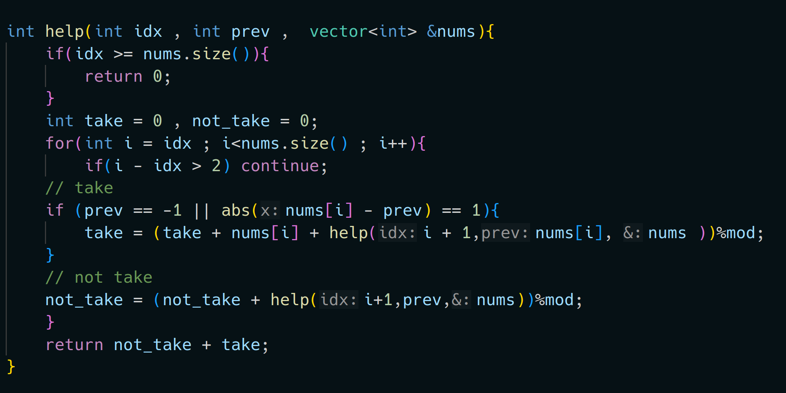

- Dynamic Programming is mainly an optimization over plain [recursion](https://www.geeksforgeeks.org/recursion/).
  The idea is to simply store the results of subproblems, so that we do not have to re-compute them when needed later.
  This simple optimization reduces time complexities from exponential to polynomial .
- **Ways to perform Dynamic Programming **
	- Tabulation
		- Bottom Up Dynamic Programming i.e Base case to required answer .
	- Memorization
		- Top Down Dynamic Programming
		- We tends to store the value of sub problems in a map/table
- #+BEGIN_NOTE
  Avoid using global variables while computing 
  #+END_NOTE
- ^^Space Optimization^^
	- We can do space optimization in dp tabulation only when ,we are computing something like previous state of the dp set i.e we do not require dp values other then the previous ones .
	  It can be done using various ways
		- Creating prev variables
		- Creating a fixed size array
- ### Sum of Good Subsequences
	- You are given an array, your task is to find good sub sequences where any two consecutive elements have exactly difference of 1.
	- #### Approach
		- Try Brute force
		  logseq.order-list-type:: number
			- 
			  logseq.order-list-type:: number
			  This try was hilarious for everyone except me.
			  Couldn't even passed the test cases.
			- logseq.order-list-type:: number
		- Optimal DP 
		  logseq.order-list-type:: number
			- Example : [1,2,1]
			  logseq.order-list-type:: number
			- logseq.order-list-type:: number