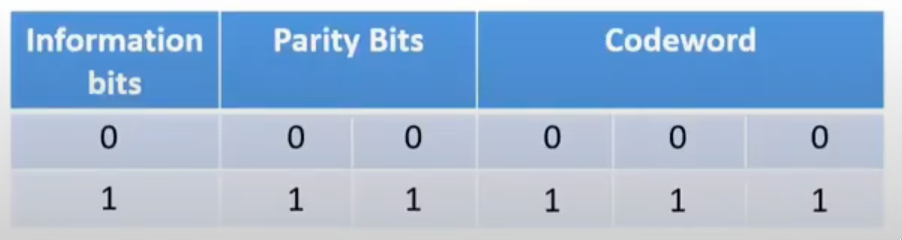
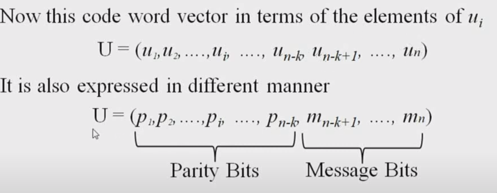
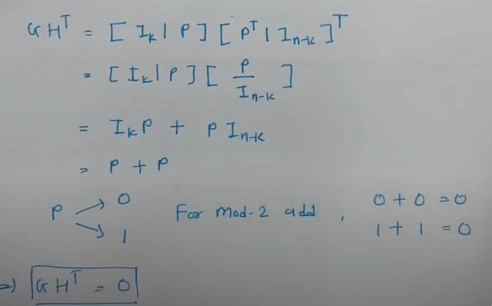
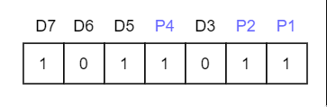
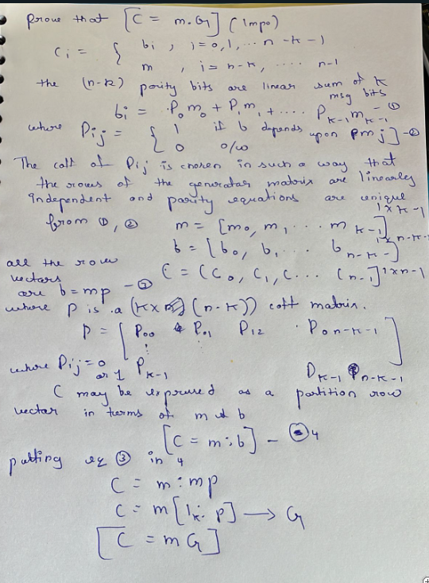
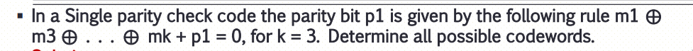

- ### Basic of Channel and Code Word
	- Any Information Contains bits 
	  \begin{equation}
	  n =  k+r 
	  \end{equation}
	  Where n is the total number of bits 
	  k is the no of information bits 
	  r is Redundant Bits
	- Every channel has an upper limit on the rate at which information can be transmitted reliably through channel , this limitation of channel capacity to transmit information is referred as ^^CHANNEL CAPACITY^^
	- Due to noise there will be error in transmitted bits at receiver side and to correct it we use block code .
	- A block code is a set of words that has a well defined structure and where each word is a sequence of fixed no of bits .
		- Block code is used in channel encoder for error correction .
		- At Source encoder we do source decoding , where we reduce redundancy to improve bandwidth utilization .
	- **Basics of Block Code**
		- Information bits = k
		  i = [i_{1} , i_{2} , i_{3}, ... , .. , i_{k}]
		- Parity bits / Redundant Bits = r
		  p = [p_{1} , p_{2}, p_{3} , ... p_{r}]
		- Total bits of code , n = k + r 
		  n = [i_{1} , i_{2} , i_{3}, ... , .. , i_{k} , p_{1} , p_{2}, p_{3} , ... p_{r} ]
		- Block Code Representation 
		  (n,r)
		- Total code words required as per n Block codes = 2^{n}
		- Total Code words required as per k information = 2^{k}
		- Total redundant code words required as per r parity bits = 2^{n} - 2^{k}
	- ### Single Parity Check Code
		- There are a class of error detecting block codes that provides simplest form of error control , In this the codes uses a single parity bit to generate codewords with even or odd parity .
		- In ( n , k ) block codes , information bits are k 
		  i = [ i_{1} , i_{2} , i_{3} , ... i_{k}]
		- for even parity bit P = i_{1} + i_{2}+i_{3} ...... i_{k}
		- #+BEGIN_NOTE
		  Here + is modulo 2 addition
		  #+END_NOTE
		- Codeword = [ i_{1} , i_{2} , i_{3} .... i_{k} , P]
		- To determine whether received codeword is correct , we do check sum of received codeword
		  If V is the received codeword then 
		  V = [ V_{1} , V_{2} , V_{3} , .... V_{n}] 
		  S  = V_{1} + V_{2} + V_{3} + V_{4} ..... + V_{n}
			- Is S = 0 , for even parity
			- If S = 1 , for odd parity
	- ### Block Code for Product Code
		- As we know that in single parity check code have no error correction capability .
		- For even parity check just do modulo 2 addition
		- Fit we calculate the row parity , then column parity .
		- It is used to detect and correct one bit error .
		- It is only suitable for single bit error detection i.e does not work if multiple bit error is present .
		- Error correction can be achieved by combining two single parity check codes in the form of rectangular array .
	- ### Repetition Code
		- There are the codes that repeat information bits two or more times .
		- They are block codes in which the parity bits are set equal to single information bit and if the no of parity bits is 'n-1' then the code is referred to as ( n , 1 ) .
		- Parity bits are repeating information bits i.e we are repeating information bits as parity bits .
		- **Encoding Process**
			- 
		- **Decoding Process**
			- It is done by ^^Majority Vote Decoding^^ .
				- If the no of zeros is more then we say received is zero bit information .
				- If the no of one's is more than we say received is one bit information .
				- Formula for majority vote decoding for V_{1} , V_{2} , V_{3}
				  \begin{equation}
				  I =   \left(  { V  }_{ 1  }   \cdot   { V  }_{ 2  }  + { V  }_{ 1  }   \cdot   { V  }_{ 3  }  + { V  }_{ 2  }   \cdot   { V  }_{ 3 }    \right)   
				  \end{equation}
		- Not useful for multiple bit error
		- **Majority Vote decoding** : It is the method of decoding based on the assumption that the largest number of occurrences of a symbol was transmitted symbol .
	- ### Linear Code
		- A block is said to be linear if its codewords satisfy the condition the sum of any two codewords gives another codeword .
			- \begin{equation}
			   { C  }_{ k  }   =   { C  }_{ 1  }  + { C  }_{ 2  }   
			  \end{equation}
			  Here Modulo 2 Addition
		- **Properties of Linear code**
			- The all zero word [ 0 , 0 , 0 , .... 0] is always a codeword .
			- Given any three codewords C_{i} ,  C_{j} , C_{k} 
			  C_{i} + C_{j} = C_{k} then D(C_{i} , C_{j}) = W(C_{k})
			  
			  #+BEGIN_NOTE
			  D => Distance between C_{i} , C_{j} , W=>Weight of Codeword C_{k} 
			  #+END_NOTE
			- Minimum Distance of the code [ d_{min} = W_{min} ]
			- #+BEGIN_IMPORTANT
			  W_{i} => no of one's in C_{i} ,
			  D_{min} => Minimum Hamming distance i.e C_{1} and C_{10} Differ at how many places . 
			  #+END_IMPORTANT
	- ### Systematic codeword
		- Block code in which the message bits are transmitted in unaltered form are called systematic codes .
		  Let m_{0}  , m_{1} , m_{n-1} 
		  Consitute a block of d message bits thus we have 2^{k} distinct messages . 
		  Let the sequence of message bits be applied to a linear block encoder producing n bits codeword whose elements are denoted by C_{0} , C_{1} , C_{2} ,...... C_{n-1} 
		  Let b_{0} , b_{1} ,...... b_{n-k-1} Denote the n- k parity bits in the codeword .
		- Structure of systematic codeword : 
		  b_{0} , B_{1} .... b_{n-k-1} | m_{n-k} ..... m_{n-1}
		- Parity bit can in the front or at the back .
		- Ci
			- bi => , i = 0 , 1  , ... n - k - 1
			- mi => i = n- k , ..... n-1 .
		- 
	- ### Systematic Generator matrix in Linear block code
		- A Generator matrix [G] = [I_{k} : P ] is said to be in a systematic form if the generates the systematic codewords .
			- [C] = [i] [G]
		- b = mp
		- 'C' may be expressed as a partition row vector in terms of the vector m & b as
			- c = [b:m] or c=[m:b]
			- putting b = m p
			- c = [mp : m]
			- c = m [ p : I_{k}]
			  Where I_{k} is the identiy matrix .
			- For Non systematic [G]
			  C = [i] [G]
			  Here [G] is not systematic
			- For Systematic [G]
			  C = [i][G]
			  Here [G] is systematic
		- #+BEGIN_NOTE
		  Please learn the derivation of ^^C=MG^^ from the class notes .
		  #+END_NOTE
	- ### Parity Check Matrix in linear block codes with examples
		- From Generator matrix [G] = [I_{k} | P] we can identify parity matrix .
		- We can use the parity check matrix to check codeword generated is valid of not .
		  If checking the received codeword V 
		  If vH^{T} = 0 then we sat codeword is valid .
		- By taking P^{t} we can make parity check matrix [H]
		- [H] = [P^{T} : I_{n-k }]
		- Parity check matrix is used at R_{x} to decode data .
	- Prove that GH^{T} and CH^{T} = 0
		- {:height 333, :width 520}
		- In the alove we have proved that GH^{T} is zero , then 
		  CH^{T} = [I][G][H^{T}]
		  = [i]0 = 0
	- In exam a question can come on conversion of systematic g to non systematic , then you need to do matrix operations .
	- Codeword = m1 m2 m3 c1 c2 c3
	- To find the codeword when generator matirx is given
		- V = u.G 
		  u is the one of the message from all the possible messages .
	- Systematic Block code : in (n,k) if either the first k digits or the last k digits of the output codeword is same as of the message then we say that the code is systematic block code .
- ### Error Syndromes
	- If the received codeword is ^^[Y]^^
	- then error syndromes 
	  ^^[S] = [Y] [H^{T}]^^
	- if v.H^{T} = 0 then v is valid otherwise error is present .
	- if error [E ] = 0 , [Y] = [C]
		- so [S] = [C][H^{T}] = 0
	- #+BEGIN_NOTE
	  When you are calculating the error remember to start form the left to right in the received codeword .
	  #+END_NOTE
- ### Hamming Code Basics
	- It is used to detect and correct error .
	- In Hamming code , we send data along with parity bits or redundant bits .
	- It is represented by ( n , k ) code.
	- To indentity parity bits , It should satisfy given condition
		- ^^2^{p} => p + k + 1^^
	- 
	- Then you need to find the position of the parity bits in the code .
	- Calculation of Parity bits
		- P1 : Check 1 and skip 1 bits  and after that take modulo 2 addition of the result .
		- P2 : Check 2 bits and skip 2 bits and after that take modulo 2 addition of the result .
		- P4 : Check 4 bits and skip 4 bits and after that take modulo 2 addition of the result .
		- After that you need to put the data bits into the place and parity bits in the place and you will get the hamming code for given data .
	- #### Hamming code error detection & error correction
		- First represent the given codeword into the block .
		- Calculate the parity for value for each parity bit and compare it with the value in the given codeword  .
		- If the value is different set 1 other wise set 0.
		- Then multiply the bit with the position of the parity bits , the result will be the position on which error is present .
		- Generate the error syndrome to correct it .
	- #+BEGIN_CAUTION
	   
	  Important derivation 
	  #+END_CAUTION
	- #### Capability of linear block code
		- D_{min} >= S + 1 
		  S : Error detection capability
		- D_{min} >= 2*t + 1
		  t : Error correction capability
		- Process : 
		  First you need to know the D_{min} and the find the value of s and t .
	- ### In Single bit parity check code
		- parity bit = m1 + m2 + m3 + ...... mk
		- Question can by asked that you are given k then determine the codewords .
		- {:height 47, :width 521}
		- When we need to find all possible code of  a linear block code 
		  Formula is V = u . G .
	- ^^Rate of code  : k / n^^
	- Sometimes we need to find syndrome look up  table : S = e.H^{T}
	- ^^r=v+e^^
	  r : received code word 
	  v : tranmitted code word
	  e : error code
- ### Cyclic Codes
	- A Binary Code is said to be Cyclic Code if it specifies two properties :
		- linearity Property : Sum of the two codeword is also a codeword
		- Cyclic Property : Any Cyclic Shift of a codeword is also a codeword
	- Suppose a Codeword a_{n-1} , a_{n-2} , ..... a_{1} , a_{0} .
	- The C(x) : a_{n-1} * x^{n-1} + a_{n-2}* x^{n-2} + ..... a_{0} * x^{0} .
	- #### Degree of polynomial
		- It is the largest power of x that has non zero cofficient .
		- G(x) which is the generator polynomial is represented as the polynomial equation with the degree n - k .
	- ### Generator Polynomial
		- It is that polynomial which is used to generate all the codeword polynomials for (n , k ) .