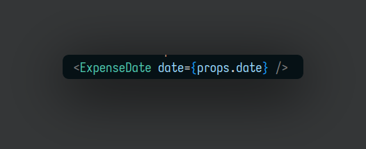
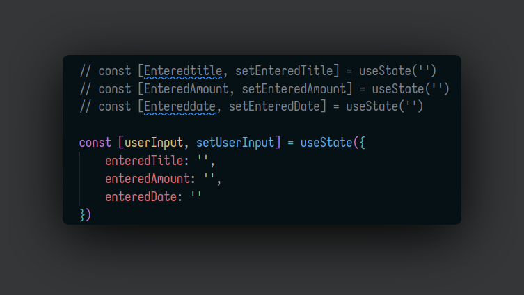
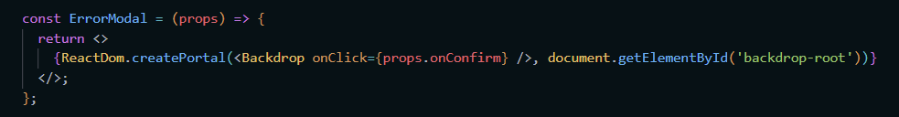

- ## React js
	- Javascript runs on browser - on the loaded page .
	- You can manipulate the HTML Structure of the page .
	- React js is client side javascript library .
	- All about modern , reactive user interfaces for the web .
	- We write code in a declarative , component-focused way .
	- #### Building SPA's
		- React can be used to control parts of HTML pages or entire pages .
		- It can also be used to control the entire frontend of the web-page .
		- There are two approaches
			- **Widget** approach some pages are still rendered and served by the back-end .
			- **SPA's** Server sends only on singe HTML page and then React takes control over the UI .
		- #+BEGIN_NOTE
		  There are also other UI libararies like React 
		  1. Angular uses typescript . 
		  2. Vue.js it is kind of a mixture of the react and angular . 
		  #+END_NOTE
	- #### JavaScript Refresher
		- let is used for variable values .
		- const is used for constant values .
		- If you try to change a constant value you will get an assignment to constant value error .
		- **Arrow Functions** 
		  ```
		  const myFun = () => {
		  	.....statements to be executed 
		  }
		  ```
		  This is the syntax for Arrow function .
			- If you are using only one argument in the function then you can remove the () brackets .
		- **Import**
			- ```
			  import person from './person.js'
			  import { clean } from './utility.js'
			  ```
		- **Export**
			- ```
			  export const person = ()  => {}
			  
			  or 
			  
			  const person = {
			  	name : 'Hello'
			  }
			  
			  export default person 
			  ```
			  The imports without { } refers to default import from that files .
			  The imports with { } are the named exports .
			- In named exports you can do alias by using as keyword where as in default exports you can name the import to what you want .
			  ```
			  import person from './person'
			  
			  import { ReactHello as rt } from './ReactHello'
			  
			  import * as everything from './everything' // this will import everything from the file with as alias of everything 
			  ```
			- In ES7 Constructor syntax is 
			  ^^myProperty = 'value'^^
			  You need to use this keyword to access myProperty everywhere in the class .
			- In ES7 Function syntax is 
			  myMethod = () => {....}
			- **Spread & Rest Operators**
				- Spread is used to split up array elements Or object properties .
				  ```
				  For example //
				  const newArray = [...oldArray,1,2]
				  ```
				- Rest is used to merge a list of function arguments into an array . 
				  ```
				  For example //
				  function sortArgs(...args){
				  return args.sort()
				  }
				  ```
			- **Destructuring**
				- Easily extract array elements or object properties and store them in variables .
				  ```
				  // Array Destructuring
				  
				  [a,b] = ['Hello','Max']
				  ```
			- Object and arrays are reference type while the others are primitive type .
			- **Array methods**
				- ^^.map()^^ calls a function once for each element in an array . 
				  ```
				  array.map((num) => {
				   return num*2;
				  })
				  ```
				  In this code we are just multiplying 2 with every element of the array .
	- #### React Basics & Working with Components
		- In react all user interfaces in the end are made up of components .
		- React allows you to create re-usable and reactive components consisting of HTML and Javascript ( and CSS ) .
		- ^^Components^^
			- These are the independent and reusable bits of code , They serve the same purpose as JavaScript functions , but work in isolation and return HTML .
			- It's just a javascript function only .
		- To create a new react app Syntax is 
		  ^^npx create-react-app [app-name]^^
		- ^^.createRoot^^ creates the main entry point of the entire user interface that you are about to build .
			- It tells React where this react app should be displayed on the page that is loaded i.e ( index.html )
			- **index.html** file is the only file that is loaded into the browser .
			- The react will display the components in the div tab inside the index.html .
			- #+BEGIN_NOTE
			  If you are importing another js file in the current js file then you can ommit ".js" 
			  #+END_NOTE
		- #### JSX
			- It stands for ^^Javascript-XML^^ .
		- The App is always the first component that is loaded into the index.html page .
		- App component is basically the root component for the application .
		- You need to export the function that you created int from the js file .
		- After importing the component you can use it as a normal html element inside your root component .
		- Syntax to include the custom function into the root component is 
		  ```
		  <Component_name></Component_name>
		  		or
		  </Component_name>
		  ```
		- The Component name starting with ^^capital letter are the custom made elements^^ where as the component made with the ^^small letter are original html element^^ using the component .
		- In the return statement you must have a root element .
		- So there is always a good practice to enclose the return statement with an empty div element tag .
		- While defining the class the syntax is : 
		  ^^className=""^^
		- To add non-hard coded values in the elements in react you can use ^^{variable_name}^^ where every you want to use them into the code .
		  
		- #### Passing Data with Props
			- When we want to pass a data from one component to another component basically to its child component then we do it with the help of ^^Props^^ in react .
			- We first pass the data as attribute in our custom component and then access it with ^^props.arrtibute_name^^ .
			- props stands for properties .
			- Syntax for passing arguments into component is : 
			  {:height 87, :width 341}
			  In this we are passing come array elements to same component .
			- To use this data into child component we need to add a parameter into the function , which will be an object that holds all the received attributes as properties .
			- You can name that object what ever you want but it is typically named **props**
				- This object holds every attribute value passed into component .
				- We get key value pairs in that object .
					- **Keys** will be the attribute name .
					- **Values** will be the values of that attribute name .
			- Now Syntax for using that data into child component is : 
			  
			- #+BEGIN_NOTE
			  The argument name passed in the parent component should be same as the key name which accessing props object keys . 
			  #+END_NOTE
			- ^^toLocaleString()^^ method returns a string with language-sensitive representation of this date . For example you want to get the month from a specific date  
			  {:height 112, :width 341}
			- #### Splitting components into Multiple-components .
				- When single component page code becomes too large to handle then we divide that page into smaller components ( by making sub-components ).
				- 
				  
		- #### Concept of Composistion
			- ^^props.children^^ is a special props , automatically passed to every component , that can be used to render the content included between the opening and closing tags when invoking a component .
			- props.children property refers to the child elements that are passed to a react component .
			- ^^children^^ is a reserved name in react .
			- ```
			  import "./Card.css";
			  
			   	 	
			  function Card(props) {
			      const classes = 'card ' + props.className
			      return <div className={classes}>{props.children}</div>;
			  }
			  
			  export default Card;
			  ```
			- ^^props.className^^ will return the passed  classnamed to the react components .
			- This is done to reduce code duplications .
			- ```
			  const App = () => {
			  	 // this is another way to declaring function in react/javascript . 
			  }
			  ```
	- ### React State & Working with Events
		- To add a piece of code that should work when the user click on a button 
		  First you need to define the piece of code into a function : 
		  
		  Secondly you need to add an onClick event on your jsx element : 
		  
		  Make sure to omit the () white using the function call here becuase we are only pointing to the function .
		- React is all about calling multiple function until there are no more functions left , once it is done react never repeats that .
		- We use state when we want react to know that some function call need to be updated .
		- We need to import useState from react library :
			- ```
			  import React, { useSate } from 'react'	
			  ```
			- ^^useState()^^ must always be called inside the main functions .
			- with useState we basically creates a variables which will leads to changes in that particular function component .
			- Therefore it requires an initial value
			- ^^useState()^^ return an array first element is value itself , and the second element is the updating function .
			- 
			  the title is pointing to the initial value . 
			  setTitle is a function that we can call in order to set that initial value to something different .
			- To update the value of the state : 
			  
			- ^^setTitle()^^ function will update that specific component with the updated value defined , it does not immedieatly changes the value right away but schedule the state update  .
			- If there is a component that is rendering multiple times in the parent component then the for each time the state is created but managed independently by react .
			- #+BEGIN_NOTE
			  
			  this is called object drilling in javascirpt  
			  #+END_NOTE
			- When there is requirement of multiple useState in a component then we can do this : 
			  
			  
			- When every we are depending on some previous state in react then we 
			  
			  This is usefull in case of counter problems .
			- #### Two way blinding
				- implicitly enforcing that some value in the DOM is always consistent with react State , so that if we change the state we also change the input .
				- For example adding a sate variable as a value attribute in the input element , so that we can set the value of that input element as empty when the user performs the submit action .
			- #### Passing data to parent components
				- To communicate with the parent component we will create a custom function/handler in the parent component and pass its reference to the function to the child component , In the parent component we can call the function with ^^props.functionName(data)^^
				- For example:
				  ```
				  const saveExpenseDataHandler = (enteredExpenseData) => {
				          const expenseData = {
				              ...enteredExpenseData,
				              id: Math.random().toString()
				          }
				          console.log(expenseData)
				      }
				  ```
				  ```
				   <ExpenseForm onSaveExpenseData={saveExpenseDataHandler} />
				   
				   
				     props.onSaveExpenseData(expenseData) // calling the parent component function in the child component
				  ```
			- #### Lifting State UP
				- Sharing state is accomplished by moving it up to the common ancestor of the component that need it .
				- When we pass some data from the child component to the their ancestors with the help of props .
			- #### Uncontrolled and controlled components & Stateless and Stateful components
				- Those components that does not have internal state are called ^^stateless components^^ ( dumb components ) .
				- On the other hand other components that have an internal state are called ^^stateful components^^
		- ### Working with Dynamic content
			- Rendering List and conditional Statements .
			- #### Rendering List of Data
				- In JSX when we want to render some dynamic content we do it inside ^^{}^^ brackets .
				- When we want to render a components according to the no of elements in an array , we use ^^maps^^ .
				- 
				  for each element of the expenses array function is called with expense representing single element of each array .
				- To render the expenses dynamically we first create a dummy array to render some data initially .
				- With the help of useState we render the newly added data with the help of previousState .
			- #### Keys
				- Keys help us to understand which items have been changed , are added , or removed .
				- If keys are not specified then the components which are rendering with map function may give an error if they are stateful components .
				- To uniquely identify each and every component we are rendering .
				-
				- ```
				   {props.expenses.map((expense) => (
				                      <ExpenseItem
				                          key={expense.id}
				                          title={expense.title}
				                          amount={expense.amount}
				                          date={expense.date}
				                      />
				                  ))}
				  ```
				- #+BEGIN_NOTE
				  If you want to show only the selected expenses from the dropdown menu then you can use :
				  {:height 206, :width 581} 
				  This will filter the expense according to the filter selected in the drop-down menu . 
				  The ^^filter^^ method always returns a new array . 
				  #+END_NOTE
			- #### Outputting Conditional Content
				- When can out the content with the conditional statements with help of operators and {}.
				- We can also store jsx content in variables .
			- #### Adding dynamic styles
				- When we add some style in react we use {} to output something dynamically .
				- In react when we are adding some style to a react component then those css syntax that has  - in between like ^^background-color is replaced with backgroundColor^^
				- 
				- ```
				  const datapointsValue = props.datapoints.map(datapoint => datapoint.value)
				      const totalMaximum = Math.max(...datapointsValue)
				  ```
				  In the above example first we are getting and array of values of datapoints then after destructuring them to get the totalMaximum value .
		- ### Styling React Components
			- We can over ride a styling of the component by using conditional statements in the arguments of the components :
			  ```
			   <label style={{ color: !isValid ? 'red' : 'black' }}>Course Goal</label>
			          <input type="text" style={{ borderColor: !isValid ? 'red' : '#ccc', background: !isValid ? 'salmon' : 'transparent' }} onChange={goalInputChangeHandler} />
			        </div>
			  ```
			- #### Setting CSS Classes Dynamically
				- First we need to create a separate class for the each components .
				- ^^<div className={`form-control + ${!isValid ? 'invalid' : ''}`}>^^
					- In this we use back tick's to add a conditional statement :
					  for example in the above statement we add ternary operator in the className to change the class name dynamically .
			- #### Introduction to styled components
				- Import a library named ^^styled-components^^
				- for pseudo selectors we can use & symbol :
				  ^^&:focus^^
				- ```
				  const Button = styled.button`
				     {
				    font: inherit;
				    padding: 0.5rem 1.5rem;
				    border: 1px solid #8b005d;
				    color: white;
				    background: #8b005d;
				    box-shadow: 0 0 4px rgba(0, 0, 0, 0.26);
				    cursor: pointer;
				  }
				  
				  &:focus {
				    outline: none;
				  }
				  
				  &:hover,
				  &:active {
				    background: #ac0e77;
				    border-color: #ac0e77;
				    box-shadow: 0 0 8px rgba(0, 0, 0, 0.26);
				  }
				  `
				  ```
				  Here button is a function
				- When we want to handle the nested className we go represent the parent class with & symbol .
				- We can also send props to the styled components :
				  
				  
				  
			- #### Media queries
				- We can also add media queries same as the css .
			- #### Using CSS modules
				- Change your css fille name to name.module.css and 
				  ^^import styles from './name.module.css'^^
				  after that access the className as props from the css file .
				- Basically it creates a unqiue name for each and every class name to be unique .
				- To extract class name in css module syntax is :
				  ```
				  className={styles['form-control']}
				  ```
				- To add conditional statement :
				  ```
				  <div className={`${styles['form-control']} ${!isValid && styles.invalid}`}>
				  ```
		- ### Debugging in React Apps
			- {:height 185, :width 683}
			  In app.js two adjacent component are wrapped adjacent to each other so they must be enclosed in a root element .
		- ### Fragments , Portals and Refs
			- Remember you cannot return more than one JSX element , in react .
			  Because this is invalid in javascript also you cannot return more than one thing .
			  The solution for the above problem is by wraping the adjacent elements in a div .
			- ^^<div> soup^^ : when you have multiple nested div components .
			  this is not good practice .
			- #### Solution to div soup
				- Creating a wrapper component .
				- 
				  Now we can wrap all our adjacent components with this wrapper component because it is just a empty component which just return ^^props.children^^
			- In react there is a ^^React().fragment^^ which we can use instead of wrapper component .
			- You can also use ^^<></>^^ instead of React fragments .
			- #### React portals
				- When we want to render a component that is inside multiple nested components just after the root component then react portals came to use .
				- Portals provide a first-class way to render children into a DOM node that exits outside the DOM hierarchy of the parent component .
				- **Implementing a react portal** : 
				  1. Add a div in ^^index.html^^ file 
				  2. Then we create a const of the backdrop . 
				  3. With the help of the react DOM createPortal function render the particular div inside another div with a class name . 
				  {:height 94, :width 653}
			- #### Use Ref's
				- Ref allows us to access the other DOM elements and work with them .
				- It is used to store mutable values that does not cause a re-render when updated .
				- It can be used to access a DOM element directly .
				- For input elements you can use ref by passing them directly as arguments in the input element .
				- ^^ref={nameInputRef}^^
		- ### Effects , Reducers and Context
			- What are Effects ?
				- All the other thing like storing data in browser storage , sending http requests to backend servers .
				- To handle the side effects in react there are ^^useEffect()^^ : 
				  Syntax : 
				  ```
				  useEffect(() => {...} , [dependencies]);
				  ```
				  First argument contains the function that is executed after every component evaluation if specified dependencies changed . 
				  Second argument **Dependencies** : of this effect the functions only runs if the dependencies are changed .
				- #+BEGIN_NOTE
				  localStorage is the global object for the browser local storage , some of the methods are .setItem('key','value') . getItem('key') . 
				  #+END_NOTE
				- if we use useEffect without specifying the dependencies then the function will run only once .
				- Basically it is a part of code that should be executed in response to something .
				- #### CleanUp function in useEffect
					- Suppose we want to execute a query after sometime but not suddenly .
					- Clean up function runs before any side effect function execution and before the component is removed .
					- It does not run in the first side effect execution .
				-