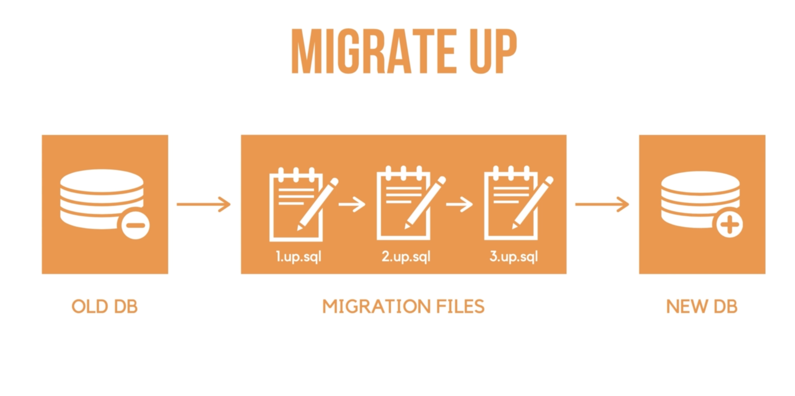

### Context
collapsed:: true
	- Tells the computer what to do next or when to stop something.
	- Best example would be high resource heavy computational API's which process lots of data or takes long time to gather the required data.
		- We could get a timeout for these API's with Go context.
	- We could also attach this context to the database in go and set a timeout for the  backend connection.
	- ```
	  	ctx, cnl_fn := context.WithTimeout(context.Background(), 5*time.Second)
	      defer cnl_fn()
	  	if err = db.PingContext(ctx); err != nil {
	  		return nil, err
	  	}
	  ```
	- ##### Purpose
		- Carry out deadlines.
		- Cancelling go routines.
		- Passing key value pairs using `context.WithValue(ctx ,"key","1234")`
	- We never mutate a  context we always create new context.
	- Passing context with Value in a middleware
		- ```
		   func (app *application) postsContextMiddleware(next http.Handler) http.Handler {
		  	return http.HandlerFunc(func(res http.ResponseWriter, req *http.Request) {
		  		postId, err := strconv.ParseInt(chi.URLParam(req, "postId"), 10, 64)
		  		if err != nil {
		  			app.internalServerError(res, req, err)
		  			return
		  		}
		  
		  		ctx := req.Context()
		  		post, err := app.store.Posts.GetById(ctx, postId)
		  		if err != nil {
		  			switch {
		  			case errors.Is(err, store.ErrNotFound):
		  				app.notFoundError(res, req, err)
		  			default:
		  				app.internalServerError(res, req, err)
		  			}
		  			return
		  		}
		  		ctx = context.WithValue(ctx, "post", post)
		  		next.ServeHTTP(res, req.WithContext(ctx))
		  	})
		  }
		  ```
		  At the bottom you can see the shallow copy of the context being passed to the next handler.
		-
- ### JSON
  collapsed:: true
	- When using json embedding in struct .
		- ```
		  type User struct {
		  	ID        int64  `json:"id"`
		  	Username  string `json:"username"`
		  	Email     string `json:"email"`
		  	Password  string `json:"-"`
		  	CreatedAt string `json:"created_at"`
		  }
		  ```
			- The password filed will be hidden and not be displayed in the JSON output.
			- #+BEGIN_NOTE
			  .PHONY command in make file is used to declare phony targets. A phony target is the one that doesn't represent a file or directory but instead is simply a name of the command or set of commands.
			  #+END_NOTE
		- ```
		  type UpdatedPostPayload struct {
		  	Title   string `json:"title" validate:"omitempty,max=100"`
		  	Content string `json:"content" validate:"omitempty,max=1000"`
		  }
		  ```
		  These will exclude the title key from struct if its empty and similarly it will exclude the content key if its empty.
		- #### Standardizing JSON
			- To make sure we get structured output from out api we could do.
			- ```
			  func (app *application) jsonResponse(res http.ResponseWriter, status int, data any) error {
			  	type resJSON struct {
			  		Data any `json:"data"`
			  	}
			  	return writeJSON(res, status, &resJSON{Data: data})
			  }
			  //JSON output like this
			  {
			      "data": {
			          "id": 3,
			          "title": "Yahoo Update hai boss 67 yahoo",
			          "content": "Nothing 3",
			          "user_id": 0,
			          "tags": [
			              "tag1",
			              "nard_dog"
			          ],
			          "created_at": "2024-11-15T17:11:30Z",
			          "updated_at": "2024-11-15T17:11:30Z",
			          "comments": []
			      }
			  }
			  ```
			-
	- #### Usage in API
	  collapsed:: true
		- It is better to create a separate readJSON and writeJSON method.
		- ```
		  package main
		  
		  import (
		  	"encoding/json"
		  	"net/http"
		  )
		  
		  func writeJSON(res http.ResponseWriter, status int, data any) error {
		  	res.Header().Set("Content-Type", "application/json")
		  	res.WriteHeader(status)
		  	return json.NewEncoder(res).Encode(data)
		  }
		  
		  func readJSON(res http.ResponseWriter, req *http.Request, data any) error {
		  	maxBytes := 1_048_578
		  	req.Body = http.MaxBytesReader(res, req.Body, int64(maxBytes))
		  	decoder := json.NewDecoder(req.Body)
		  	return decoder.Decode(data)
		  }
		  ```
			- `http.MaxBytesReader()` will throw an error if req.Body contains data greater the specified maximum bytes by the user.
			- `decoder.DisallowUnknownFields()` this will prevent the arbitrary values passed as key value pairs which decoding.
		-
	- #### Marshaling Json ( SQL )
		- When every time we do marshallings or unmarshallings slice we need to do this
			- `pq.Array(post.Tags))`
		-
	-
- ### DB Migrations
  collapsed:: true
	- Transferring the data from one database to another.
	- #### Up/Down Migration   SSSSS
		- 
		  collapsed:: true
			- The migration files will run sequentially in order.
		- Similarly in the migration down process certain statements will get executed in **order**.
		- During migration the dirty columns tell os that weather the last command has failed or not.
			- If **DIRTY** : FALSE
			  collapsed:: true
				- No problems in executing the commands.
			- Else
			  collapsed:: true
				- Some problem has occurred.
		-
- ### Error Handling
  collapsed:: true
	- Make sure to attach it the top of the application because we need all the dependencies.
	- ```
	  package main
	  
	  import (
	  	"log"
	  	"net/http"
	  )
	  
	  func (app *application) internalServerError(res http.ResponseWriter, req *http.Request, err error) {
	  	log.Printf("internal server error : %s : path %s : err : %s", req.Method, req.URL.Path, err.Error())
	  	writeJSONError(res, http.StatusInternalServerError, "server encountered a problem")
	  }
	  func (app *application) badRequestError(res http.ResponseWriter, req *http.Request, err error) {
	  	log.Printf("bad request error : %s :  path : %s err : %s", req.Method, req.URL.Path, err.Error())
	  	writeJSONError(res, http.StatusBadRequest, err.Error())
	  }
	  
	  func (app *application) notFoundError(res http.ResponseWriter, req *http.Request, err error) {
	  	log.Printf("not found error : %s : path : %s err : %s", req.Method, req.URL.Path, err.Error())
	  	writeJSONError(res, http.StatusNotFound, "not found")
	  }
	  
	  ```
	-
- ### HTTP Payload Validation
  collapsed:: true
	- We could do it naively with multiple if else condition.
	- #### Validator Package
		- **Steps**
			- `var validate *validator.Validate`
			  Instantiating a pointer varaiable.
			- ```
			  func init() {
			  	validate = validator.New(validator.WithRequiredStructEnabled())
			  }
			  ```
			  Initialize the validate.
			- ```
			  type CreatePostPayload struct {
			  	Content string   `json:"content" validate:"required,max=1000"`
			  	Title   string   `json:"title" validate:"required,max=50"`
			  	Tags    []string `json:"tags"`
			  }
			  ```
			  Just like this we can add validation with this.
		-
- ### Casting
  collapsed:: true
	- Assertion of a value
		- ```
		  func getPostFromCtx(req *http.Request) *store.Post {
		  	post, _ := req.Context().Value("post").(*store.Post)
		  	return post
		  }
		  ```
		  We are asserting that the value stored in the context is of type *store.Post.
	- ``````
- ### Concurrency
	- #### Optimistic concurrency
		- Implementing concurrency in any database using a timestamp or a version number.
		- We can compare the
	- #### Pessimistic concurrency
		-