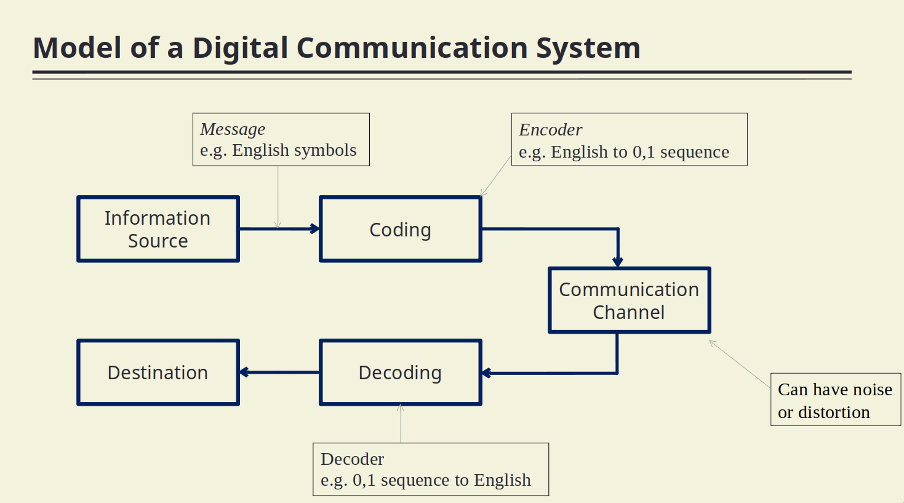
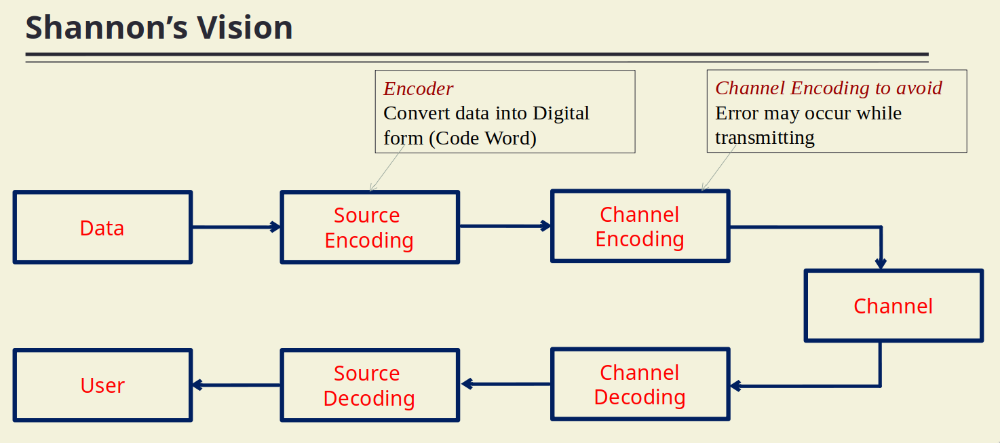

- The root of modern digital communication is given by Claude Elwood Shannon in 1948
- #### Digital Communication
	- All these channels have the common property is that >> the received signal is not the identical to the transmitted signal .
	  Becuase of the noise or other .. interference
		- #+BEGIN_NOTE
		  ^^Received Signal  = transmitted Signal + Noise^^
		  #+END_NOTE
		  But we require Received Signal = Transmitted Signal
		- 
		- 
		- #+BEGIN_NOTE
		  Zip => Source Encoding 
		  Unzip => Source Decoding
		  Add CRC = Channel Encoding
		  Verify CRC = Channel Decoding
		  #+END_NOTE
		- Information theory provides a quantitative measure of the information contained messages signals and allows us to determine the **capacity of a communication system** to transfer this information from source to destination .
		  **According to information theory** : 
		  1. Information uncertainty : an information source is modelled by a random variable . 
		  2. Information is digital : In Shannon's seminal paper , there are two fundamental .
		- We will study these information coding thoery : 
		  1. Measurement of Information [[Measurement of Information]] 
		  2. Source Coding Theory [[Source Coding]] 
		  3. Channel Coding Theory [[Error Detection & Correction]]