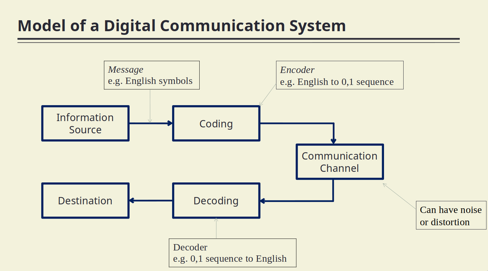
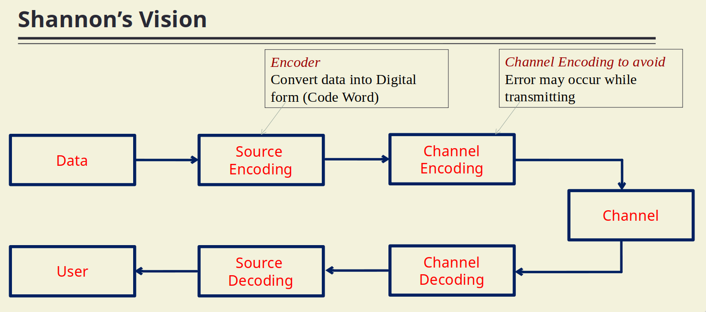

- The root of modern digital communication is given by Claude Elwood Shannon in 1948
- #### Digital Communication
	- All these channels have the common property is that >> the received signal is not the identical to the transmitted signal .
	  Becuase of the noise or other .. interference
		- #+BEGIN_NOTE
		  ^^Received Signal  = transmitted Signal + Noise^^
		  #+END_NOTE
		  But we require Received Signal = Transmitted Signal
		- 
		- 
-