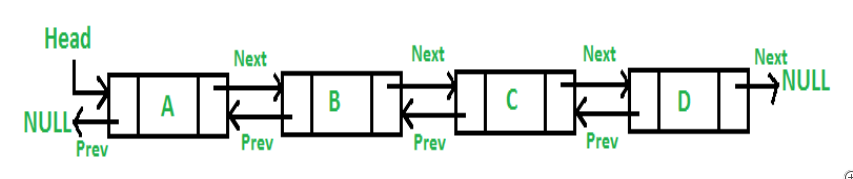
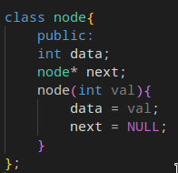
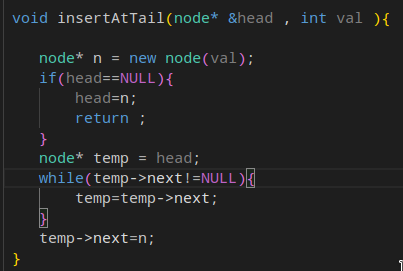
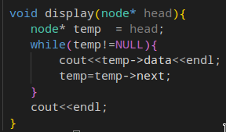
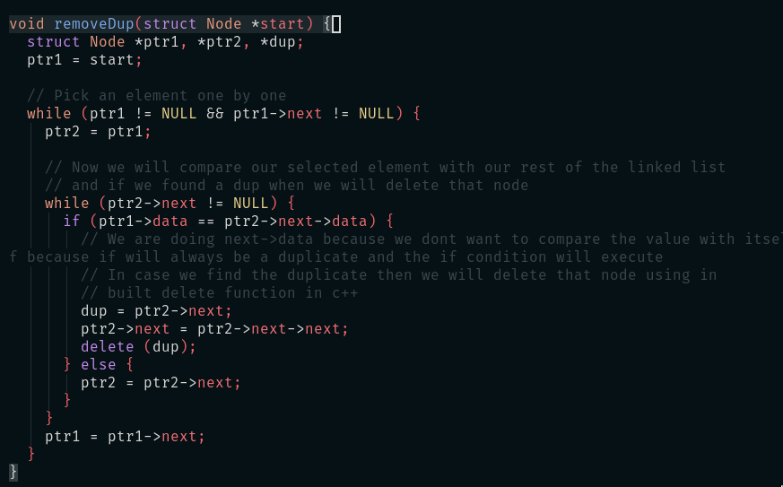
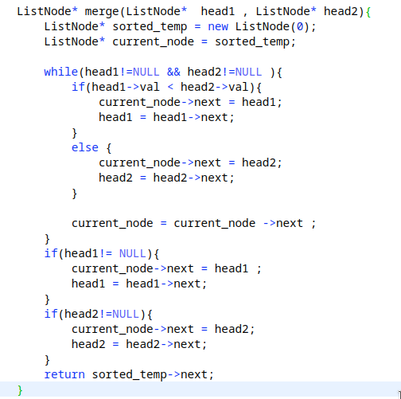

- A Linked list is a Data Structure that represents a  sequence of nodes . In a singly linked list , each node points to the next node in the linked list . A doubly linked list gives each node pointers to both the next node and the previous node . 
- Linked list does not provide constant time access to a particular "index" within the list . This means that if you'd like to find the kth element int the list you will need to iterate through k elements .
- #### Creating a Linked List
	- 
- #### Inserting a Node in the linked List
	- 
	  To Display Linked List 
- #### Remove Duplicates from linked list
	- First approach will be brute force approach in which we will run two loops  , the second loop will check if any duplicate value is present in the rest of the linked list when a specific element is selected from the first loop .
	  
- #### Sort Linked list using merge sort
	- [Problem Link](https://leetcode.com/problems/sort-list/submissions/)
	  1. In this problem we will do slow and fast pointer approach to find the middle of the linked list and then we will pass the left and right part of the linked list to the merge function which is 
- #### Remove the nth node from the linked list
	- 1. First we will create a dummy node and store head in it .
	  2. We will create two pointers slow and fast equal to the dummy node 
	  3. ^^fast = fast->next^^ till n+1 so that fast pointer reaches first , [] 
	  4. Do while loop till fast is not null , and then do slow = slow->next , fast = fast->next . 
	  5. Then we have got the reference the node , simply we will point the **slow->next = slow->next->next** and return our dummy_head->next; 
	  **Code :** \darr
	  ```
	    ListNode* removeNthFromEnd(ListNode* head, int n) {
	          ListNode* dummy_node = new ListNode(0);
	          dummy_node->next = head;
	          ListNode* fast = dummy_node;
	          ListNode* slow = dummy_node;
	          for(int i = 1 ; i<= n+1 ; i++){
	              fast = fast->next;
	          }
	          while(fast!=NULL ){
	              fast = fast->next;
	              slow=slow->next;
	          }
	          slow->next = slow->next->next;
	          return dummy_node->next;
	      }
	  ```
- #### Reverse a linked list
	- There are two methods to reverse a linked list \darr
	  1. **Iterative method** -> Think of reversing two nodes in a linked list , To solve the prove of lost pointer we will use a temp variable which will store the next node pointer , as we move forward in linked list we will simply increase our temp variable till it reaches the end of the linked list , In sort we will maintain three pointers curr , prev and temp :
	  ```
	  ListNode* reverseList(ListNode* head) {
	          ListNode* curr= head;
	          ListNode* prev = NULL;
	          while(curr!=NULL){
	              ListNode* temp = curr->next;
	              curr->next = prev ;
	              prev = curr ;
	              curr = temp;
	          }
	          return prev ;
	      }
	  ```
	- 2. __Recursive method -> We need to divide the linked into minimum subproblem, which is the si
- #### Merger Two sorted Linked list
	- **Alogrithm** -> 
	  1. First we will create a dummy node and then pointer the newly created node to an existing node . 
	  2. Then a While loop till both the given ListNode becomes null .  
	  3. Comparing the value of each sorted node from the two given lists.
	  ```
	  ListNode* mergeTwoLists(ListNode* list1, ListNode* list2) {
	          ListNode* dummy_node = new ListNode(0);
	          ListNode* temp_node = dummy_node;
	          while(list1!=NULL && list2!=NULL){
	              if ( list1->val < list2->val){
	                  temp_node->next = list1 ;
	                  list1=list1->next;
	              }
	              else{
	                  temp_node->next = list2;
	                  list2 = list2->next;
	              }
	              temp_node = temp_node->next;
	          }
	          if(list1!=NULL){
	              temp_node->next = list1;
	              list1=list1->next;
	          }
	          if(list2!=NULL){
	              temp_node->next = list2;
	              list2 = list2->next;
	          }
	          return dummy_node->next;
	      }
	  ```
-