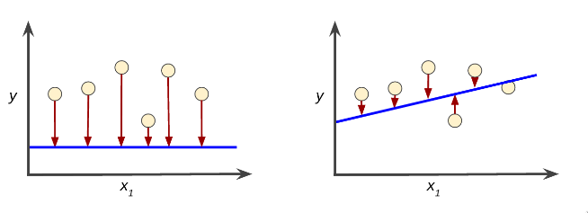

- ## What is machine Learning
	- ML System learn how to combine input to produce useful predictions on never-before seen data
	- #### Labels
		- It is the thing we are predicting
	- #### Features
		- It is the thing describing out data i.e input variable x .
	- #### Examples
		- It is a particular instance of a data
			- **Labeled example** : includes both features and the label .
			- **Unlableled example** : contains features but not the label .
	- #### Models
		- It is defined as the relationship between features and label .
		- **Training** : means creating or learning the model
		- **Inference** : Applying the trained model to unlabeled examples .
- #### Linear Regression
	- It is used to predict the value of a variable based on the value of another variable.
	  \begin{equation}
	  y =  mx+b
	  \end{equation}
	- \begin{equation}
	  { y  }^{ 1  }   =  b+ { w  }_{ 1  }   { x  }_{ 1  }   
	  \end{equation}
- ### Training and Loss
	- 
	  Figure 1 shows High loss ,Figure 2 shows low loss
-