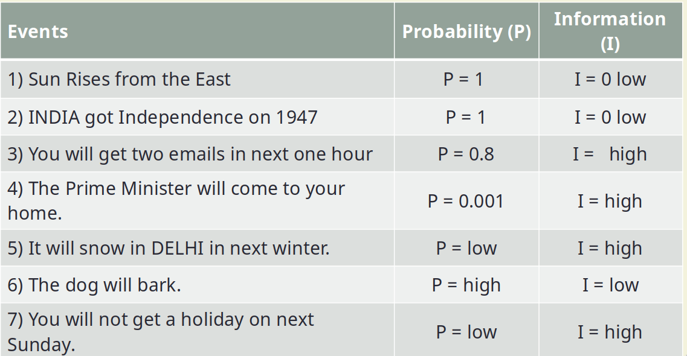
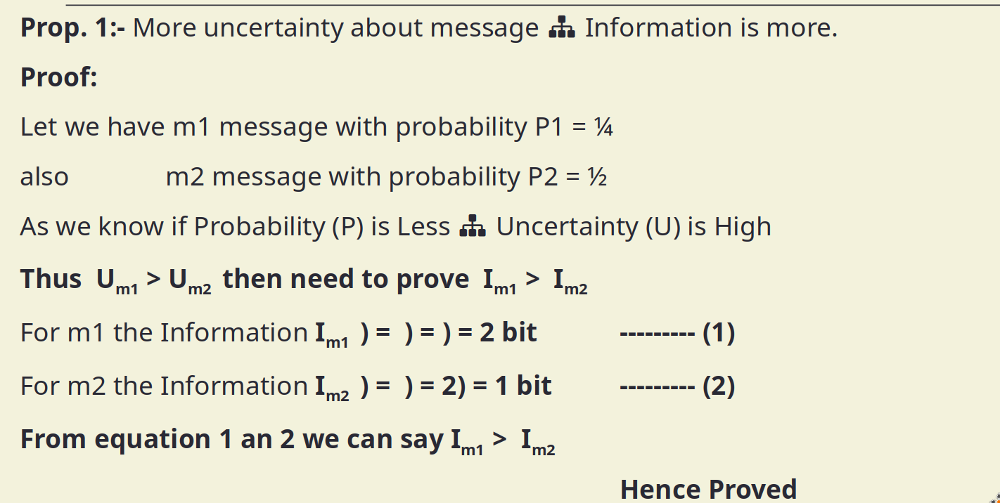
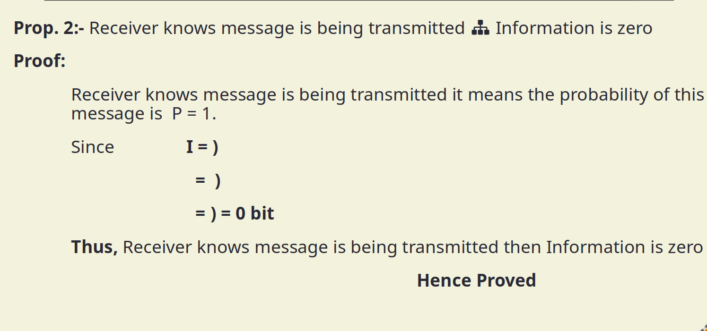
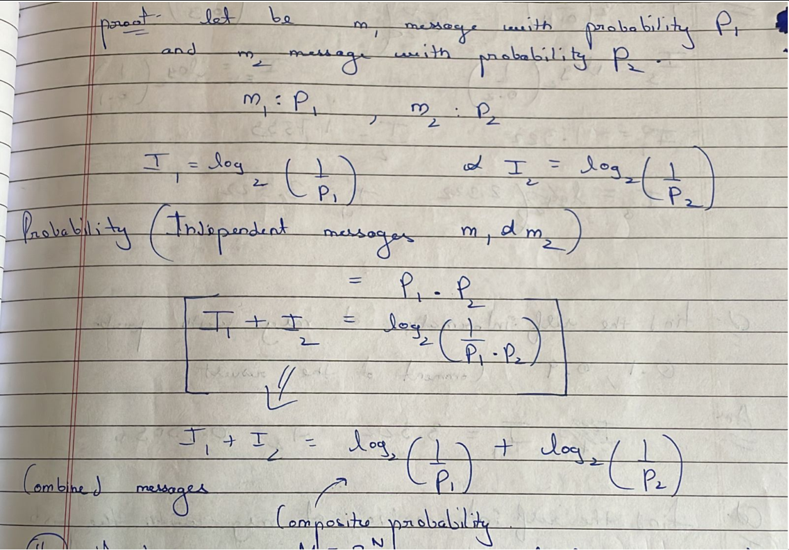

- **Information** can be defined as the amount of uncertainty that the receiver has about what is being sent .
  
  ^^Information = Amount of Uncertainty^^ or Amount of how  much you don't know or Amount of how much surprise .
	- 
	  
	  #+BEGIN_IMPORTANT
	  **Less Probability of happening  : High Information**
	  **Less Probability of happening : High Uncertainty**
	  #+END_IMPORTANT
		- The amount of information contained in an event is closely related to its uncertainty.
		  If an event has a probability of 1 then it conveys zero information . 
		     Functions of probability :
			- 1. Information should be proportional to the uncertainty ( Probability ) of an outcome 
			  2. Information contained in independent outcomes should add .
		-
	- Consider an Information Source emitting independent messages (Memory less Source) M = {m1, m2, …, mn} with probability of occurrence is P = {p1, p2, …, pn}.
	  Total probability of all messages will p1+p1+ … + Pn =  should be  1.
	  ^^I_{k}^^ => **Amount of information of message** or **Amount of surprise**
	- #### Properties of information
		- 1. More uncertainty about message Information is more .
		  2. Receiver knows message is being transmitted Information is zero 
		  3. If I_{1} is the information of message m1 and I_{2} of m2 the ( I_{1} + I_{2}) combined information by m1 and m2 . 
		  4. If there are M = 2^{N} equally likely messages , then amount of information carried by each message will be N bits .
		- Proof of 1 :
			- 
		- Proof of 2 :
			- 
		- Proof of 3 :
			- 
			- I_{k} = log_{2} \(\frac{1}{P_{k}}\)
		- Proof of 4 :
			- Since we have M equally likely messages then the probability of each messages is 1/M 
			  since I = log_{2}(1/P) = log_{2}(1/1/M) = log_{2}(M) = log_{2}2^{n}
	- #### Entropy
		- Average of information of the messages transmitted by source
-