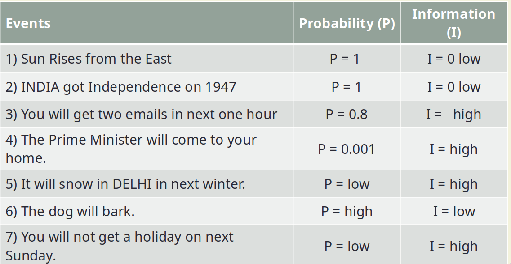
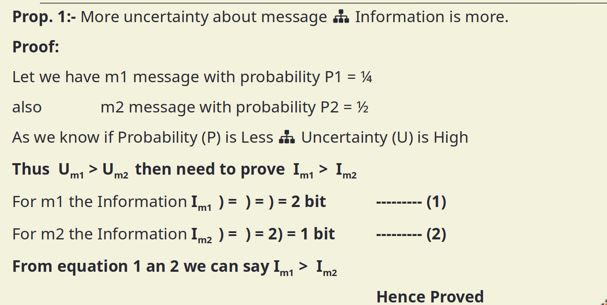
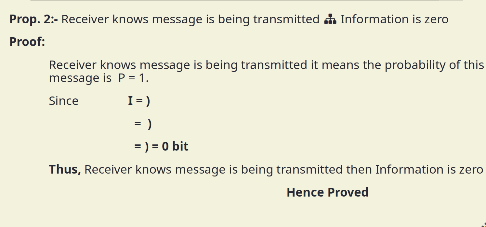
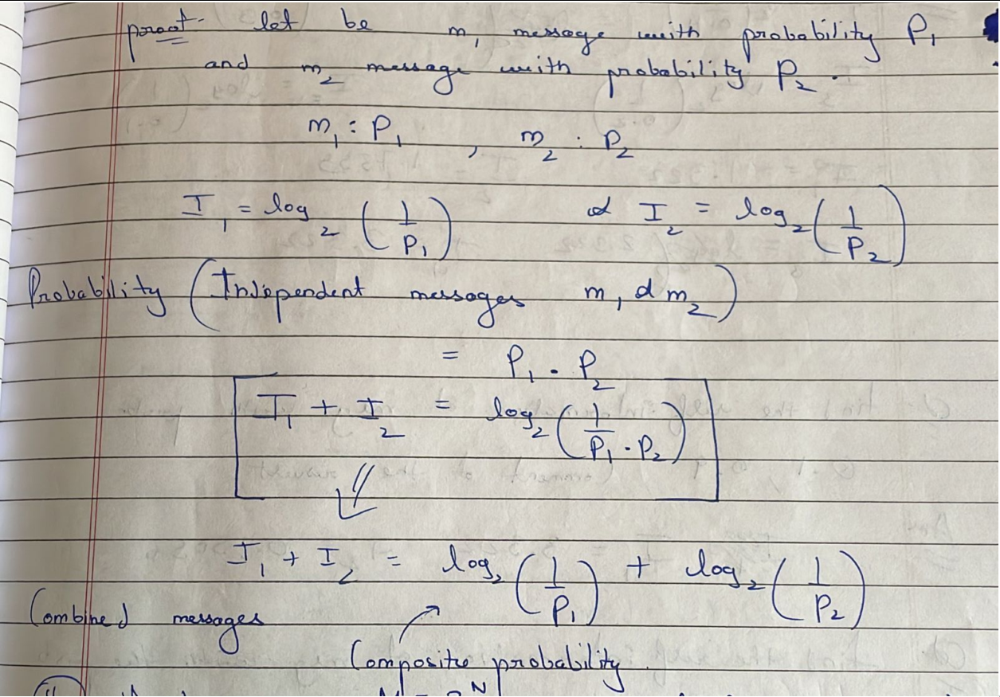

- **Information** can be defined as the amount of uncertainty that the receiver has about what is being sent .
  
  ^^Information = Amount of Uncertainty^^ or Amount of how  much you don't know or Amount of how much surprise .
	- 
	  
	  #+BEGIN_IMPORTANT
	  **Less Probability of happening  : High Information**
	  **Less Probability of happening : High Uncertainty**
	  #+END_IMPORTANT
		- The amount of information contained in an event is closely related to its uncertainty.
		  If an event has a probability of 1 then it conveys zero information . 
		     Functions of probability :
			- 1. Information should be proportional to the uncertainty ( Probability ) of an outcome 
			  2. Information contained in independent outcomes should add .
		-
	- Consider an Information Source emitting independent messages (Memory less Source) M = {m1, m2, …, mn} with probability of occurrence is P = {p1, p2, …, pn}.
	  Total probability of all messages will p1+p1+ … + Pn =  should be  1.
	  ^^I_{k}^^ => **Amount of information of message** or **Amount of surprise**
	- #### Properties of information
		- 1. More uncertainty about message Information is more .
		  2. Receiver knows message is being transmitted Information is zero 
		  3. If I_{1} is the information of message m1 and I_{2} of m2 the ( I_{1} + I_{2}) combined information by m1 and m2 . 
		  4. If there are M = 2^{N} equally likely messages , then amount of information carried by each message will be N bits .
		- Proof of 1 :
			- 
		- Proof of 2 :
			- 
		- Proof of 3 :
			- 
			- I_{k} = log_{2} \(\frac{1}{P_{k}}\)
		- Proof of 4 :
			- Since we have M equally likely messages then the probability of each messages is 1/M 
			  since I = log_{2}(1/P) = log_{2}(1/1/M) = log_{2}(M) = log_{2}2^{n} = M
	- #### Entropy
		- Average of information of the messages transmitted by source
		  If message m1 is transmitted n1 times 
		  \begin{equation}
		   { I  }_{ 1  }   =   { n  }_{ 1  }   \cdot   \log\left(  \dfrac{ 1  }{  { p  }_{ 1  }    }    \right)   
		  \end{equation}
		  If message m2 is transmitted n2 times 
		  \begin{equation}
		   { I  }_{ 2  }   =   { n  }_{ 2  }   \cdot   \log\left(  \dfrac{ 1 }{  { p  }_{ 2  }    }    \right)   
		  \end{equation}
		  If message m3 is transmitted n3 times 
		  \begin{equation}
		   { I  }_{ 3 }   =   { n  }_{ 3  }   \cdot   \log\left(  \dfrac{ 1  }{  { p  }_{ 13 }    }    \right)   
		  \end{equation}
		  Entropy = Total information / number of messages 
		  \begin{equation}
		  E =   \displaystyle\sum_{ i =  1  }^{ n  } \left( { P  }_{ i  }   \cdot   \log\left(  \dfrac{ 1  }{  { P  }_{ i  }    }    \right)   \right)   
		  \end{equation}
		  ^^The unit of entropy is bits/symbol^^
		- Entropy is average of information provided by source .
		- Total probability of all messages will 
		  \begin{equation}
		  p1+p2+p3.... { p  }^{ n  }   =   \displaystyle\sum_{   }^{   } \left( { p  }_{ i  }   \right)   =  1 
		  \end{equation}
		- **Properties of Entropy**
			- Entropy is zero , if event is sure . 
			  if event is sure , then probability may be P = 0 or P =1 . 
			  If P = 0 then Entropy  = 0
			  If P = 1 then Entropy = 0
			  If event is sure there is no information i.e information is already known thus entropy is zero . 
			  The maximum value of H can be obtained at P_{1} = 1/2 ,  
			  P_{2} = 1/2;
			  H(S) = maximum .
			- When P_{k} = 1/M for all symbols M then symbol are equally probable , So 
			  \begin{equation}
			  H \left( S  \right)   =   \log\left( M  \right)   
			  \end{equation}
			  Here M is the total symbols generated by the source .
		- **Source Efficiency , Redundancy and Information Rate**
			- 1. Source Efficiency : 
			  \begin{equation}
			   \eta   =   \dfrac{ H  }{  { H  }_{ max  }    }   
			  \end{equation}
			- 2. Redundancy rate : 
			  \begin{equation}
			  { R  }_{ t  }   =  1- \eta   
			  \end{equation}
			- 3. Information Rate : 
			  \begin{equation}
			  R =  r \cdot  H 
			  \end{equation}
			  
			  #+BEGIN_NOTE
			  r = Rate of message are generated . 
			  Unit of r  = message / sec 
			  r should be in message / sec before using it in the formula
			  Unit of R = bits /sec
			  #+END_NOTE
	- #### Type of Entropy
		- Let transmitter transmitting alphbet 
		  X = { x1, x2,.....} with probability of P(x1),p(x2), .....P(xm).
		  Y = {y1,y2....} with probability of P(y1),P(y2).....P(yn).
		  for Transmitter X -> 
		  \begin{equation}
		   \displaystyle\sum_{ i =  1  }^{ m  } \left(P \left(  { x  }_{ i  }    \right)   \right)   
		  \end{equation}
		  for Receiver Y -> 
		  \begin{equation} 
		  \displaystyle\sum_{ i =  1  }^{ n } \left(P \left(  { \left(y \right) }_{ i  }    \right)   \right)   
		  \end{equation}
		- **Marginal Entropy** : 
		  We can define Marginal entropy of Transmitter X and receiver Y as 
		  \begin{equation}
		  H \left( X  \right)   =   \displaystyle\sum_{ i =  1  }^{ m  } \left(P \left(  { x  }_{ i  }    \right)   \log\left(  \dfrac{ 1  }{ P \left(  { x  }_{ i  }    \right)    }    \right)   \right)   
		  \end{equation}
		  Marginal entropy of Receiver Y as 
		  \begin{equation}
		  H \left( Y  \right)   =   \displaystyle\sum_{ i =  1  }^{ n  } \left(P \left(  { y }_{ i  }    \right)   \log\left(  \dfrac{ 1  }{ P \left(  { y }_{ i  }    \right)    }    \right)   \right)   
		  \end{equation}
		- **Joint Entropy**
		  We can define the entropy of the whole communication as H(X,Y)
		  \begin{equation}
		  H \left( X,Y  \right  )   =   \displaystyle\sum_{ i =  1  }^{ m  } \left( \displaystyle\sum_{ i =  1  }^{ n  } \left(P \left(  { x  }_{ i  }   { y  }_{ i  }    \right)   \log\left(  \dfrac{ 1  }{ P \left(  { x  }_{ i  }   { y  }_{ i  }    \right)    }    \right)   \right)   \right)   
		  \end{equation}
		- **Conditional Entropy** : 
		  Average conditional self information is called as conditional entropy . 
		  \begin{equation}
		  H \left( X/Y  \right)   =   \displaystyle\sum_{ i =  1  }^{ m  } \left( \displaystyle\sum_{ i =  1  }^{ n  } \left(P \left(  { x  }_{ i  }   { y  }_{ i  }    \right)   \cdot  lo { g  }_{ 2  }   \left(  \dfrac{ 1  }{ P \left(  { x  }_{ i  }  / { y  }_{ i  }    \right)    }    \right)   \right)   \right)   
		  \end{equation}
		  \begin{equation}
		  H \left( Y/X  \right)   =   \displaystyle\sum_{ i =  1  }^{ m  } \left( \displaystyle\sum_{ i =  1  }^{ n  } \left(P \left(  { x  }_{ i  }   \cdot   { y  }_{ i  }    \right)   \cdot  lo { g  }_{ 2  }   \left(  \dfrac{ 1  }{ p \left(  { y  }_{ i  }  / { \left(x \right) }_{ i  }    \right)    }    \right)   \right)   \right)   
		  \end{equation}
			- Relationship : 
			  \begin{equation}
			  H \left( X,Y  \right)   =  H \left( X/Y  \right)  +H \left( Y  \right)   
			  \end{equation}
			  \begin{equation}
			  H \left( X,Y  \right)   =  H \left( Y/X  \right)  +H \left( X \right)   
			  \end{equation}
			  
			  #+BEGIN_NOTE
			  When X and Y are independent then we can say that : 
			  \begin{equation}
			  H \left( X,Y  \right)   =  H \left( X  \right)  +H \left( Y  \right)   
			  \end{equation}
			  #+END_NOTE
	- #### Mutual Information
		- A quantity that measures a relationship between the random variables that are sampled simultaneously .
		- It is symmetric
		- I(x;y) >= 0
		- \begin{equation}
		  I \left( X;Y  \right)   =  H \left( X  \right)  -H \left( X/Y  \right)     
		  \end{equation}
		  \begin{equation}
		  I \left( X;Y  \right)   =  H \left( Y  \right)  -H \left( Y/X  \right)   
		  \end{equation}
		- Mutual Information is related to joint entropy 
		  \begin{equation}
		  I \left( X,Y  \right)   =  H \left( X  \right)  +H \left( Y  \right)  -H \left( X,Y  \right)   
		  \end{equation}