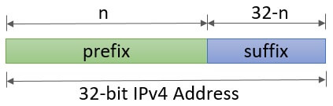
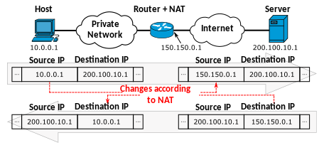

- #### Packetizing
	- The first duty of the network layer is definitely
	  ^^packetizing^^: encapsulating the payload in a network-
	  layer packet at the source and decapsulating the
	  payload from the network-layer packet at the
	  destination.
	  In other words, the duty of the network layer is to
	  carry a payload from the source to the destination
	  without changing it or using it.
- #### Routing and Forwarding
	- Other duties of the network layer , which are important as the first , are routing and forwarding , which are directly related to each other .
- #### Packet Switching
	- Packet switching is the transfer of small pieces of data across various networks. These data chunks or ^^packets^^ allow for faster, more efficient data transfer.
	  Often, when a user sends a file across a network, it gets transferred in smaller data packets, not in one piece.
	  **For example**, a 3MB file will be divided into packets, each with a packet header that includes the origin IP address, the destination IP address, the number of packets in the entire data file, and the sequence number.
	  ^^Total Time = n(Transmission Time between Switches ) + (Propagation Delay)^^
	- |Datagram Switching|Virtual Circuit Switching|
	  |--|--|
	  |Connection less i.e we will send the packets without storing them in any buffer . |Connection Oriented i.e we will send the packets with reservation ( A global packet will be sent in the network first ) |
	  | There is no dedicated transmisson path.|	There is also no dedicated transmission path.|
	  |No Reservation |Reservation |
	  |Out of Order i.e The packets arrive at their intended destination in a multiple order in which they were transmitted.|Same Order i.e The packets continually reach their destined destination in the similar order in which they were transmitted.|
	  |In Datagram approach the overhead is high i.e All the packets will travel different path , so it is important to add header to each packets . |In this approaoch the overhead is less i.e we add only the global header to the global packet ( rest header are the local header ).  |
	  |More Packet lost i.e all the packets are travelling different path henceare very prone to get lost . |Less Packet Lost i.e every packet is following the same path less prone to get lost .|
	  |Used in Internet|ATM ( Asynchronus transmission mode )|
	- **Working of Virtual Circuit **
		- In the first step a medium is set up between the two end nodes.
		- Resources are reserved for the transmission of packets.
		- Then a signal is sent to sender to tell the medium is set up and transmission can be started.
		- It ensures the transmission of all packets.
		- A global header is used in the first packet of the connection.
		- Whenever data is to be transmitted a new connection is set up.
	- #+BEGIN_TIP
	  In Virtual Circuit the ACK also travels in the same path 
	  #+END_TIP
- #### Example of Datagram approach
	- 
- #### Example of Virtual Circuit approach
	- 
- #### IPV4 Addresses
	- **IP** stands for **Internet Protocol** and v4 stands for **Version Four** (IPv4). IPv4 was the primary version brought into action for production within the ARPANET in 1983.
	  IP version four addresses are 32-bit integers which will be expressed in decimal notation. 
	  Example- 192.0.2.126 could be an IPv4 address.
	- Notation of Ipv4 addressing 
	  {:height 279, :width 550}
	- From 32 bits : 
	  n bits determines the network ,
	  (32 - n )bits Define connection to the node .
- #### Classfull addressing
	- 
	- #### Class A
		- Total Possible address in class A = 2^{7} -2  = 128 -2 = 126 .
		  127 is reserved for loop back .
		- Total Possible host in class A = 2^{24} -2 . 
		  
		  #+BEGIN_NOTE
		  Both two host addresses :
		  64.0.0.0 represents the network 
		  64.255.255.255 represents the broadcast address 
		  #+END_NOTE
		- Default Mask = 255.0.0.0
		  
		  #+BEGIN_TIP
		  A subnet mask is a 32-bit number created by setting host bits to all 0s and setting network bits to all 1s. In this way, the subnet mask separates the IP address into the network and host addresses.
		  #+END_TIP
		- By Applying AND operation of default mask with the IP address we get the address to which network node belongs .
	- #### Class B
		- Range = 128 - 191 
		  
		  #+BEGIN_NOTE
		  The bounds are included in the range 
		  #+END_NOTE
		- No of Addresses : 2^{30}
		- No of Networks possible : 2^{14}
		- No of hosts possible in each network :  2^{16} - 2 = 65534
		  Default Mask = 255.255.0.0
	- #### Class C
		- Range = 192 - 223
		- No of Addresses : 2^{29}
		- No of Networks possible :  2^{21}
		- No of hosts possible in each network : 2^{8} -2 = 254
		  Default Mast  = 255.255.255.0
	- #### Class D
		- Range = 224 - 239
		- No of IP Addresses possible : 2^{28}
		- These Address are reserved for multi-casting and group email / Broadcasting .
		-
	- #### Class E
		- Range = 240 - 255
		- No of IP Addresses possible : 2^{28}
		- Reserved for military Purpose .
	- #+BEGIN_NOTE
	  There are two type of broadcast address first is limited 
	  and the second is Direct . 
	  #+END_NOTE
		- The limited broadcast is used when a person inside the network wants to send a message to the whole organization , Direct address is used when you want to broadcast the message into a network from outside .
- #### Drawbacks of class-full addressing
	- **Wastage of Ip - address **
	  In class A so many addresses are waste .
	- **Maintenance is time consuming**
	  In Big Network Maintenance is very difficult .
	- **More prone to errors and security**
	  If an error or a security flow is detected then that is a very big problem to find the error and solve it . More Ip address are there which means more ways to gain unauthorized access to the network .
- #### Class-less addressing
	- No Classes
	- Only blocks : According to the requirement of the user we give the customized size block .
	- 
	- Notation : 
	  \begin{equation}
	  x.y.z.w \backslash\texttt{   }  n 
	  \end{equation}
	  
	  #+BEGIN_NOTE
	  In the above notation n represnts the mask or no of bit represents  blocks / network
	  To get the network it just to the and operation with subnet mask . 
	  #+END_NOTE
	-
	- Rules : Addresses should be contiguous .
	  No of addresses in a block must be in power of 2 .
	  ^^32-n^^ Must be in power of 2 . 
	  First addresses of every block must be evenly divided with  size of block .
- #### Subnetting in Classfull Addressing
	- Dividing the big network into small networks .
	  Subnetting is always does inside an organization to make their own networks for different departments . 
	  Subnetting imporve the wastage of  ip addresses in classfull addressing .
- #### Subnetting in Classless addressing ( CIDR )
	- The sub-networks in a network should be carefully enable the routing of packets.
	- The following steps needs to be taken care while proper operation of the subnetworks .
		- 1. The number of addresses in each subnetwork should be a power  of 2 . 
		  2. The prefix of length of each subnetwork should be found using the follwing formula : 
		  \begin{equation}
		   { n  }_{ snet  }   =  n+lo { g  }_{ 2  }   \left(  \dfrac{ N  }{  { N  }_{ sub  }    }    \right)   
		  \end{equation}
		  3. The starting address is each subnetwork should be divisible by the number of addresses in that subnetwork . This can be achieved if we assign addresses to larger networks .
- #### DHCP ( Dynamic Host Configuration Protocol )
	- Address assignment in an orgnanization can be done automatically using the Dynamic Host Configuration Protocol ( DHCP ) . it is an application layer program , using the client sever paradigm , that actually helps TCP/IP at the network layer .
	- There are two types of addresses that can be assigned first is
		- **Static ip** i.e that user assigns manually .
		- **Dynamic ip** i.e where computer gets an I.P address from a DHCP server .
	- A DCHP server automatically  assigns a computer an :
	  1. I.P address 
	  2. Subnet mast 
	  3. Default gateway 
	  4. DNS Server
	- DHCP  assigns the ip address on the basis of its ^^scope .^^
	- The DHCP server assigns the I.P address as a lease
	  
	  #+BEGIN_IMPORTANT
	  A lease is the amount of time an ip address is assigned to a computer 
	  #+END_IMPORTANT
	- The reason for lease is to make sure that the DHCP does not run out of ip addresses .
	- While the host is connected to network the host will send a signal asking the DHCP server to renew their lease time .
	-
- #### NAT(Network Address Translation)
	- In most situations , only a small portion of computers need access to internet simultaneously  .
	- A technology that can provide the mapping between public and private Ip address . 
	  This technology allows you to set the public addresses for communication outside the netowrk and private addresses for inter-communication .
	  
	- It maintains a translation table to store the buffer of public and private Ip addresses .
- #### ARP ( Address Resolution Protocol)
	- Most of the computer programs/applications use **logical address (IP address)** to send/receive messages, however, the actual communication happens over the **physical address (MAC address)** i.e from layer 2 of the OSI model. So our mission is to get the destination MAC address which helps in communicating with other devices. This is where ARP comes into the picture, its functionality is to translate IP address to physical addresses.
-