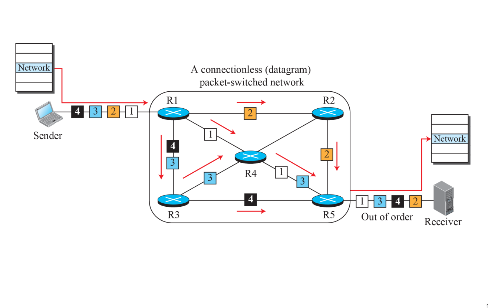
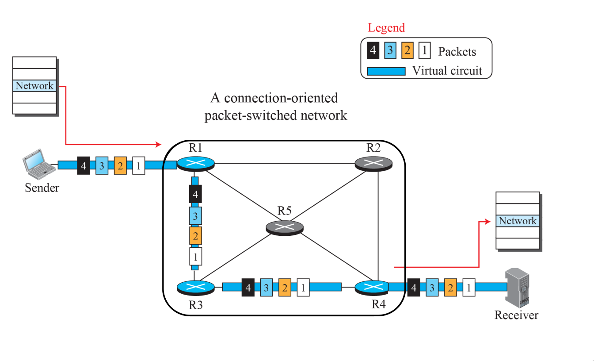
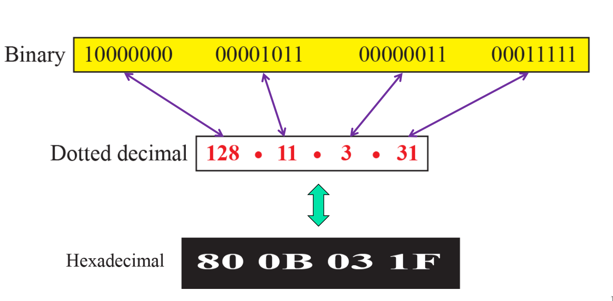
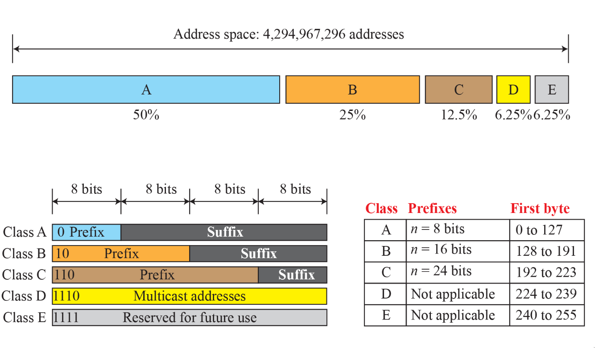

- #### Packetizing
	- The first duty of the network layer is definitely
	  ^^packetizing^^: encapsulating the payload in a network-
	  layer packet at the source and decapsulating the
	  payload from the network-layer packet at the
	  destination.
	  In other words, the duty of the network layer is to
	  carry a payload from the source to the destination
	  without changing it or using it.
- #### Routing and Forwarding
	- Other duties of the network layer , which are important as the first , are routing and forwarding , which are directly related to each other .
- #### Packet Switching
	- Packet switching is the transfer of small pieces of data across various networks. These data chunks or ^^packets^^ allow for faster, more efficient data transfer.
	  Often, when a user sends a file across a network, it gets transferred in smaller data packets, not in one piece.
	  **For example**, a 3MB file will be divided into packets, each with a packet header that includes the origin IP address, the destination IP address, the number of packets in the entire data file, and the sequence number.
	  ^^Total Time = n(Transmission Time between Switches ) + (Propagation Delay)^^
	- |Datagram Switching|Virtual Circuit Switching|
	  |--|--|
	  |Connection less i.e we will send the packets without storing them in any buffer . |Connection Oriented i.e we will send the packets with reservation ( A global packet will be sent in the network first ) |
	  | There is no dedicated transmisson path.|	There is also no dedicated transmission path.|
	  |No Reservation |Reservation |
	  |Out of Order i.e The packets arrive at their intended destination in a multiple order in which they were transmitted.|Same Order i.e The packets continually reach their destined destination in the similar order in which they were transmitted.|
	  |In Datagram approach the overhead is high i.e All the packets will travel different path , so it is important to add header to each packets . |In this approaoch the overhead is less i.e we add only the global header to the global packet ( rest header are the local header ).  |
	  |More Packet lost i.e all the packets are travelling different path henceare very prone to get lost . |Less Packet Lost i.e every packet is following the same path less prone to get lost .|
	  |Used in Internet|ATM ( Asynchronus transmission mode )|
	- **Working of Virtual Circuit **
		- In the first step a medium is set up between the two end nodes.
		- Resources are reserved for the transmission of packets.
		- Then a signal is sent to sender to tell the medium is set up and transmission can be started.
		- It ensures the transmission of all packets.
		- A global header is used in the first packet of the connection.
		- Whenever data is to be transmitted a new connection is set up.
	- #+BEGIN_TIP
	  In Virtual Circuit the ACK also travels in the same path 
	  #+END_TIP
- #### Example of Datagram approach
	- 
- #### Example of Virtual Circuit approach
	- 
- #### IPV4 Addresses
	- **IP** stands for **Internet Protocol** and v4 stands for **Version Four** (IPv4). IPv4 was the primary version brought into action for production within the ARPANET in 1983.
	  IP version four addresses are 32-bit integers which will be expressed in decimal notation. 
	  Example- 192.0.2.126 could be an IPv4 address.
	- Notation of Ipv4 addressing 
	  {:height 279, :width 550}
	- From 32 bits : 
	  n bits determines the network ,
	  (32 - n )bits Define connection to the node .
- #### Classfull addressing
	- 
	- #### Class A
		- Total Possible address in class A = 2^{7} -2  = 128 -2 = 126 .
		  127 is reserved for loop back .
		- Total Possible host in class A = 2^{24} -2 . 
		  
		  #+BEGIN_NOTE
		  Both two host addresses :
		  64.0.0.0 represents the network 
		  64.255.255.255 represents the broadcast address 
		  #+END_NOTE
		- Default Mask = 255.0.0.0
		  
		  #+BEGIN_TIP
		  A subnet mask is a 32-bit number created by setting host bits to all 0s and setting network bits to all 1s. In this way, the subnet mask separates the IP address into the network and host addresses.
		  #+END_TIP
		- By Applying AND operation of default mask with the IP address we get the address to which the node is connected .
	- #### Class B
		- Range = 128 - 191 
		  
		  #+BEGIN_NOTE
		  The bounds are included in the range 
		  #+END_NOTE
		-