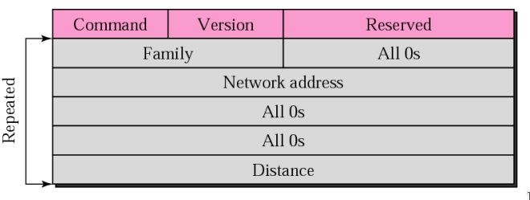
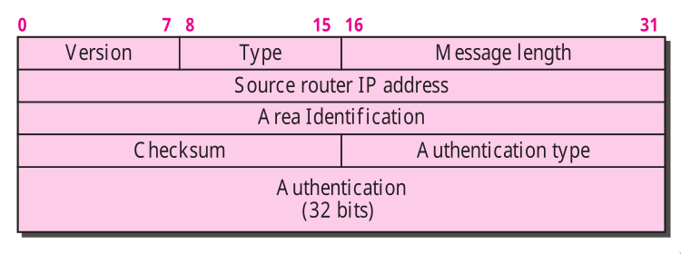
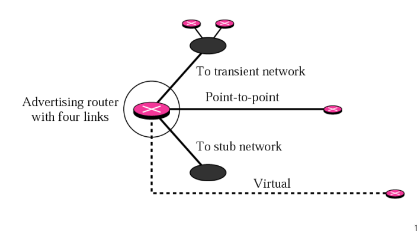
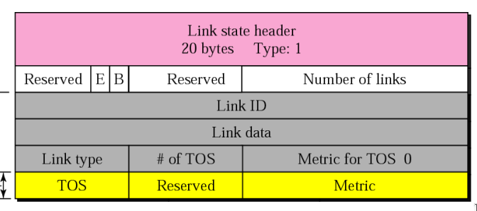
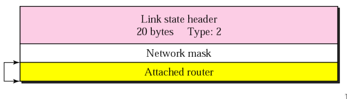
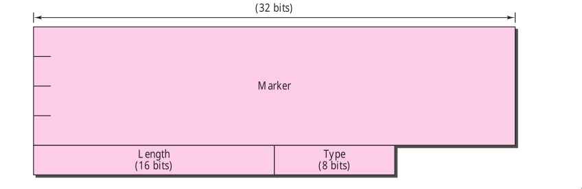

- ## Routing Protocol
	- A routing protocol is a combination of rules and procedures that lets routers in the internet inform each other of the change .
	- There are two types of routing protocols
		- An interior protocol handles the intra-domain routing
			- Examples are RIP and OSPF
		- An exterior protocol handles the inter-domain routing
			- Examples are BSF
- ## Static vs Dynamic Routing Table
	- A routing table can be either static or dynamic . A static table is one with manual entries . A dynamic table is one that is updated automatically when there is  a change somewhere in the internet .
- ## Static Routing Algorithms
	- A form of routing occurs when a router uses manual configuration routing entry rather than dynamic entry
	- Types are : 
	  1. Shortest Path Algorithm 
	  2. Flooding
- ### Shortest Path Algorithm
	- Finds the shortest path between the given pairs of routers
	- #+BEGIN_NOTE
	  Study Djkstra's algorithm
	  #+END_NOTE
	- The cost of Link may be function of
	  1. Distance 
	  2. Bandwidth 
	  3. avg Traffic 
	  4. Communication Cost 
	  5. Delay , etc
- ### Distance Vector Algorithm
	- A distance-vector routing required that a router inform its neighbours of topology changes periodically .
		- ^^Algorithm ->^^ 
		  1.  A router transmits its distance vector to each of its neighbours in a routing packet . 
		  2. Each router receives and saves the most recently received distance vector from each its neighbours . 
		  3.  A router recalculates its distance vector when : It receives a distance vector from  a neighbor containing different information than before , It discovers that a link to a neighbor has gone down .
	- 1. Make table for every router in the network circuit .  
	  2. The Table headings are Destination , Distance and next/hop 
	  3. Mark infinity for those router which does not have direct connection to the current router . 
	  4. Mark next/hop column empty if they does not have direct connection .
	- ### Count to infinity
		- A problem with distance vector routing is that any decrease in cost propagates quickly but any increase in cost propagates slowly .
		- In DVR if any link is broken , then every router in the network should be aware of it , but it takes some time . 
		  
		  #+BEGIN_NOTE
		  It tales several updates before the cost for a broken link is recorded as infinity by all routers . 
		  #+END_NOTE
	- ### Sharing Routing Tables
		- 1. Only neighbours 
		  2. Only Distance Vector
		- #+BEGIN_NOTE
		  When we are making the new routing table only the distance vector we get used , not the old one . 
		  #+END_NOTE
- #### Link State Routing
	- It is a technique in which each router shares the knowledge of its neighbourhood with every other router in the internetwork .
		- Three keys to understand the Link state routing algorithm 
		  1. Knowledge about the neighborhood 
		  2. Flooding ( Djikstara's algo)
		  3. Information Sharing
		- **Initial State** Each node knows the cost of its neighbors .
		- **Final State** Each node knows the entire graph .
	- Each node uses Dijkstra's algorithm on the graph to calculate the optimal routes to all nodes .
	- In Link State routing every router will make their own link state routing table .
	- It solves the problem of count to infinity in Distance vector routing .
	- It uses flooding i.e it uses djkstra's algorithm .
- ### Intra-and-inter-domain routing
	- An autonomous system is a group of networks and routers under the authority of a single administration .
	- Routing inside an autonomous system is referred to as intra-domain routing and routing between autonomous system is referred as inter-domain routing .
- ### RIP
	- Routing Information Protocol is an intra-domain routing protocol used inside an autonomous system . It is based on distance vector routing .
	- It is a distance vector protocol based on hop count matrix .
	- When a router forward a data packet to a network segment , it is counted as a single hop .
	- It will choose the path which contains least no of hops .
	- It two paths have the same hope count then the packet will be to both the paths .
	- Hope count is the number of devices through which data passes from source to destination .
	- **Request and Response**
		- Request message is sent by a router that has just came up or by a sender that has same time-out entries .
		- Response message can be
			- **Solicited** : Sent only in response
			- **Unsolicited** : Send periodically every 30 sec or when there is a change in the routing table .
	- **Disadvantages**
		- It is only based on hop count matrix , so if there is better route available with more bandwidth then it will not the choose that one .
		- It is a classfull routing protocol i.e does not support VLSM .
		- it broadcast the update to the entire network which simply creates lots of traffic in the network .
	- All router configured with RIP sends their update after every 30 sec .
	- **Advantages**
		- CPU Utillization is less .
		- There is no complexity .
		- It is easy to configure .
	- **RIP message format**
		- 
	- **RIP Timer**
		- **Periodic** : Generally it is set between 25 - 35 sec , It counts down to zero and when ever zero is reach a msg is sent , timer value get reset again .
		- **Expiration** : Generally it is set to 180 sec , It governs validity of route . If no update is received within 180 sec , then the route is considered to be expired & HOP count is set to 16  .
		- **Garbage Collection** : Generally it is set to 120 sec . When a router path is invalid then the table does not delete it , instead its HOP count is set to 16 , when the it counts down to zero , the route is purged from the table for that route . 
		  It invokes after expiry of expiration timer .
- ### OSPF
	- The Open shortest path first protocol is an intra-domain routing protocol based on link state routing . Its domain is also an autonomous system .
	- Based on dijiktra's algorithm .
	- **Types of link in OSPF**
		- 1. **Point-to-point Link** : Connects two routers without any other host or router in between . 
		  2. **Transient Link** : It is a network with several router attached to it . 
		  3. **Stub Link :** It is a network that is connected to only one router . Data Packets enter Network through single router and leave the    network through the same router . 
		  4. **Virtual Link :** When the link between to routers is broke the administration may create a virtual link between them using longer path .
	- **Type of OSPF Packets**
		- 1. Hello : To create neighbourhood relationship 
		  2. Database description : After relationship network sends data about the topology of the network . 
		  3. Link State request : It is sent by a router that needs a specific information about a specific route or routes .  
		  4. Link State update : It is used to advertise the state of its links . 
		  5. Link State Acknowledgement :
		  It is forcing every router to acknowledge the receipt of every link state update packet .
		- 
		- #+BEGIN_IMPORTANT
		  Message Length = Message + Header 
		  #+END_IMPORTANT
		- Area Identification block defines the area .
		- Checksum is used for error detection and correction
		- Authentication Type 0 ( none ) , 1 ( password )
		- Advertising : Is the router characteristics for broadcasting network updates and changes .
		- **Types of LSA**
			- Router Link : defines the links of a true router . A true router uses this advertisement to announce information about all of its link and neighbours .
				- 
				- 
			- Network Link : it defines the links of a network .
				- The packet announces the existence of all of the routers connected to the network .
			- Summary Link to network
			- Summary Link to AS boundary router
			- External link
		- 
	- ### Border Gateway Protocol (BGP)
		- it is an inter domain routing protocol that uses path vector routing .
		- ^^Autonomous system^^ is the group of routers and networks under the authority of single administration .
		- Policy routing : When a router received a message , it can check the path . If one of the autonomous system list in the path is against its policy .
		- **Types of autonomous system ( AS )**
			- Stub AS : A stub AS has only one connection to another AS . 
			  It can either a source or a sink i.e data can not pass through the AS .
			- Multihomed AS :  It can have more that one connection to other AS's , but still act as source or sink for data traffic .
			- Transit AS : It is same as Multihomed but allows Transient traffic .
		- #### Path Attributes
			- It is presented as the list of autonomous systems .
			- Each attributes gives some information about the path .
			- Well-known Attributes : Every BGP Router must recognize .
			- Optional Attributes : Not mandatory .
		- #### BGP Sessions
			- External : Exchange information between two speaker nodes .
			- Internal : Exchange information between routers of same AS .
			- **Types of Packets**
				- Open : used to create an neighbourhood relation .
				- Update : used to withdraw destination  that have been advertised previously , announce a new destination or both .
				- KeepAlive : Exchange regularly to tell other routers weather they are alive or not .
				- Notification : Sent by the router when error condition is detected or when a router wants to close the connection .
			- #### Packet Format
				- 
				- BGP uses the services of TCP on port 179