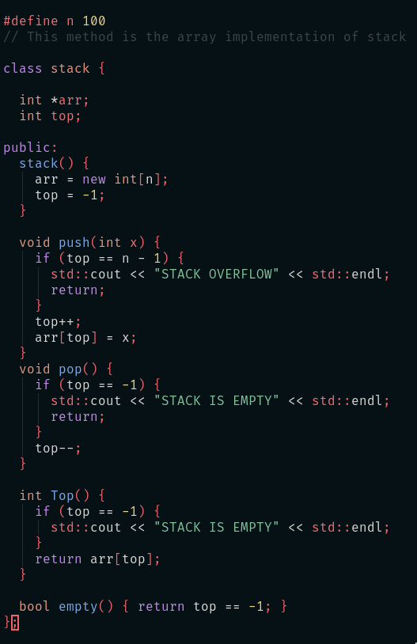
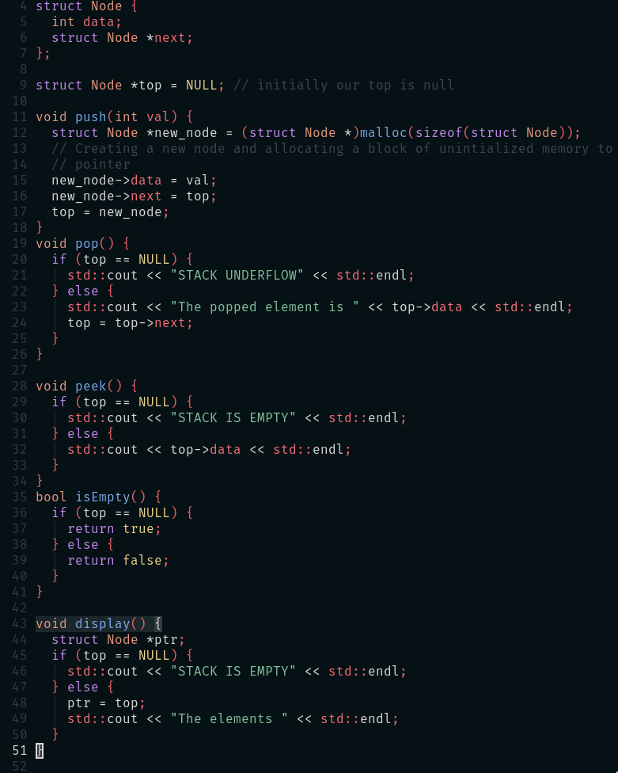

- The stack data structure is precisely what it sounds like: a stack of data . In certain types of problems , if can be favorable to store data in a stack rather than in a array .
- A Stack uses LIFO ( last in first out ) ordering . 
  Some operations in stack are as follows : 
  1. **pop()** : Remove the top item from the stack . 
  2. **push(item)** : Add an item to the top of the stack . 
  3. **peek()** : Return the top of the stack . 
  4. **isEmpty()**: Return true if and only if the stack is empty .
- Unlike array stack does not offer constant-time access to the ith term . However , it does allow constant-time adds and removes , as it doesn't require shifting . 
  For-example : if you enter the lift at the end ( at last )then only you will get off the lift firstly .
- #### Implementation of Stack in cpp
	- 1. Array Implementation 
	  {:height 823, :width 527}
	  2. Linked List Implementation
	  
	  #+BEGIN_NOTE
	  In linked list implementation we will always push and pop from head only 
	  #+END_NOTE
	  
	-
	-
	-
	-