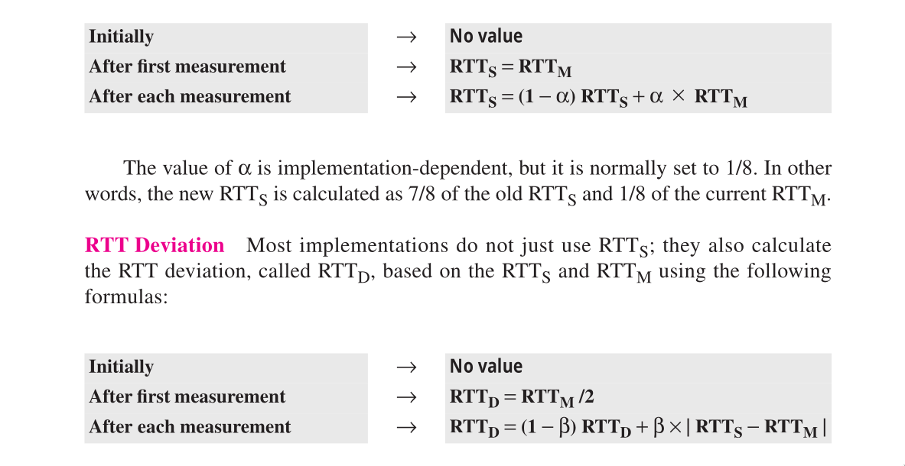

- The transport layer is located between the application layer and the network Layer .
- The first duty of transport layer is to provide process-to-process communication i.e end to end delivery .
- Responsible for communication at the computer level .
- A process is an running program that uses the services of the transport layer .
- ### Port Numbers
	- The client program defines itself with a port number called ^^ephemeral port number^^
	- **Well known ports :** The ports ranging from 0 to 1023 are assigned and controlled by ICANN . These are well known ports
	- **Registered Ports :** The ports ranging from 1024 to 49515 are not assigned or controlled by ICANN . They can only be registered with ICANN to prevent duplication .
	- **Dynamic Ports :** The ports ranging from 49152 to 65535 are neither controlled nor registered . They can be used as temporary or private port numbers .
	- #+BEGIN_NOTE
	  The combination of IP Address and the port number is referred as socket address . 
	  #+END_NOTE
- #### Encapsulation and Decapsulation
	- To send a message from application layer to transport layer  then transport layer adds a  header to the message , this is referred as encapsulation .
	- To send a message from transport layer to application layer then transport layer removes the header from the message , this is referred as decapsulation .
- #### Multiplexing and Demultiplexing
	- Whenever and entity accepts the data from more than one source then it is called multiplexing .
	- Whenever an entity deliver the data to more than one source then it is called demultiplexing .
	- Transport layer at the source perform multiplexing and at destination performs demultiplexing .
- ### Flow control
	- It is the technique that generally observes the proper flow of data from sender to receiver .
	- Delivery from producer to consumer can take place in two ways :
		- **Pushing :** If a sender deliver an items whenever they are produced , without the prior request form the consumer then it is called pushing .
		- **Pulling :** : If producer deliver the items after the consumer has requested them is called pulling .
		- One of the solution for flow control is using two **Buffer**
		  
		  #+BEGIN_NOTE
		  Buffer is a set of memory location that can hold the packets at the sender and receiver . 
		  When every the buffer is full , it informs the application layer to stop sending chunks of messages . 
		  #+END_NOTE
	- #+BEGIN_NOTE
	  A transport layer provide two types of services : 
	  1. Connection less 
	  2. Connection oriented
	  #+END_NOTE
- ### User datagram protocol
	- UDP is connectionless , unreiable transport protocol
	- There is no flow control mechanism
	- There is no acknowledgement for packets received .
	- There is no ordering of the packets when they reach their destination .
	- 
		- **Source port  number** : This is the port number used by the process running on the source host .
		  Chosen by the software running on the source host .
		- **Destination port number** : This is the port number used by the process running on the destination host .
		- **Length** :  It is the 16 bit field that defines the length of the user datagram header plus data .
		- ^^UDP Length = IP Length - IP header's length^^
		- **Checksum** : This field is used to detect errors over the entire user datagram .
		- Checksum field is optional
		- #+BEGIN_NOTE
		  Header is 8 bytes fixed 
		  #+END_NOTE
	- ### UDP services
		- It provides process to process communication using sockets , a combination of IP addresses and port numbers .
		- There is no connection establishment and no connection termination as in the case for TCP .
		- It means that each user datagram can travel on a different path .
		- #+BEGIN_IMPORTANT
		  Since UDP is very simple protocol , there is no flow control and error control mechanism . 
		  #+END_IMPORTANT
		- **Pseudoheader :** It is the part of the header of the IP packet in which user data gram is to be encapsulated with some fields filled with 0's .
		- 
		- When ever packet is sent through UDP , it passes the message to  UDP along with the pair of socket address and the length . UDP receives the data and adds the UDP header i.e Encapsulation .
		- When ever the message arrives is the destination host , then the UDP uses the checksum to check weather the entire user datagram is correct or not , if correct then , it removes the UDP header and pass it to the next layer i.e Decapsulation .
	- #### Queuing
		- queuing is associated with ports .
		- UDP process creates incoming and outgoing queues .
		- Queues functions as long as the process is running .
		- There are two types of queue towards the sender and the receiver side both have
			- **Outgoing queue** : When the client sends a messsage to the server , UDP removes the messages from the outgoing queue one by one and if the queue overflows then it asks the client to wait before sending any messages .
			- **Incoming queue** :  At the server side first the message enters the incoming queue for the specified port number in the destination field , if the there is such a queue in the server side then the datagram gets added to the queue . If queue does not exist for the particular port number then the client gets an error message i.e port unreachable
			- Both the incoming and the outgoing queues are created while communication .
	- ### Multiplexing Demultiplexing
		- 
		- There are several processes at the sender side , that needs to send user datagram but the UDP is only one . This is many to one relationship  and requires multiplexing .
		- How ever at the receiver side there is only one UDP , but many processes can receive the datagram . This is one to many relationship and requires demultiplexing .
	- #### UDP Package
		- **Control-Block Table :**
			- It keeps the track of all the open ports
			- It contains a table of column headings like port ID , port number , and the corresponding queue number ^^State( Free and in use ))^^
		- **Control Block module :**
			- The control-block module is responsible for mangement of control-block table .
			- When a process starts the operating systems assigns a well known port number to servers , and the process ID and the port number to the control block module to create entry in the table for the process .
			- **Input Module** :
				- it receives a user datagram from the IP . It searches the table entry have the same port number and if the entry is found , the module uses the information in the entry to enqueue the data and if entry not found it generates ICMP message .
			- **Output Module** :
				- It is responsible for creating and sending user datagrams    .
	- ### UDP & TCP
		- |TCP|UDP|
		  |--|--|
		  |Connection Oriented protocol|Connection less protocol|
		  |Reliable : Becuause data packets knows what path to travel i.e Datagrams follows ordering , the packets can reach in particular order  |Less Reliable : Datagram follows no ordering i.e at the receiver end the packets can reach in any order . |
		  |Error control is mandatory i.e we use checksum to detect the errors . |Error control is optimal : either we can include the checksum or exclude it . |
		  |Slow transmission |Faster transmission |
		  |More overhead : Header length ( 20 - 60 bytes ) |Less overhead  : Header length ( 8 bytes ) |
		  |Flow Control and Congestion control are neccessary |No Flow control , Congestion control |
	- ### TCP
		- TCP Provides a connection oriented full duplex , reliable , streamed delivery service using IP to transport message between processes .
		- **Reliability is ensured by : **
			- Connection-Oriented service
			- Flow control using sliding window protocol
			- Error detection using checksum
			- Error control using Go-back-N-ARQ technique
			- Congestion Avoidance algorithm
				- Multiple decrease
				- slow start
		- **Other functionalities implemented by TCP **
			- Recovery from packet losses
			- Detection of duplicate packets
			- Packet delivery in correct order
		- #### TCP Header
			- Size of TCP header ( 20 - 60 Bytes ) => 160 bits
			- 
				- **Sequence Number** : It defines the number assigned to the first byte of data contained in the segment . TCP assigns a sequence number of each byte .
				- **Acknowledgement Number** : It defines the byte number that the receiver of the segment is expecting to receive from the other party .
				- **HLEN** ( data offset 4 bit ) : It specifies the number of 32 bit words present in TCP header 
				  
				  #+BEGIN_NOTE
				  In HLEN we use scale of  4 : bits x 4 
				  #+END_NOTE
				- **Control Flag bits** :
					- URG - Urgent Pointer
					- PSH - Push data without buffering
					- ACK - Indicates whether acknowledgement flied valid
					- RST - Reset the correction
					- SYN - Synchronize sequence number during connection establishment
					- FIN - Terminate the connection
				- **Window(16 bit )** : Specifies the window size .
				- **Checksum(16 bit )** : Used for error detection
				- **Urgent Pointer (16 bits )** Which data is urgent from the collection of data .
				- **Optional 40 bytes of information** : Optional 40 bytes of information .
				- #+BEGIN_NOTE
				  There is a difference between MSS and window size . 
				  #+END_NOTE
		- ### Connection Establishment
			- In this client is active open ( it tells the tcp to connect to an open server ) and server is passive open ( it is always ready to connect any machine in the world )
			- The connection establishment is called three-way-handshaking .
			- The client sends the first segment , a SYN segment , in which only the SYN flag is set . The client chooses a random number as the first sequence and sends this number to the server . No Acknowledgement number is there in a SYN segment .
			  ^^A SYN segment cannot carry data , but it consumes one sequence number .^^
			- The server send a segment , called ACK + SYN segment , in which SYN and ACK bit are set . The server generates a sequence number and also to acknowledge the syn receipt it sends the header with the ack and syn bit set , It also defines the window size in this segment . 
			  ^^A SYN + ACK cannot carry data , but does consumes one sequence number ^^
			- The client sends the third segment , this is just an ACK segment . It acknowledges the receipt of the second segment with the ACK flag and acknowledgement number , 
			  
			  #+BEGIN_NOTE
			  The sequence number in this segment is same as the one in the SYN segment . 
			  #+END_NOTE
			  It must also must define the server window size . ^^An ACK segment , if carrying no data , consumes no sequence numbers^^
			   .
			- #+BEGIN_CAUTION
			  If both processes issue an active open . In this case both tcp sends a SYN + ACK .  
			  #+END_CAUTION
		- ### Connection termination
			- 
			- In termination , client sends the first fin segment in which the FIN flag is set . The fin segment can include the last chunk of data sent by client , if not the is consumes only sequence number .
			  ^^The fin segment consumes one sequence number if does not carry data^^
			- ^^Half-close^^ : one end can stop sending data while still receiving data . This is called Half close . Either the server or client can issue a half close request . 
			  Example : sorting the data .
			- FIN + ACK segment consumes one sequence number if it does not carry data .
			- ### Data Transfer
				- {:height 396, :width 461}
		- ### Flow Control
			- Each client and the server has two types of buffer
				- Sender Buffer
				- Receiver Buffer
			- In TCP the sender window size is totally controlled by receiver window value .
			- ### Send Window & Receive Window
				- 
			- A sliding window is used to make transmission more efficient  as well as to control the flow of data so that the destination does not become overwhelmed with the data .
			  TCP sliding windows are byte oriented .
			- Flow control balances the rate a producer creates data with the rate a consumer can use the data .
			- The receiver window size always smaller or equal to the buffer size . 
			  The receiver window size determines the number of bytes that the receive size , normally called rwnd , can be determined by : 
			  ^^rwnd = buffer size - number of waiting bytes to be pulled^^
		- ### Error Control in TCP
			- Mechanisms for :
				- Detecting & sending corrupted segments
				- Resending lost segments
				- Detecting & discarding duplicated segments
				- Storing out of order segments till the missing segments arrive .
			- **Tools Used**
				- Checksum : If segment is courrupted then it should be discarded , so checksum does this work for us .
				- Acknowledgement
					- Cumulative Acknowlegement : When only a single ack is sent for multiple segments  (ACK) .
					- Selective Acknowledgement : It is going to specify the sender that some of the bytes are out of order , or duplicated .
					- When A sends data segment to B , it must include the ancknowledgement that gives the next sequence number it expects to receiver .
					- The receiver needs to delay sending an ack segment . if there is only one out-standing in-order segment .
					- Same goes if receiver receives an segment which is out of order sequence number , that is higher than expected , the receiver immediately sends an ack segment announcing the sequence number for the next expected segment .
					- When a missing segment arrives , the receiver sends an ACK to announce the next expected sequence number .
					- If duplicate segment the receiver immediately sends an ack .
				- Retransmission :
					- After Retransmission Timeout
						- Suppose sender has sent as segment then a timer starts , after that timeout if ack is not received then the sender re-transmit the segment .
					- After 3 duplicate Ack's
						- 
						- In the above figure segment 2 is not received , hence the receiver sends  3 duplicate ack to notify the sender that segment 2 is not received .
						- Out of order segments : If the receiver has received out of order segments , it will order it and then send it to the upper layer .
					- **Timers in TCP**
						- **Timeout Timer** : Retransmission of lost segments
						- **Time Wait Timer** : Suppose some segments are arriving late from the receiver , so in this case the sender should wait for the segments upto a timer called **Time wait timer** .
						- **Keep Alive Timer** : This timer is set up by the receiver , suppose if the client is idle for a amount of time greater than the keep alive timer , then it will send 10 segments called probes every 75 seconds , if the client is not responding to these probs then the server will terminate the connection .
						- **Presistent Timer** : If receiver is sending a window size as 0 , the updated window size segment from the receiver gets lost , so data transfer is happening . 
						  To avoid this , Before this timer the sender should receive the updated windows size from the receiver .
						  If this timer runs out the sender sends probs to server to send the updated window size .
					- ### Numericals
						- RTO will be given in the question
						- Measured RTT ( RTTm ) : how long it takes to send a segment and receives an acknowledgement .
						- Smoothened RTT ( RTTs ) : weightd average of RTTm and previous RTTS
						- ^^RTTm  = RTTs^^
						- ^^RTTd = RTTm / 2^^
						- ^^RTO = RTTs  + 4 * RTTd^^
						- if RTO is reduced then traffic is smoothened .
						- RTTm will be given in the question for every measurement .
						- ^^Optimal window size in TCP = Maximum amount of data that can be sent in 1 RTT^^ .
						- {:height 316, :width 401}
						- 
						- {{video https://www.youtube.com/watch?v=fHUeG6VFlSY}}
		- ### Congestion control in TCP
			- If the load offered to any network is more than its capability
			- TCP controls congestion by means of window mechanism .
			- TCP sets a window size telling the other end how much data segment to send .
			- TCP may use three algorithms
				- 
				- **Slow start algorithms** : In this algorithm , the size of window grows exponentially till the timeout occurs when the received window  reached to the maximum threshold .
				  ^^Threshold = windows size / 2^^
				- **Congestion avoidance algorithms** : In this algorithm , to avoid the congestion before it happens , it is necessary to slow down the exponential growth i.e by increasing the window size linearly .
				- **Congestion Detection algorithms :** If congestion occurs it is required to decrease the window size . 
				  In this the threshold size can be dropped to one half of the previous window size .
				- #+BEGIN_NOTE
				  When timeout occurs ( as given in the question ) 
				  The new threshold = window size  / 2 
				  and the window size is reduced to its initial size from where it started . 
				  #+END_NOTE
				- {{video https://youtu.be/o4ndRxWGjOs}}
				-