- Binary trees in (c++)
	- Implementation of Binary tree
	- 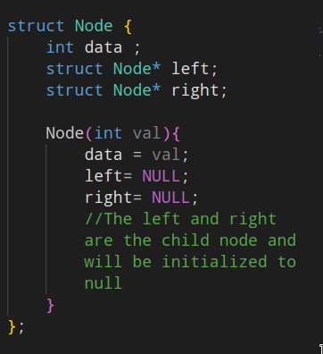{:height 405, :width 361}
	- To add a root node we need to write
	- #+BEGIN_NOTE
	  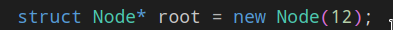 
	  #+END_NOTE
	- We will use two stacks currentLevel & nextLevel and a bool variable Left to Right , if Left to right is true we first push left child to nextLevel Stack else vice versa .
	- 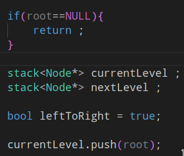
	- We will push to root to currentLevel stack always ( before the while loop )
	- 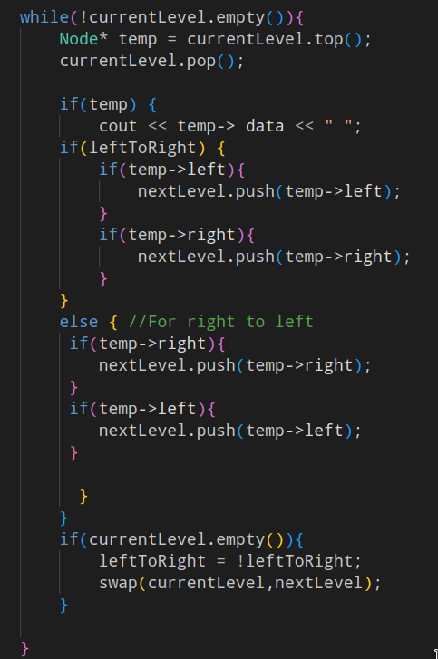
	- We are creating a temp of type Node* which will store the top of currentLevel stack If temp is NULL then it will not do anything .
	- At the end of the while loop we are swapping the currentLevel and nextLevel stack to cover all the other Levels of the binary tree .
- #### Height of binary Tree
  id:: 63159149-e1c3-4386-8404-8ce9ba74fd28
	- id:: 6315915b-62f5-49a7-8f1b-56c809e275ab
	  ```
	  int height(TreeNode* root){
	  	if(root==NULL){
	       return 0;
	      }
	      return max(height(root->left), height(root->right)) + 1;
	  }
	  ```
- #### Properties
	- Maximum nodes at level $L = L^2$
	- Maximum nodes in a tree of height $H = H^2$ - 1
	- For N nodes , minimum possible height or minimum number of levels are 
	- A binary tree with L leaves has at least 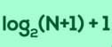 number of levels
- #### Major Traversal In BST
	- #### Pre_order
		- 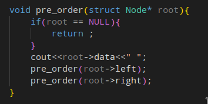
	- #### In_order
		- 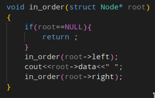
	- #### Post_order
		- 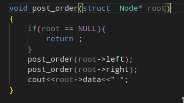
	- #### Check_BST
		- This method is the range method in which we will check the range of each node while traversing the binary tree and then return true and false accordingly , 
		  ```
		  bool isValidBST(TreeNode* root) {
		          // Base case...
		          if(root == NULL) return true;
		          return check(root, LONG_MIN, LONG_MAX);
		      }
		      bool check(TreeNode* root, long minimum, long maximum){
		          // If root is NULl...
		          if(root == NULL) return true;
		          // If the value of root is less or equal to minimum 
		          // Or If the value of root is greater or equal to maximum
		          if(root->val <= minimum || root->val >= maximum) return false;
		          // Recursively call the function for the left and right subtree...
		          return check(root->left, minimum, root->val) && check(root->right, root->val, maximum);
		      }
		  ```
		- ##### Method two
			- 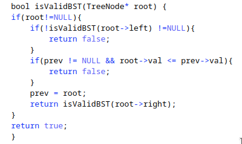
		- #### Find the Kth Smallest element in BST
			- We are going to use Inorder traversal of the bst and when we will reach the left most element in the bst which satisfy the condition 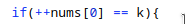 
			  , then we will assign the val to the nums[1] and return .
			- 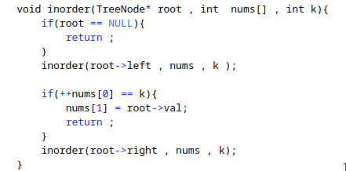
		- #### Find the second minimum value in BST
			- [Second Minimum In BST](https://leetcode.com/problems/second-minimum-node-in-a-binary-tree/)
		- #### Vertical Order Print in BST
			- In this approach we will be doing level order traversal 
			  We will go level by level in BST , so that the upper element comes first and then the rest lower elements . The Data Structure we are going to use is hashmap .
			- In HashMap ^^Key = Horizontal Distance^^  
			  ^^Value = Array/Vectors of Integers^^
			- [#C] Algo ->
			  1. Starting from root Node 
			  2. Recursively call left and right with (HD -1) and (HD + 1) as arguments .
			  3. **Base Case** : When current node = Null(return).
			  4. Push the value into vector corresponding to the horizontal distance (HD).
			- [Link To Problem](https://leetcode.com/problems/vertical-order-traversal-of-a-binary-tree/submissions/)
			  ```
			      vector<vector<int>> verticalTraversal(TreeNode* root) {
			          map<int,map<int,multiset<int>>> nodes;
			          queue<pair <TreeNode* , pair <int,int>>> todo;
			          todo.push({root,{0,0}});
			          
			          while(!todo.empty()){
			              auto p = todo.front();
			              todo.pop();
			              TreeNode* node = p.first;
			              int x = p.second.first , y = p.second.second;
			              nodes[x][y].insert(node->val);
			              if(node->left){
			                  todo.push({node->left , {x-1,y+1}});
			              }
			              if(node->right){
			                  todo.push({node->right, { x+1 , y+1}});
			              }
			          }
			          vector<vector<int>> ans;
			          for(auto p : nodes){
			              vector<int> col;
			              for(auto q : p.second){
			                  col.insert(col.end(), q.second.begin() , q.second.end());
			              }
			              ans.push_back(col);
			          }
			          return ans;
			      }
			  ```
			-
		- #### Binary Tree Pruning
			- In this approach first we will pass the reference of our root node to the helper function 
			  and **Base Case** : When root = null
			- The helper function will do recursive calls to the left and the right subtree respectively .
			  Then we will check if left doesn't  contain the 1 then we are going to set left = null i.e remove the subtree 
			  Then we will check if right doesn't contain the 1 then we are going to set right  = null i.e remove the subtree
			  Code : 
			  ```
			  TreeNode* pruneTree(TreeNode* root) {
			          if(root == NULL){
			              return NULL;
			          }
			          root->left = pruneTree(root->left);
			          root->right = pruneTree(root->right);
			          if(helper(root)){
			              return NULL;
			          }
			          return root;
			      }
			      bool helper(TreeNode* root){
			          if(root->val == 0 && root->left == NULL && root->right == NULL){
			              return true;
			          }
			          else{
			              return false;
			          }
			      }
			  ```
			-
		- #### Maximum Depth of binary tree
			- **Top-To-Bottom** in this approach we will pass the root and depth of the bst recursively and update our answer each time we reach the leaf node and then print the answer  variable  \darr
			  ```
			   public static void maximum_depth(Node root, int depth){
			      if(root == null){
			          return;
			      }
			      if ( root.left == null && root.right == null){
			        answer = Math.max(answer,depth);
			      }
			      maximum_depth(root.left , depth + 1);
			      maximum_depth(root.right, depth + 1);
			    }
			  ```
			- **Bottom-Up**  in this approach we will pass the root of the bst recursively and call the function again for the left and right tree and return the maximum + 1  value return the recursive calls \darr
			  ```
			   public static int maximum_depth_bottom_up(Node root ){
			      if ( root === null){
			        return 0;
			      }
			      int left_depth = maximum_depth_bottom_up(root.left);
			      int right_depth = maximum_depth_bottom_up(root.right);
			      return Math.max(left_depth , right_depth) +1 ;
			    }
			  
			  ```
		- #### Level Order Traversal
			- The Brute Force Approach Will be :
			  1. First we will calculate the height of the binary tree using {{embed ((63159149-e1c3-4386-8404-8ce9ba74fd28))}}
			  2. We wil call the function which will print the current Level nodes . 
			  3. The base case is when root is null , If level is 1 the we will print the root->data , If level is > 1 then we will call the function recursively for the Sub-Trees . 
			  
			  #+BEGIN_NOTE
			  Time Complexity => O(N^2);
			  #+END_NOTE 
			  **Code :**
			  ```
			  void printCurrLevl(TreeNode* root , int level){
			  if(root == NULL){
			  	return;
			  		}
			  if(level == 1){
			  	cout<<root->data<<" ";
			  	}
			  else if(level > 1){
			  	printCurrLevl(root->left, level -1);
			      printCurrLevl(root->right , level -1);
			  	}
			  }
			  ```
			- Second Approach is using Queue Data Structure : 
			  1.  First we will create our Queue of Node* type . 
			  2. Then we will push the root node into the queue and remove it , once a node is removed from the queue then immediately its left and right node are pushed into the queue respectively . 
			  3. We repeat the above process until the queue is empty . 
			  ```
			   vector<vector<int>> levelOrder(Node* root) {
			          vector<vector<int>> result ;
			          if(root == NULL){
			              return result;
			          }
			          queue<Node*> q ;
			          q.push(root);
			          while(q.empty()){
			              int size = q.size();
			              vector<int> temp;
			              for(int i = 0 ; i<size ; i++){
			                  temp.push_back(q.front()->val)
			                  Node* current = q.front();
			                  temp.push_back(current->val);
			                  if(current->left!=NULL){
			                      q.push(current->left);
			                  }
			                  if(current->right!=NULL){
			                      q.push(current->right);
			                  }
			              }
			               result.push_back(temp);
			              
			          }
			          return result;
			      }
			      
			      // LeetCode Approach
			      vector<vector<int>> levelOrder(Node* root){
			      		vector<vector<int >> result;
			              queue<Node*> q;
			              q.push(root);
			              if(root == NULL){
			              	return ans;
			              }
			              while(1){
			              	int size = q.size();
			                  if(size == 0){
			                  	return ans;
			                  }
			                  vector<int> temp;
			                  while(size>0){
			                  Node* temp = q.front();
			                  q.pop();
			                  data.push_back(temp->val);
			                  if(temp ->left != NULL){
			                  	q.push(temp->left);
			                  }
			                  if(temp ->right != NULL){
			                  	q.push(temp->right);
			                  }
			                  size--;
			                  }
			                  ans.push_back(temp);
			              }
			              return ans;
			      }
			  ```
	- #### Construct a binary tree from inorder and preorder traversal
		- {{video https://youtu.be/aZNaLrVebKQ}}
		- **Algorithm**
			- ```
			  create_bst()
			  	map<int,int> mp;
			  	for(0 to inorder.size)
			      	mp[inorder[i]] -> i
			      root = help( preorder , 0 , preorder,size ,inroder , 0 , inorder.size ,mp )
			  	return root
			      
			  help()
			  	 if(preStart > preEnd or inStart > inEnd)
			       	return NULL
			       root = new->rootNode(preorder[preStart])
			       inRoot = mp[root->val]
			       numsLeft = inRoot - inStart
			       left = help(preorder,preStart+1,preStart+numsLeft,inorder,inStart,inRoot -1,mp);
			       right = help(preorder,preStart+numsLeft+1,preEnd,inorder,inRoot+1,inEnd,mp)
			       return root
			  ```
	- [[Advanced Trees]]